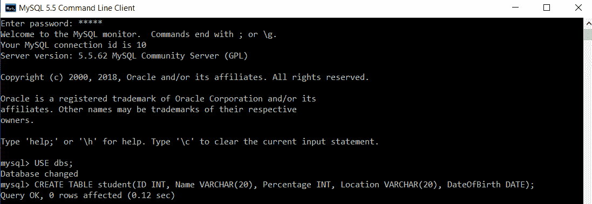

# 插入多行

> 原文：<https://www.javatpoint.com/sql-insert-multiple-rows>

很多时候开发人员会问，是否可以在一条语句中将多行插入到一个表中。目前，开发人员在表中插入值时，必须编写多个 insert 语句。它不仅无聊，而且耗时。

让我们看几个实际的例子来更清楚地理解这个概念。我们将使用 MySQL 数据库来编写所有的查询。

**例 1:**

要在数据库中创建表，首先，我们需要选择要在其中创建表的数据库。

```

mysql> USE dbs;

```

然后，我们将编写一个查询，在选定的数据库“dbs”中创建一个名为 student 的表。

```

mysql> CREATE TABLE student(ID INT, Name VARCHAR(20), Percentage INT, Location VARCHAR(20), DateOfBirth DATE);

```



学生表已成功创建。

现在，我们将编写一个查询，在学生表中插入多条记录:

```

mysql> INSERT INTO student(ID, Name, Percentage, Location, DateOfBirth) VALUES(1, "Manthan Koli", 79, "Delhi", "2003-08-20"), (2, "Dev Dixit", 75, "Pune", "1999-06-17"), (3, "Aakash Deshmukh", 87, "Mumbai", "1997-09-12"), (4, "Aaryan Jaiswal", 90, "Chennai", "2005-10-02"), (5, "Rahul Khanna", 92, "Ambala", "1996-03-04"), (6, "Pankaj Deshmukh", 67, "Kanpur", "2000-02-02"), (7, "Gaurav Kumar", 84, "Chandigarh", "1998-07-06"), (8, "Sanket Jain", 61, "Shimla", "1990-09-08"), (9, "Sahil Wagh", 90, "Kolkata", "1968-04-03"), (10, "Saurabh Singh", 54, "Kashmir", "1989-01-06");

```


为了验证学生表中是否插入了多条记录，我们将执行 SELECT 查询。

```

mysql> SELECT *FROM student;

```

| 身份 | 名字 | 百分率 | 位置 | 出生日期 |
| one | 曼坦科利 | Seventy-nine | 德里 | 2003-08-20 |
| Two | Dev Dixit | Seventy-five | 浦那 | 1999-06-17 |
| three | Aakash Deshmukh | Eighty-seven | 孟买 | 1997-09-12 |
| four | 阿尔扬·杰史瓦尔 | Ninety | 金奈 | 2005-10-02 |
| five | 拉胡尔·康纳 | Ninety-two | 安芭拉 | 1996-03-04 |
| six | 潘卡·迪苏赫赫 | Sixty-seven | 坎普尔。原称 CAWNPORE | 2000-02-02 |
| seven | 高拉夫·库马尔 | Eighty-four | 昌迪加尔 | 1998-07-06 |
| eight | 圣耆那教 | Sixty-one | 西姆拉 | 1990-09-08 |
| nine | Sahil Wagh | Ninety | 加尔各答 | 1968-04-03 |
| Ten | 索拉博·辛格 | Fifty-four | 克什米尔 | 1989-01-06 |

结果显示，所有十条记录都是使用一个查询成功插入的。

**例 2:**

要在数据库中创建表，首先，我们需要选择要在其中创建表的数据库。

```

mysql> USE dbs;

```

然后，我们将编写一个查询，在选定的数据库“dbs”中创建一个名为 items_tbl 的表。

```

mysql> CREATE TABLE items_tbl(ID INT, Item_Name VARCHAR(20), Item_Quantity INT, Item_Price INT, Purchase_Date DATE);

```


名为 items_tbl 的表已成功创建。

现在，我们将编写一个查询，在 items_tbl 表中插入多条记录:

```

mysql> INSERT INTO items_tbl(ID, Item_Name, Item_Quantity, Item_Price, Purchase_Date) VALUES(1, "Soap", 5, 200, "2021-07-08"), (2, "Toothpaste", 2, 80, "2021-07-10"), (3, "Pen", 10, 50, "2021-07-12"), (4, "Bottle", 1, 250, "2021-07-13"), (5, "Brush", 3, 90, "2021-07-15"), (6, "Notebooks", 10, 1000, "2021-07-26"), (7, "Handkerchief", 3, 100, "2021-07-28"), (8, "Chips Packet", 5, 50, "2021-07-30"), (9, "Marker", 2, 30, "2021-08-13"), (10, "Scissors", 1, 60, "2021-08-13");

```


为了验证 items_tbl 表中是否插入了多条记录，我们将执行 SELECT 查询。

```

mysql> SELECT *FROM items_tbl;

```

| 身份 | 项目名称 | 项目 _ 数量 | 项目 _ 价格 | 购买日期 |
| one | 肥皂 | five | Two hundred | 2021-07-08 |
| Two | 牙膏 | Two | Eighty | 2021-07-10 |
| three | 笔 | Ten | Fifty | 2021-07-12 |
| four | 瓶子 | one | Two hundred and fifty | 2021-07-13 |
| five | 刷 | three | Ninety | 2021-07-15 |
| six | 笔记本电脑 | Ten | One thousand | 2021-07-26 |
| seven | 围巾 | three | One hundred | 2021-07-28 |
| eight | 芯片包 | five | Fifty | 2021-07-30 |
| nine | 标记 | Two | Thirty | 2021-08-13 |
| Ten | 剪刀 | one | Sixty | 2021-08-13 |

结果显示，所有十条记录都是使用一个查询成功插入的。

* * *