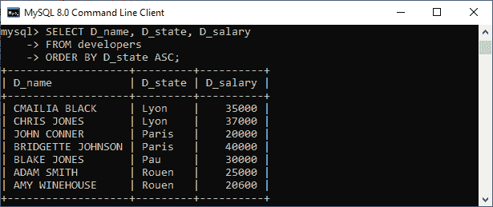
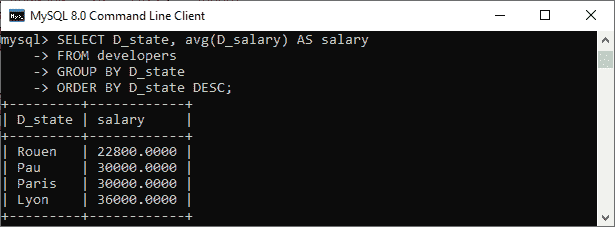

# 分组依据与订单依据

> 原文：<https://www.javatpoint.com/group-by-vs-order-by>

本文解释了 GROUP BY 和 ORDER BY 子句的完整概述。它们主要用于组织通过 SQL 查询获得的数据。这些子句之间的区别是学习 [SQL](https://www.javatpoint.com/sql-tutorial) 时最容易被卡住的地方之一。它们之间的主要区别在于**GROUP BY 子句适用于我们想要对多组行使用聚合函数的情况。ORDER BY 子句适用于我们想要以排序顺序**获取查询得到的数据。在进行比较之前，我们将首先了解这些 SQL 子句。


## 订单条款

在 SQL 查询中使用 [ORDER BY 子句](https://www.javatpoint.com/sql-order-by)以升序或降序对查询返回的数据进行排序。如果省略排序顺序，默认情况下，它会按升序对汇总结果进行排序。ORDER BY 子句与 GROUP BY 子句一样，可以与 SELECT 语句结合使用。 **ASC** 表示升序，而 **DESC** 表示降序。

**以下是在 SQL 语句中使用 ORDER BY 子句的语法:**

```

SELECT expressions  
FROM tables  
[WHERE conditions]  
ORDER BY expression [ ASC | DESC ];  

```

让我们借助下面的例子来理解 ORDER BY 子句是如何工作的。假设我们有一个包含以下数据的表**开发者**:


我们可以看到，这些结果没有以有组织的方式显示。假设我们希望根据**状态列**以升序或降序组织结果。在这种情况下，我们需要 ORDER BY 命令来获得期望的结果。我们可以通过执行以下命令来做到这一点:

```

mysql> SELECT D_name, D_state, D_salary 
FROM developers
ORDER BY D_state ASC;

```

以下是我们将获得所需结果的输出:



## 分组依据条款

在 SQL 查询中使用 [GROUP BY 子句](https://www.javatpoint.com/sql-group-by)来组织具有相同属性值的数据。通常，我们将其与 [SELECT 语句](https://www.javatpoint.com/sql-select)一起使用。请始终记住，我们必须将 GROUP BY 子句放在 [WHERE 子句](https://www.javatpoint.com/sql-where)之后。此外，它位于 ORDER BY 子句之前。

我们经常可以将这个子句与 SUM、AVG、MIN、MAX 和 COUNT 等聚合函数一起使用，从数据库中生成摘要报告。重要的是要记住，这个子句中的属性必须出现在 SELECT 子句中，而不是在聚合函数下。如果我们这样做，查询将是不正确的。因此，GROUP BY 子句总是与 SELECT 子句一起使用。GROUP BY 子句的查询是分组查询，它为每个分组对象返回一行。

**以下是在 SQL 语句中使用 GROUP BY 子句的语法:**

```

SELECT column_name, function(column_name)
FROM table_name 
WHERE condition 
GROUP BY column_name;

```

让我们借助一个例子来理解 GROUP BY 子句是如何工作的。在这里，我们将用同一个表来演示它。

假设我们想知道**开发人员在特定状态**下的平均工资，并根据状态列按降序组织结果。在这种情况下，我们需要 GROUP BY 和 ORDER BY 命令来获得期望的结果。我们可以通过执行以下命令来做到这一点:

```

mysql> SELECT D_state, avg(D_salary) AS salary
FROM developers
GROUP BY D_state
ORDER BY D_state DESC;

```

这个查询最初形成了一个对状态进行分组的中间结果。接下来，对每组状态执行 **AVG** 功能，然后对结果进行降序排序，最终得到如下所示的期望结果:



## 分组依据和订单依据的主要区别

以下是分组依据和排序依据条款之间的主要区别:

*   Group By 子句用于根据特定列中的相同值对数据进行分组。另一方面，ORDER BY 子句对结果进行排序，并以升序或降序显示。
*   必须使用聚合函数来使用分组依据。另一方面，使用聚合函数来使用排序依据并不是强制性的。
*   该属性不能在聚合函数下的 GROUP BY 语句下，而该属性可以在聚合函数下的 ORDER BY 语句下。
*   Group By 子句控制元组的表示，这意味着分组是基于行属性值之间的相似性来完成的。相比之下，ORDER BY 子句控制列的显示，这意味着排序或排序是根据列的属性值以升序或降序进行的。
*   分组依据总是放在 WHERE 子句之后，但在 ORDER BY 语句之前。另一方面，ORDER BY 总是用在 GROUP BY 语句之后。

## 分组依据与订单依据对比图

下面的对比图快速解释了它们的主要区别:

| 塞内加尔 | 分组依据 | 以...排序 |
| 1. | 它用于对具有相同值的行进行分组。 | 它以升序或降序对结果集进行排序。 |
| 2. | 它可能在 CREATE VIEW 语句中被允许。 | 它在 CREATE VIEW 语句中是不允许的 |
| 3. | 它控制行的显示。 | 它控制列的显示。 |
| 4. | 该属性不能在 GROUP BY 语句下的聚合函数下。 | 该属性可以在 ORDER BY 语句下的聚合函数下。 |
| 5. | 它总是用在 SELECT 语句的 ORDER BY 子句之前。 | 它总是用在 SELECT 语句的 GROUP BY 子句之后。 |
| 6. | 必须在分组依据中使用聚合函数。 | 在 ORDER BY 中使用聚合函数并不是强制性的。 |
| 7. | 这里，分组是基于行属性值之间的相似性来完成的。 | 这里，结果集根据列的属性值进行排序，可以是升序，也可以是降序。 |

## 结论

本文对分组依据和排序依据条款进行了比较。这两个子句都是非常有用的 SQL 数据库功能。当我们想要形成一组行时，我们使用 GROUP BY 子句。如果我们想根据特定的列以升序或降序组织数据，我们使用 ORDER BY 子句。它们没有任何关系，因为两者用于两个不同的目的。然而，我们可以将它们组合起来以达到某种特殊目的，或者可以根据情况单独使用它们。我们只能在 SELECT 语句中使用这些子句。

* * *