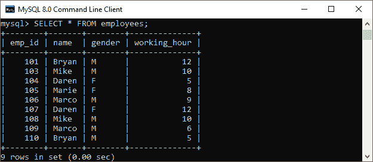
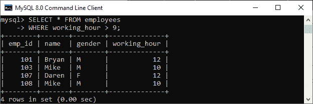
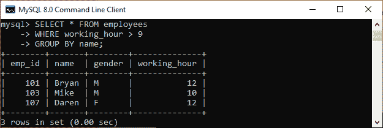
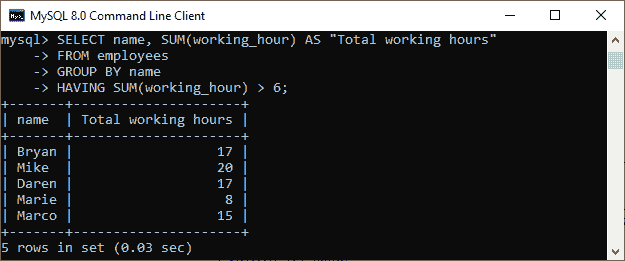

# 哪里和拥有的区别

> 原文：<https://www.javatpoint.com/where-vs-having>

本文将深入讨论 WHERE 和 HAVING 子句。它们也用于过滤 SQL 查询中的记录。WHERE 和 HAVING 子句之间的区别是面试中最常见的问题。**它们之间的主要区别在于，WHERE 子句用于指定在进行任何分组之前过滤记录的条件，而 HAVING 子句用于指定从组中过滤值的条件。**在做比较之前，我们先了解一下这些 [SQL](https://www.javatpoint.com/sql-tutorial) 子句。


## WHERE 子句

MySQL 中的 WHERE 子句与 [SELECT](https://www.javatpoint.com/sql-select) 、 [INSERT](https://www.javatpoint.com/sql-insert) 、 [UPDATE](https://www.javatpoint.com/sql-update) 和 [DELETE](https://www.javatpoint.com/sql-delete) 查询一起使用，从表或关系中过滤数据。它描述了使用 [JOIN 子句](https://www.javatpoint.com/sql-join)从单个表或多个表中检索记录时的特定条件。如果满足指定的条件，它将从表中返回特定的值。 [WHERE 子句](https://www.javatpoint.com/sql-where)将条件放在选定的列上。

MySQL 中的 WHERE 子句还可以**实现逻辑连接词** [和](https://www.javatpoint.com/sql-and)[或](https://www.javatpoint.com/sql-or)，以及 NOT。它们被称为布尔条件，必须为真才能检索数据。逻辑连接词表达式使用比较运算符作为其操作数，如<、< =、>、> =、=、< >。比较运算符通常用于比较字符串和算术表达式。

**以下语法说明了 WHERE 子句的用法:**

```sql

SELECT column_lists,   
FROM table_name
WHERE conditions
GROUP BY column_lists;

```

让我们举个例子来理解这一子句。假设我们有一个名为**员工**的表，其中包含以下数据:



如果我们想要**得到工作时间大于 9** 的员工详细信息，那么我们可以使用如下语句:

```sql

mysql> SELECT * FROM employees
WHERE working_hour > 9;

```

我们将获得以下输出，从中可以看到工作时间超过 9 小时的员工详细信息:



如果我们将上面的查询与 [**GROUP BY** 子句](https://www.javatpoint.com/sql-group-by)一起使用，我们将得到不同的结果:

```sql

mysql> SELECT * FROM employees
WHERE working_hour > 9
GROUP BY name;

```

以下是输出:



## 拥有子句

MySQL 中的 HAVING 子句**与 GROUP BY** 子句结合使用，使我们能够指定过滤结果中出现的分组结果的条件。它只返回最终结果中满足特定条件的组中的那些值。我们也可以在选择的时候一起使用 WHERE 和 HAVING 子句。在这种情况下，WHERE 子句首先过滤单个行，然后对行进行分组，执行聚合计算，最后 HAVING 子句过滤组。

此子句对由 GROUP BY 子句创建的组设置条件。当 SQL 语句不使用 GROUP BY 关键字时，它的行为类似于 WHERE 子句。我们可以使用聚合(组)函数，例如 [SUM](https://www.javatpoint.com/sql-select-sum) 、MIN、MAX、AVG 和 [COUNT](https://www.javatpoint.com/sql-select-count) ，只需要两个子句:SELECT 和 HAVING。

**以下语法说明了 HAVING 子句的用法:**

```sql

SELECT column_lists,   
aggregate_function (expression)  
FROM table_name
WHERE conditions
GROUP BY column_lists  
HAVING condition;

```

让我们举个例子来理解这一子句。这里我们考虑同一个表**员工**进行演示。

如果我们想要**得到每个工作时间大于 6 小时**的员工的总工作时间，那么我们可以使用如下语句:

```sql

mysql> SELECT name, SUM(working_hour) AS "Total working hours"  
FROM employees  
GROUP BY name  
HAVING SUM(working_hour) > 6;  

```

我们将获得以下输出，从中可以看到每个员工的总工作时间:



## WHERE 子句和 HAVING 子句的主要区别

以下几点解释了数据库和模式之间的主要区别:

*   WHERE 子句筛选单个行，而 HAVING 子句筛选组，而不是一次筛选一行。
*   我们不能将 WHERE 子句与聚合函数一起使用，因为它用于过滤单个行。相比之下，HAVING 可以使用聚合函数，因为它用于过滤组。
*   行操作由 WHERE 子句处理，而 HAVING 子句处理对汇总行或组的列操作。
*   WHERE 在 GROUP BY 之前，这意味着 WHERE 子句在执行聚合计算之前过滤行。HAVING 排在 GROUP BY 之后，这意味着 HAVING 子句在执行聚合计算后过滤行。因此，就效率而言，HAVING 比 WHERE 慢，应尽可能避免。
*   我们可以在 SELECT 查询中将 WHERE 和 HAVING 子句组合在一起。在这种情况下，首先使用 WHERE 子句来筛选单个行。然后对行进行分组，执行聚合计算，最后，使用 HAVING 子句过滤组。
*   WHERE 子句根据指定的条件检索所需的数据。另一方面，HAVING 子句首先获取整个数据，然后根据指定的条件进行分离。
*   没有 SELECT 语句，我们就不能使用 HAVING 子句。相反，我们可以在 SELECT、UPDATE 和 DELETE 语句中使用 WHERE。
*   WHERE 子句是一个前置过滤器，而 HAVING 子句是一个后置过滤器。

## 哪里与拥有对比图

下面的对比图快速解释了它们的主要区别:

| 比较基础 | WHERE 子句 | 拥有子句 |
| **定义** | 它用于对单个行执行过滤。 | 它用于对组进行过滤。 |
| **基础** | 它是在行操作中实现的。 | 它在列操作中实现。 |
| **数据提取** | WHERE 子句根据指定的条件从特定的行中获取特定的数据 | HAVING 子句首先获取完整的数据。然后根据给定的条件将它们分开。 |
| **聚合函数** | WHERE 子句不允许使用聚合函数。 | HAVING 子句可以使用聚合函数。 |
| **充当** | WHERE 子句充当前置过滤器。 | HAVING 子句充当后置筛选器。 |
| **与**配合使用 | 我们可以在 SELECT、UPDATE 和 DELETE 语句中使用 WHERE 子句。 | HAVING 子句只能与 SELECT 语句一起使用。 |
| **分组依据** | GROUP BY 子句在 WHERE 子句之后。 | GROUP BY 子句在 HAVING 子句之前。 |

## 结论

在这篇文章中，我们对 WHERE 和 HAVING 子句进行了比较。在这里，我们得出结论，这两个子句在过滤数据方面的工作方式是相同的，除了一些额外的特性使 HAVING 子句更受欢迎。我们可以在 HAVING 子句中有效地使用聚合函数，而 WHERE 不允许使用聚合函数。

* * *