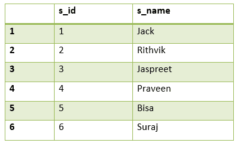
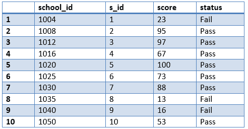

# 在 SQL 中连接三个或更多表

> 原文：<https://www.javatpoint.com/joining-three-or-more-tables-in-sql>

***在 SQL 中连接多个表*** 是一些棘手的任务。如果在单个 SQL 查询中需要 ***连接*** 两个以上的表，可能会比较困难，我们将分析如何使用 **INNER JOINs** 从多个表中检索数据。在本节中，我们使用了两种方法将三个或更多的表连接到 SQL 中。

### 示例:

**我们正在创建三个表，如下所示:**

1.  学生
2.  记号
3.  细节

### 表 1:学生

```

create table student(s_id int primary key, s_name varchar(17));
insert into student values(1, 'Jack');
insert into student values(2, 'Rithvik');
insert into student values(3, 'Jaspreet');
insert into student values(4, 'Praveen');
insert into student values(5, 'Bisa');
insert into student values(6, 'Suraj');

```

**学生表**



在上表中 **s_id** 是主键。

### 表 2:标记

```

create table marks(school_id int primary key, s_id int, score int, status varchar(20));
insert into marks values(1004, 1, 23, 'fail');
insert into marks values(1008, 6, 95, 'pass');
insert into marks values(1012, 2, 97, 'pass');
insert into marks values(1016, 7, 67, 'pass'); 
insert into marks values(1020, 3, 100, 'pass');
insert into marks values(1025, 8, 73, 'pass');
insert into marks values(1030, 4, 88, 'pass');
insert into marks values(1035, 9,  13, 'fail');
insert into marks values(1040, 5,  16, 'fail');
insert into marks values(1050, 10, 53, 'pass');

```

**标记表**



在上表中， **school_id 为主键，s_id 为外键。**

### 表 3:详细信息

```

create table details(address_city varchar(20), email_ID varchar(20),    school_id int, accomplishments varchar(50));

insert into details values('Bangalore',  'jsingh@jtp.com',
                                1020, 'ACM ICPC selected');
insert into details values('Hyderabad', 'praveen@jtp.com',
                                1030, 'Geek of the month');
insert into details values('Delhi',     'rithvik@jtp.com',
                                    1012, 'IOI finalist');
insert into details values('Chennai',   'om@jtp.com',
                                 1111, 'Geek of the year');
insert into details values('Banglore', ' suraj@jtp.com',
                                 1008, 'IMO finalist');
insert into details values('Mumbai',    'sasukeh@jtp.com',
                                  2211, 'Made a robot');
insert into details values('Ahmedabad', 'itachi@jtp.com',
                               1172, 'Code Jam finalist');
insert into details values('Jaipur',    'kumar@jtp.com',
                                   1972, 'KVPY finalist');

```


在上表中， **school_id** 为**外键**。

在 [SQL](https://www.javatpoint.com/sql-tutorial) 中有两种连接三个或更多表的方法:

### 1.在 SQL 中使用 JOINS:

这里应用了相同的逻辑，用于连接**两个表**，即连接 **n 个**表的连接语句的最小**数量为 **(n-1)** 。**

```

select s_name, score, status, address_city, email_id,
accomplishments from student s inner join mark m on
s.s_id = m.s_id inner join details d on 
d.school_id = m.school_id;

```

**输出:**


### 2.使用父子关系:

在父子关系中，我们使用[**子句**](https://www.javatpoint.com/sql-where)**来连接两个或多个表。在一个表中创建列 **X** 作为主键，在另一个表中创建外键**

 **看看创建的表:
**s_id** 是学生表中的**主键**和标记表中的**外键**。**(学生(家长)-分数(孩子))**。
**school_id** 是 marks 表中的**主键**和学生表中的**外键**。**(标记(父)-细节(子))**。

**查询:**

```

select s_name, score, status, address_city, 
email_id, accomplishments from student s, 
marks m, details d where s.s_id = m.s_id and 
m.school_id = d.school_id;

```

**输出:**


* * ***