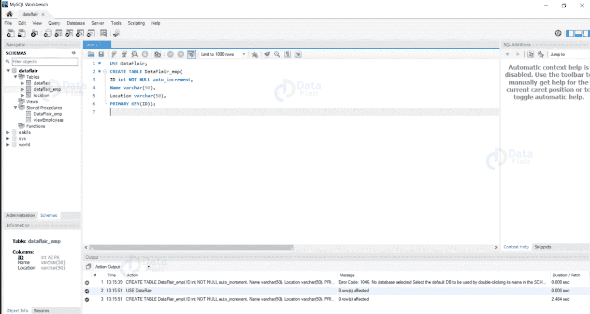
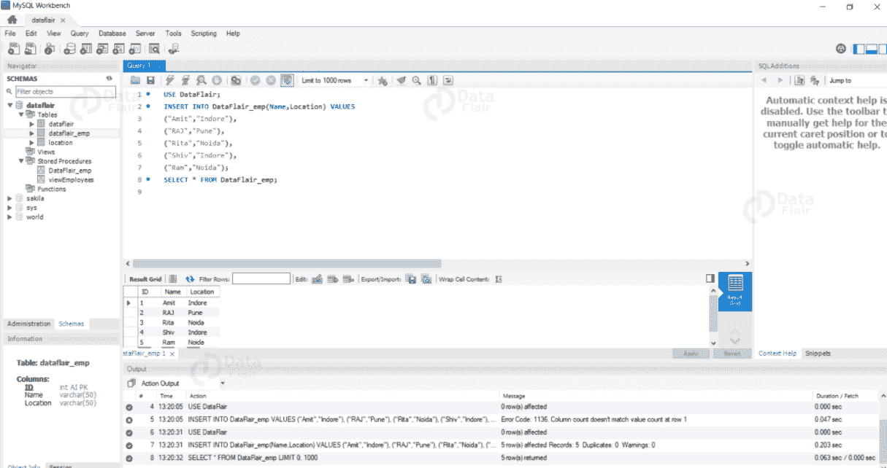
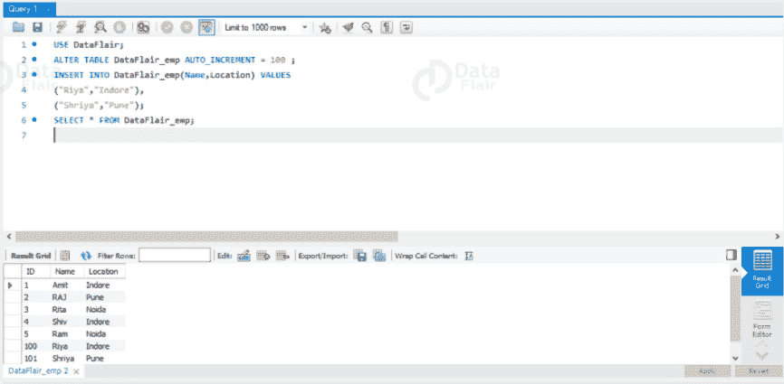

# SQL 自动递增

> 原文：<https://www.javatpoint.com/sql-auto-increment>

数据库是用来逻辑存储海量数据的。您可能遇到过各种情况，在这些情况下，您很难为表中的每条记录提到一个唯一的数字。这种情况实际上是不可能的，因为手动输入受到限制。因此**没有增加数值**的余地。在这种情况下，您可以使用其他方法，并在 SQL 中选择自动增量。SQL 中的自动递增输入一个唯一的数字会自动增加表中每一条新记录的计数。为了熟悉 [SQL](https://www.javatpoint.com/sql-tutorial) 中的自动增量，让我们看一些理由来更好地理解。

## 什么是 SQL 中的自动增量？

顾名思义，自动增量被定义为一个字段，主要用于为任何实例中添加到表中的每个记录生成唯一的编号。一般来说，它用于主键列，因为 SQL 中的[主键应该是唯一的，而不是空的。因此，自动增量使开发人员能够轻松地为所有记录自动生成唯一的编号。](https://www.javatpoint.com/sql-primary-key)

存储在数据库中的数据并不总是具有唯一的属性，因此某些记录会被唯一地挑选和处理。为了确保每条记录的唯一标识，您可以为唯一标识创建一个属性，该属性可以指定每一行。因此，在创建这样一个唯一的标识后，您需要使用自动增量来设置它，以便值一旦增加就可以方便地存储在数据库中。

SQL 中的自动增量通过轻松识别每条记录增加了优势。请务必记住，您需要在 Create 语句中将列设置为自动递增。否则，可能会出现一些问题。因此，为了保持完整性，您需要为自动增量分配一个主键，确保数据的标识在数据库中得到维护。

现在，由于您非常熟悉 SQL 中的自动增量，让我们继续讨论不同数据库管理系统中的这个领域。

## SQL 中的自动增量功能。

自动增量的一些功能列举如下:

1.  它可以帮助您创建在数据中可能没有任何唯一标识属性的主键。
2.  自动增量中的值可以在任何时间点显式初始化和修改。
3.  可以轻松创建记录的唯一标识。
4.  通过自动增量，可以轻松处理每条记录之间的间隙。
5.  用 SQL 编写自动增量查询在语法上很容易。

## 设置自动增量

为了方便起见，您可以开始创建一个具有某些属性的表，如**客户标识、客户名称、年龄、电话号码**等。要使用自动递增字段，您需要在您的 SQL Server 中使用 IDENTITY 关键字。为了继续设置，让我们从与自动增量相关的语法和示例开始。

### 句法

```

CREATE TABLE TableName (
Column1 DataType  IDENTITY(starting value, increment by),
Column2 DataType, 
);

```

### SQL Server 示例

假设您必须按照上面的语法创建一个表，该表具有像“客户”这样的属性作为名称，列具有“客户标识”、“客户名称”、“年龄”和“电话号码”。在这种情况下，如果创建自动增量，CustomerID 将被视为主键，因为它可以作为表的唯一标识符。

```

CREATE TABLE Customers (
CustomerID int IDENTITY(1,1) PRIMARY KEY,
CustomerName varchar(255),
Age int,
PhoneNumber int);

```

在上面的例子中，IDENTITY 的初始值被赋予了一个值，并且每当添加新记录时，这个值都会增加一个值。您可以根据需要直接提到该值，要插入该值，您需要按照以下方式使用 insert 查询，如下所示。

```

INSERT INTO Customers (CustomerName,Age, PhoneNumber)
VALUES ('Kundan','24','9876543210');

```

如果仔细观察，CustomerID 列不会被提及，因为它们会自动生成。因此，如果您想存储更多这样的值，可以通过以下方式来实现。

```

INSERT INTO Customers (CustomerName,Age, PhoneNumber)
VALUES ('Suraj','21','9812323210');

INSERT INTO Customers (CustomerName,Age, PhoneNumber)
VALUES ('Anup','19','9954413210');

INSERT INTO Customers (CustomerName,Age, PhoneNumber)
VALUES ('Monalisa','24','9876544911');

INSERT INTO Customers (CustomerName,Age, PhoneNumber)
VALUES ('Sanju','31','9657154310');

```

包含上述数据并保存更改后，结果可能如下所示。


到目前为止，您已经看到了 SQL 中的自动增量的详细版本。现在，您将看到一些重要动作和示例的快速回顾，这些动作和示例可以用来清楚地了解自动增量及其多样化应用。

### 创建自动增量列

```

CREATE TABLE tableName (
col1 NOT NULL AUTO_INCREMENT,
Col2, col3,......
PRIMARY KEY(col1)
);

```

### 更改自动递增列

```

ALTER TABLE tableName  AUTO_INCREMENT = n;

```

### 每列的增量

```

CREATE TABLE tableName (
col1 NOT NULL AUTO_INCREMENT(n,m),
Col2, col3,......
PRIMARY KEY(col1)
);

Here, n and m are starting points and gaps between the created record.

```

### 创建自动增量属性

首先，您需要创建一个任意名称的示例数据库。为了方便起见，您可以创建一个名为 DataFlair _ emp 的数据库，其列如下所示。

1.  自动增量不为空
2.  姓名 varchar(50)
3.  位置 varchar(50)

使用以下查询来支出上面应用的列。

```

USE DataFlair;
CREATE TABLE DataFlair_emp(
ID int NOT NULL auto_increment,
Name varchar(50),
Location varchar(50),
PRIMARY KEY(ID));

```

结果可能是这样的。



您可以看到，数据库是用一个定义为自动增量的标识创建的。下一个任务是使用下面给出的查询将数据插入数据库。

```

USE DataFlair;
INSERT INTO DataFlair_emp(Name, Location) VALUES
("Amit","Indore"),
("RAJ","Pune"),
("Rita","Noida"),
("Shiv","Indore"),
("Ram","Noida");
SELECT * FROM DataFlair_emp; 

```

在上面的查询中，尽管传递了任何数值或标识列值，但您主要还是输入了数据。它由 SQL 中的自动增量自动处理，结果会自动分配各自的值。

通过下面给出的图像可以看到可视化数据库的预期输出。



下一个任务是找到一种改变表的方法。之前，您已经看到了一个关于如何更改 SQL 表的代码片段，现在您实际上已经看到了这个示例。

```

USE DataFlair;
ALTER TABLE DataFlair_emp AUTO_INCREMENT = 100 ;
INSERT INTO DataFlair_emp(Name,Location) VALUES
("Riya","Indore"),
("Shriya","Pune");
SELECT * FROM DataFlair_emp; 

```

上面代码片段的输出看起来像这样。



您可以注意到，在结果中插入多条记录时，自动增量值最初设置为 100。您可以添加范围高达 100 的值，它们将增加 1，并作为主键存储在我们的数据库中。

### 自动增量示例

**例 1**

```

CREATE TABLE animals (
     id MEDIUMINT NOT NULL AUTO_INCREMENT,
     name CHAR(30) NOT NULL,
     PRIMARY KEY (id)
);
INSERT INTO animals (name) VALUES
    ('dog'),('cat'),('penguin'),
    ('lax'),('whale'),('ostrich');
SELECT * FROM animals;

```

**输出**

```
+----+---------+
| id | name    |
+----+---------+
|  1 | dog     |
|  2 | cat     |
|  3 | penguin |
|  4 | lax     |
|  5 | whale   |
|  6 | ostrich |
+----+--------+

```

在上面的示例中，AUTO_INCREMENT 列没有指定的值。MySQL 自动显式地自动分配数字，范围从 0 到生成的列序列数。例如，考虑下面的格式。

```

INSERT INTO animals (id,name) VALUES(0,'groundhog');

```

如果您将列分配为非空，则有可能将其分配给可以生成序列号的列。

对于这种情况，为自动递增列插入任何其他值可能会自动重置，并且设置的值遵循较大列的序列。例如:

```

INSERT INTO animals (id,name) VALUES(100,'rabbit');
INSERT INTO animals (id,name) VALUES(NULL,'mouse');
SELECT * FROM animals;
+-----+-----------+
| id  | name      |
+-----+-----------+
|   1 | dog       |
|   2 | cat      |
|   3 | penguin   |
|   4 | lax      |
|   5 | whale     |
|   6 | ostrich   |
|   7 | groundhog |
|   8 | squirrel  |
| 100 | rabbit    |
| 101 | mouse     |
+-----+-----------+

```

当您更新任何数据库中现有的自动递增列值时，该表不会直接重置自动递增的顺序。因此，您可以检索自动递增或最后插入的最新值。这些函数是特定于连接的，由于这个属性，对正在执行的其他插入操作没有影响。

这里要补充的另一点是，自动增量可以很容易地保持较大值的最大序列。但是，在达到数据类型上限的过程中，由于最大限制，生成的序列号可能会失败。例如，如果整数的最大允许序列设置为 127，则相同的无符号序列可能设置为 255。因此，您必须首先保持 TINYINT、BIGINT 等的约定。

## 摘要

在本教程中，您看到了什么是 SQL 中的自动增量属性，以及如何使用它来**存储、顺序存储和检索**数据。在后面的部分中，您熟悉了语法和大量示例，以了解自动增量流在不同的实例中是如何工作的，无论是插入还是更改表中的值。自动递增功能允许您根据数据缺少某种唯一标识的事实来创建主键。有了这些特性和功能，自动增量允许您修改和弥合主键值之间的差距。

* * *