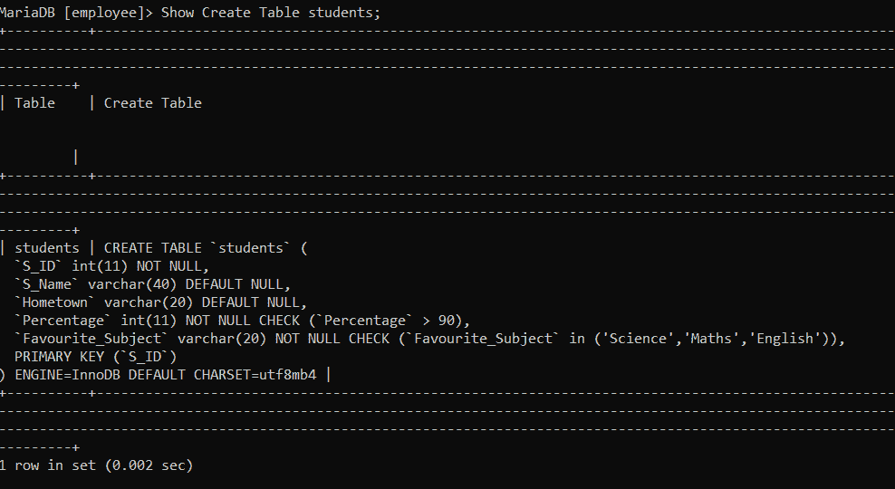
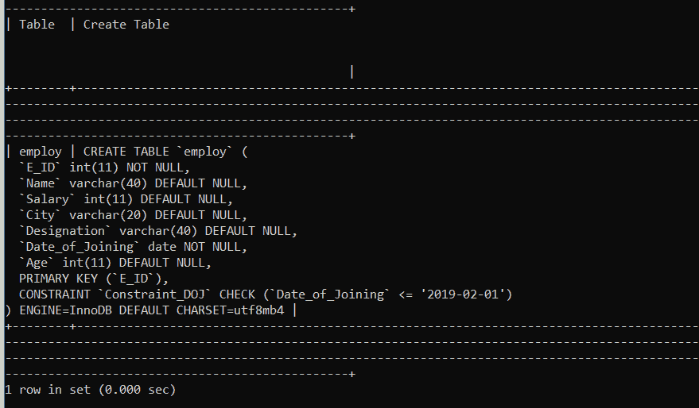
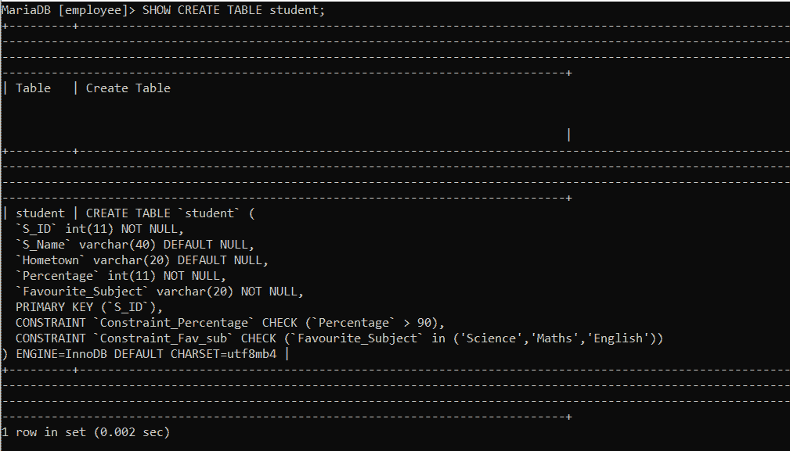
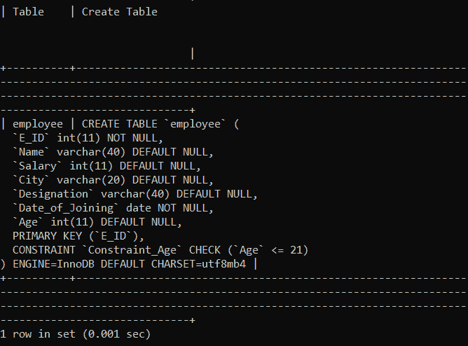
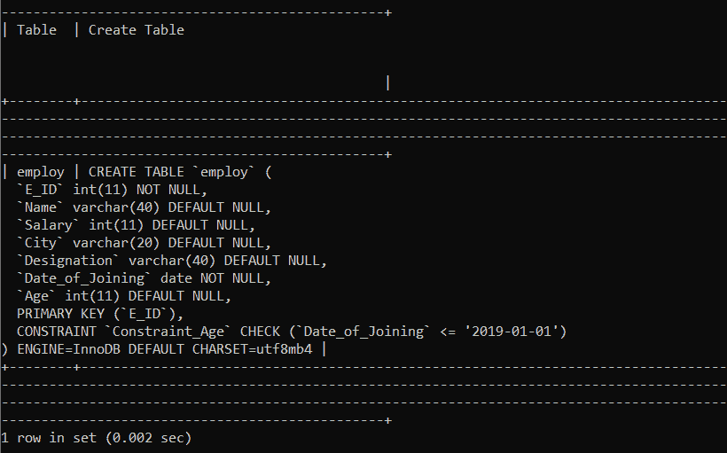
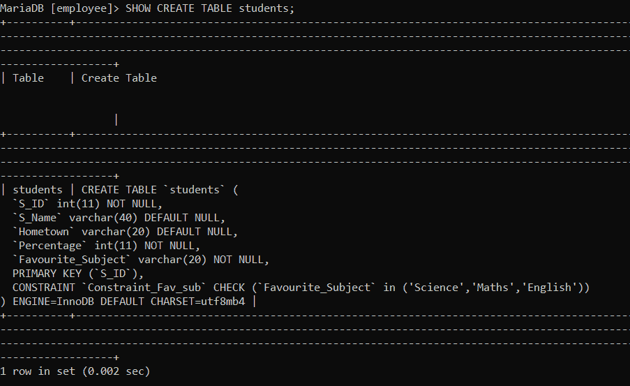
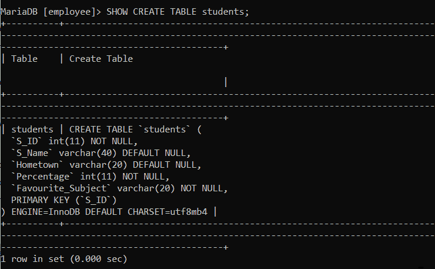
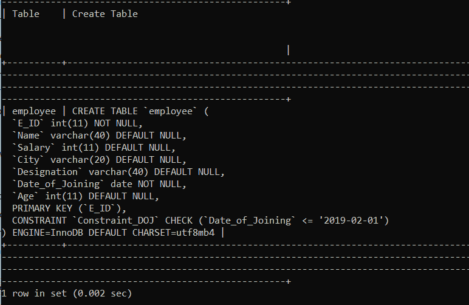
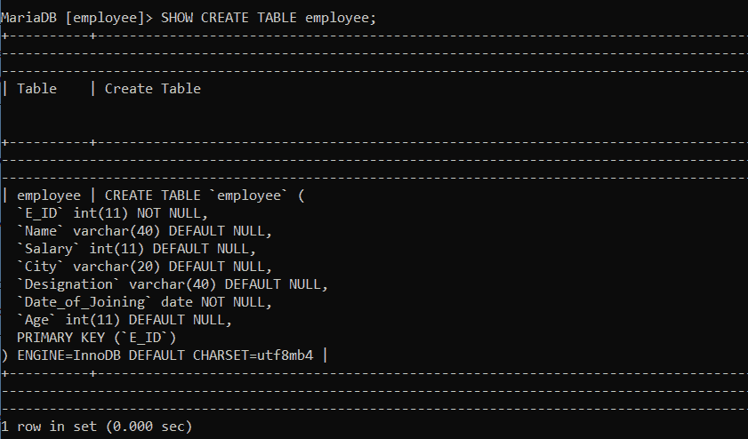

# 检查 SQL 中的约束

> 原文：<https://www.javatpoint.com/check-constraint-in-sql>

*   检查约束是应用于表列的验证或规则。
*   当我们对任何列应用 check 约束时，它会在插入任何记录时检查特定的值。
*   可以在表级和列级创建检查约束。
*   检查约束只能应用于单个列，但是单个表中可以有多个检查约束。

让我们看几个实际的例子来更清楚地理解这个概念。我们将使用 MariaDB 数据库来编写所有的查询。

### 1.检查列级别的约束:

要在列级别应用检查约束，我们必须在列名后面指定检查约束。

**语法:**

```sql

CREATE TABLE TableName(ColumnName1 Datatype(size), ColumnName2 Datatype(size), ColumnName3 Datatype(size) Constraint ConstraintName CHECK(ColumnName CONDITION Value),…, ColumnNameN Datatype(size));

```

我们将编写一个查询来创建一个表，并在其中一列上指定列级检查约束:

```sql

CREATE TABLE employee(E_ID INT NOT NULL, Name VARCHAR(40), Salary INT, City VARCHAR(20), Designation VARCHAR(40), Date_of_Joining Date NOT NULL CHECK(Date_of_Joining > "2019-02-01"), Age INT, PRIMARY KEY(E_ID));

```


在上面的查询中，我们在“加入日期”列中指定了 CHECK 约束。根据此约束，加入日期列将只允许插入那些加入日期在“2019-02-01”之后的记录。

为了验证 CHECK 约束是否是在“加入日期”列中创建的，我们将执行以下查询:

```sql

SHOW CREATE TABLE employee;

```


现在，我们将尝试在 employees 表中插入一条记录，其中员工的加入日期在“2019-02-01”之前。

```sql

INSERT INTO employees(E_ID, Name, Salary, City, Designation, Date_of_Joining, Age) VALUES(11, "Simran Khanna", 45500, "Kolhapur", "HR", "2019-01-01", 26);

```


当我们尝试插入加入日期为“2019-01-01”的员工时，出现约束失败错误。由于我们在“加入日期”列中应用了检查约束，它将只允许超过“2019-02-01”的加入日期。

**例 2:**

我们将编写一个查询来创建一个表，并在多个列上指定列级检查约束。

**查询:**

```sql

CREATE TABLE students(S_ID INT NOT NULL, S_Name VARCHAR(40), Hometown VARCHAR(20), Percentage INT NOT NULL CHECK(Percentage >90), Favourite_Subject VARCHAR(20) NOT NULL CHECK( Favourite_Subject IN('Science', 'Maths', 'English')), PRIMARY KEY (S_ID));

```


在上面的查询中，我们在百分比和收藏夹主题列上指定了 CHECK 约束。根据此限制，“百分比”列将只允许插入学生保证的百分比高于 90，并且学生最喜欢的科目是科学、数学或英语的记录。

要验证在百分比和收藏夹主题列上成功创建了检查约束，我们将执行以下命令:

```sql

SHOW CREATE TABLE students;

```



现在，我们将尝试在学生表中插入一条记录，其中学生所保证的百分比低于 90。

```sql

INSERT INTO students(S_ID, S_Name, Hometown, Percentage, Favourite_Subject) VALUES(106, "Harshada", "Nashik", 89, "Science");

```


当我们试图插入一个百分比为 89 的学生时，会出现约束失败错误。由于我们对百分比列应用了检查约束，它将只允许百分比超过 90。

现在，我们将尝试在学生表中插入一条记录，其中学生所保证的百分比高于 90。

```sql

INSERT INTO students(S_ID, S_Name, Hometown, Percentage, Favourite_Subject) VALUES(106, "Harshada", "Nashik", 92, "Science");

```


成功插入学生保证的百分比为 92 的记录。由于我们对百分比列应用了检查约束，它将只允许百分比超过 90。

### 1.检查表级约束:

要在表级别应用检查约束，我们必须在结束表创建之前指定检查约束。

**语法:**

```sql

CREATE TABLE TableName(ColumnName1 Datatype(size), ColumnName2 Datatype(size), ColumnName3 Datatype(size),…, ColumnNameN Datatype(size), Constraint ConstraintName CHECK(ColumnName CONDITION Value));

```

**例 1:**

我们将编写一个查询来创建一个表，并在其中一列上指定表级检查约束。

```sql

CREATE TABLE employ(E_ID INT NOT NULL, Name VARCHAR(40), Salary INT, City VARCHAR(20), Designation VARCHAR(40), Date_of_Joining Date NOT NULL, Age INT, PRIMARY KEY(E_ID), CONSTRAINT Constraint_DOJ CHECK(Date_of_Joining <= "2019-02-01"));

```


在上面的查询中，我们在“加入日期”列中指定了 CHECK 约束。根据此约束，加入日期列将只允许插入那些加入日期小于或等于“2019-02-01”的记录。

要验证在“加入日期”列中是否成功创建了检查约束，我们将执行以下命令:

```sql

SHOW CREATE TABLE employ;

```



现在，我们将尝试在雇佣表中插入一条记录，其中员工的加入日期等于“2019-02-01”。

```sql

INSERT INTO employ(E_ID, Name, Salary, City, Designation, Date_of_Joining, Age) VALUES(11, "Simran Khanna", 45500, "Kolhapur", "HR", "2019-02-01", 26);

```


成功插入加入日期小于或等于“29-02-01”的记录。由于我们在“加入日期”列中应用了检查约束，它将只允许小于或等于“29-02-01”的日期。

**例 2:**

我们将编写一个查询来创建一个表，并在多个列上指定表级检查约束。

```sql

CREATE TABLE student(S_ID INT NOT NULL, S_Name VARCHAR(40), Hometown VARCHAR(20), Percentage INT NOT NULL,  Favourite_Subject VARCHAR(20) NOT NULL, CONSTRAINT Constraint_Percentage (Percentage >90), CONSTRAINT Constraint_Fav_sub CHECK( Favourite_Subject IN('Science', 'Maths', 'English')), PRIMARY KEY (S_ID));

```


在上面的查询中，我们在百分比和收藏夹主题列上指定了 CHECK 约束。根据此限制，“百分比”列将只允许插入学生保证的百分比高于 90，并且学生最喜欢的科目是科学、数学或英语的记录。

要验证百分比和收藏夹 _ 主题列上的检查约束是否已成功创建，我们将执行以下命令:

```sql

SHOW CREATE TABLE student;

```



现在，我们将尝试在学生表中插入一条记录，其中学生获得的百分比高于 90。

```sql

INSERT INTO students(S_ID, S_Name, Hometown, Percentage, Favourite_Subject) VALUES(106, "Harshada", "Nashik", 92, "Science");

```


成功插入学生保证的百分比为 92 的记录。由于我们对百分比列应用了检查约束，它将只允许百分比超过 90。

现在，我们将尝试在学生表中插入一条记录，其中学生保证的百分比低于 90。

```sql

INSERT INTO student(S_ID, S_Name, Hometown, Percentage, Favourite_Subject) VALUES(106, "Harshada", "Nashik", 89, "Science");

```


当我们试图插入一个百分比为 89 的学生时，会出现约束失败错误。由于我们对百分比列应用了检查约束，它将只允许百分比超过 90。

### 3.创建表后检查约束:

当我们需要在表创建后对列应用检查约束时，可能会出现这种情况。在这种情况下，我们必须使用 ALTER 命令对已经创建的表应用检查约束。

**语法:**

```sql

ALTER TABLE TableName ADD CONSTRAINT ConstraintName CHECK(ColumnName CONDITION Value);

```

**例 1:**

假设我们创建了一个没有任何约束的 employee 表，后来我们决定在其中一列上添加一个约束。然后我们将执行以下查询:

```sql

ALTER TABLE employee ADD CONSTRAINT Constraint_Age CHECK (Age <= 21);

```


要验证是否在“年龄”列上成功创建了检查约束，我们将执行以下命令:

```sql

SHOW CREATE TABLE employee;

```



现在，我们将尝试在员工表中插入一条记录，其中员工的年龄大于 21 岁。

```sql

INSERT INTO employees(E_ID, Name, Salary, City, Designation, Date_of_Joining, Age) VALUES(11, "Simran Khanna", 45500, "Kolhapur", "HR", "2019-02-02", 22);

```


当我们试图插入一个年龄在 21 岁以上的员工时，会出现约束失败错误。由于我们对“年龄”列应用了检查约束，它将只允许小于或等于 21 的年龄值。

**例 2:**

假设我们创建了一个没有任何约束的 employ 表，后来我们决定在其中一列上添加一个约束。然后我们将执行以下查询:

```sql

ALTER TABLE employ ADD CONSTRAINT Constraint_Age CHECK (Date_of_Joining <= "2019-01-01");

```


要验证在“加入日期”列中是否成功创建了检查约束，我们将执行以下命令:

```sql

SHOW CREATE TABLE employ;

```



现在，我们将尝试在雇员入职日期在“2019-01-01”以上的雇佣表中插入一条记录。

```sql

INSERT INTO employ(E_ID, Name, Salary, City, Designation, Date_of_Joining, Age) VALUES(11, "Simran Khanna", 45500, "Kolhapur", "HR", "2019-02-02", 26);

```


当我们尝试插入加入日期为“2019-02-02”的员工时，出现约束失败错误。由于我们在“加入日期”列中应用了检查约束，它将只允许低于或等于“2019-01-01”的加入日期。

### 4.移除检查约束

假设我们在表的列上创建了一个检查约束。后来，我们决定从列中移除该约束。然后，在这种情况下，我们将使用 ALTER 命令删除检查约束。

**语法:**

```sql

ALTER TABLE TableName DROP CHECK ConstraintName;

```

**例 1:**

假设我们在学生表的一列上分配了一个检查约束。后来，我们决定取消这一限制。

为了验证创建的约束，我们将执行以下查询:

```sql

SHOW CREATE TABLE students;

```



我们将执行以下命令来移除名为约束 _Fav_sub 的约束:

```sql

ALTER TABLE students DROP CHECK Constraint_Fav_sub;

```


我们将再次执行 SHOW CREATE TABLE 命令来验证检查约束是否被成功移除。

```sql

SHOW CREATE TABLE students;

```



**例 2:**

假设我们在 employee 表的一列上分配了一个 check 约束。后来，我们决定取消这一限制。

为了验证创建的约束，我们将执行以下查询:

```sql

SHOW CREATE TABLE employee;

```



我们将执行以下命令来删除名为“约束 _DOJ”的约束:

```sql

ALTER TABLE employee DROP CHECK Constraint_DOJ;

```


我们将再次执行 SHOW CREATE TABLE 命令来验证检查约束是否被成功移除。

```sql

SHOW CREATE TABLE employees;

```



* * *