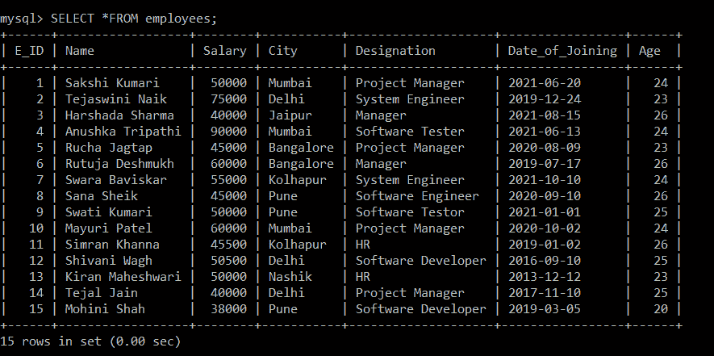
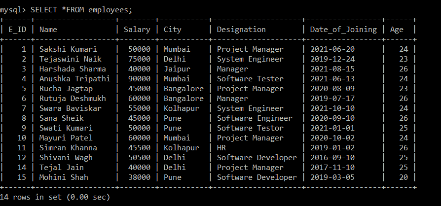
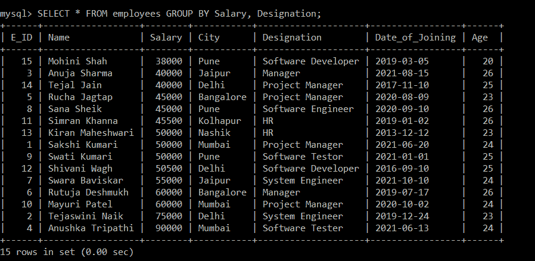
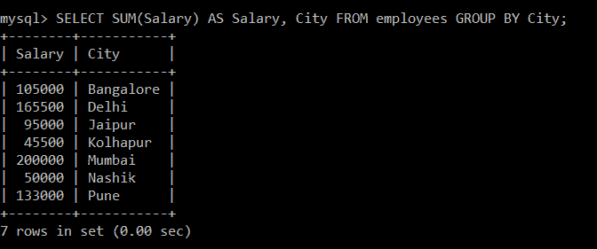
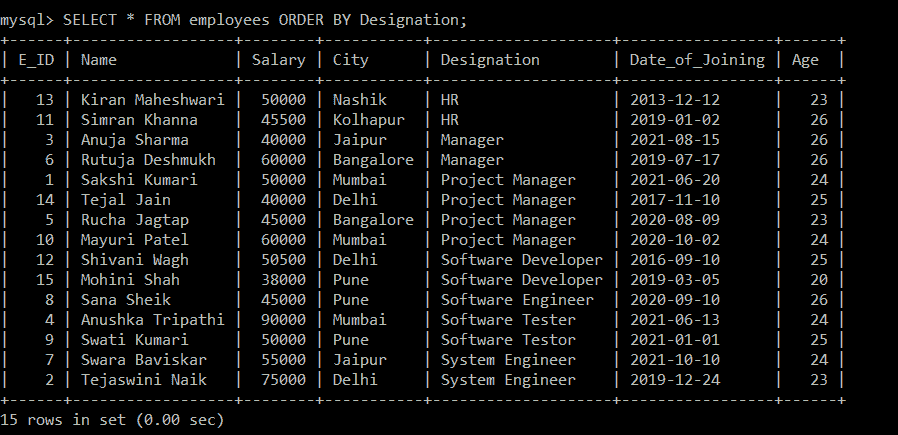
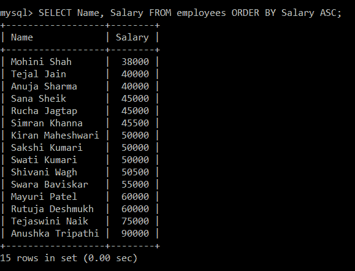
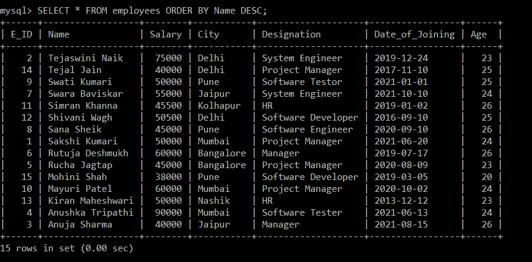

# SQL 子句

> 原文：<https://www.javatpoint.com/sql-clauses>

*   SQL 子句帮助我们从表中检索一组或多组记录。
*   SQL 子句帮助我们在表的列或记录上指定一个条件。

**结构化查询语言中可用的不同子句如下:**

1.  WHERE 子句
2.  分组子句
3.  HAVING 子句
4.  按子句排序

让我们用一个例子一个一个地看每个子句。我们将使用 MySQL 数据库来编写示例中的查询。

## 1.WHERE 子句

SQL 中的 WHERE 子句与 SELECT 查询一起使用，SELECT 查询是数据操作语言命令之一。WHERE 子句可用于限制结果集中显示的行数，它通常有助于过滤记录。它只返回那些满足 WHERE 子句特定条件的查询。WHERE 子句用于 SELECT、UPDATE、DELETE 语句等。

### 带有选择查询的 WHERE 子句

星号符号与 SELECT 查询中的 WHERE 子句一起使用，从表中检索每条记录的所有列值。

**where 子句的语法，使用选择查询从表中检索每个记录的所有列值:**

```

SELECT * FROM TABLENAME WHERE CONDITION;

```

**如果根据需求，我们只想检索选择性列，那么我们将使用以下语法:**

```

SELECT COLUMNNAME1, COLUMNNAME2 FROM TABLENAME WHERE CONDITION;

```

考虑包含以下数据的员工表:

| E_ID | 名字 | 薪水 | 城市 | 指定 | 加入日期 | 年龄 |
| one | 佐殊库马里 | Fifty thousand | 孟买 | 项目管理人 | 2021-06-20 | Twenty-four |
| Two | Tejaswini Naik | Seventy-five thousand | 德里 | 系统工程师 | 2019-12-24 | Twenty-three |
| three | 取消 Sharma | forty thousand | 斋浦尔 | 经理 | 2021-08-15 | Twenty-six |
| four | Anushka Tripathi | Ninety thousand | 孟买 | 软件测试人员 | 2021-06-13 | Twenty-four |
| five | 罗夏·贾塔普 | Forty-five thousand | 班加罗尔 | 项目管理人 | 2020-08-09 | Twenty-three |
| six | 德斯蒙方块 | Sixty thousand | 班加罗尔 | 经理 | 2019-07-17 | Twenty-six |
| seven | 斯瓦巴什语 | Fifty-five thousand | 斋浦尔 | 系统工程师 | 2021-10-10 | Twenty-four |
| eight | 萨那谢赫 | Forty-five thousand | 浦那 | 软件工程师 | 2020-09-10 | Twenty-six |
| nine | 斯瓦蒂·活女神 | Fifty thousand | 浦那 | 软件测试人员 | 2021-01-01 | Twenty-five |
| Ten | 万由里·帕特尔 | Sixty thousand | 孟买 | 项目管理人 | 2020-10-02 | Twenty-four |
| Eleven | 西姆兰·卡纳 | Forty-five thousand five hundred | 戈尔哈布尔 | 小时 | 2019-01-02 | Twenty-six |
| Twelve | 希瓦尼·瓦赫 | Fifty thousand five hundred | 德里 | 软件开发人员 | 2016-09-10 | Twenty-five |
| Thirteen | 基兰·马赫什瓦拉 | Fifty thousand | 纳西克 | 小时 | 2013-12-12 | Twenty-three |
| Fourteen | 特哈尔·耆那教 | forty thousand | 德里 | 项目管理人 | 2017-11-10 | Twenty-five |
| Fifteen | 莫希妮·沙阿 | Thirty-eight thousand | 浦那 | 软件开发人员 | 2019-03-05 | Twenty |

### 例 1:

编写一个查询来检索员工工资高于 50000 的所有记录。

**查询:**

```

mysql> SELECT * FROM employees WHERE Salary > 50000;

```

上面的查询将显示员工工资高于 50000 的所有记录。低于 50000 的工资不会按照条件显示。

您将获得以下输出:


根据预期的输出，仅显示员工工资高于 50000 的记录。员工表中有六条满足给定条件的记录。

### 例 2:

编写一个查询来更新员工的记录，并将更新后的姓名设置为“Harshada Sharma”，其中员工的城市名称是斋浦尔。

**查询:**

```

mysql> UPDATE employees SET Name = "Harshada Sharma" WHERE City = "Jaipur";

```


上面的查询将员工的姓名更新为“Harshada Sharma”，其中员工的城市是斋浦尔。

为了验证记录是否被更新，我们将运行一个选择查询。

```

mysql> SELECT * FROM employees;

```



员工表中只有一条记录，其中员工的城市是“斋浦尔”。记录的 id 是 3，满足给定的条件。因此，根据给定的条件，员工 id 为 3 的员工姓名现在更改为“Harshada Sharma”。

### 例 3:

写一个查询，删除员工入职日期为“2013-12-12”的记录。

**查询:**

```

mysql> DELETE FROM employees WHERE Date_of_Joining = "2013-12-12";

```


上述查询将删除入职日期为“2013-12-12”的员工的员工详细信息。

为了验证上述查询的结果，我们将执行 select 查询。

```

mysql> SELECT *FROM employees;

```



员工表中只有一条记录，该员工的入职日期为“2013-12-12”。记录的 id 是 13，满足给定的条件。因此，根据给定的条件，员工 id 为 13 的员工现在已从员工表中删除。

## 2.分组子句

Group By 子句用于在结构化查询语言中将类似类型的记录排列成组。结构化查询语言中的 Group by 子句与 Select 语句一起使用。Group by 子句放在 SQL 语句中的 where 子句之后。Group By 子句专门与聚合函数(即 max()、min()、avg()、sum()、count()一起使用，根据一列或多列对结果进行分组。

### 分组依据子句的语法:

```

SELECT * FROM TABLENAME GROUP BY COLUMNNAME; 

```

上面的语法将从表中选择所有数据或记录，但是它将根据查询中给出的列名在组中排列所有这些数据或记录。

### 带有聚合函数的 Group By 子句的语法:

```

SELECT COLUMNNAME1, Aggregate_FUNCTION (COLUMNNAME) FROM TABLENAME GROUP BY COLUMNNAME;

```

让我们借助例子来理解 Group By 子句。

考虑包含以下数据的员工表:

| E_ID | 名字 | 薪水 | 城市 | 指定 | 加入日期 | 年龄 |
| one | 佐殊库马里 | Fifty thousand | 孟买 | 项目管理人 | 2021-06-20 | Twenty-four |
| Two | Tejaswini Naik | Seventy-five thousand | 德里 | 系统工程师 | 2019-12-24 | Twenty-three |
| three | 取消 Sharma | forty thousand | 斋浦尔 | 经理 | 2021-08-15 | Twenty-six |
| four | Anushka Tripathi | Ninety thousand | 孟买 | 软件测试人员 | 2021-06-13 | Twenty-four |
| five | 罗夏·贾塔普 | Forty-five thousand | 班加罗尔 | 项目管理人 | 2020-08-09 | Twenty-three |
| six | 德斯蒙方块 | Sixty thousand | 班加罗尔 | 经理 | 2019-07-17 | Twenty-six |
| seven | 斯瓦巴什语 | Fifty-five thousand | 斋浦尔 | 系统工程师 | 2021-10-10 | Twenty-four |
| eight | 萨那谢赫 | Forty-five thousand | 浦那 | 软件工程师 | 2020-09-10 | Twenty-six |
| nine | 斯瓦蒂·活女神 | Fifty thousand | 浦那 | 软件测试人员 | 2021-01-01 | Twenty-five |
| Ten | 万由里·帕特尔 | Sixty thousand | 孟买 | 项目管理人 | 2020-10-02 | Twenty-four |
| Eleven | 西姆兰·卡纳 | Forty-five thousand five hundred | 戈尔哈布尔 | 小时 | 2019-01-02 | Twenty-six |
| Twelve | 希瓦尼·瓦赫 | Fifty thousand five hundred | 德里 | 软件开发人员 | 2016-09-10 | Twenty-five |
| Thirteen | 基兰·马赫什瓦拉 | Fifty thousand | 纳西克 | 小时 | 2013-12-12 | Twenty-three |
| Fourteen | 特哈尔·耆那教 | forty thousand | 德里 | 项目管理人 | 2017-11-10 | Twenty-five |
| Fifteen | 莫希妮·沙阿 | Thirty-eight thousand | 浦那 | 软件开发人员 | 2019-03-05 | Twenty |

### 例 1:

编写一个查询来显示 employees 表的所有记录，但根据年龄列对结果进行分组。

**查询:**

```

mysql> SELECT * FROM employees GROUP BY Age;

```

上面的查询将显示雇员表中的所有记录，但按年龄列分组。

您将获得以下输出:


### 例 2:

编写一个查询来显示员工表中按指定和工资分组的所有记录。

**查询:**

```

mysql> SELECT * FROM employees GROUP BY Salary, Designation;

```

上面的查询将显示员工表中的所有记录，但按薪资和指定列分组。

您将获得以下输出:



### 使用聚合函数的 Group By 子句示例

**例 1:**

编写一个查询，列出从事特定指定工作的员工数量，并根据员工的指定对结果进行分组。

**查询:**

```

mysql> SELECT COUNT (E_ID) AS Number_of_Employees, Designation FROM employees GROUP BY Designation;

```

上述查询将显示该指定以及从事该指定工作的相应员工人数。所有这些结果将按名称列分组。

您将获得以下输出:


根据预期的输出，显示带有相应员工数量的名称。

**例 2:**

编写一个查询，根据员工年龄分组的城市显示员工的工资总和。

**查询:**

```

mysql> SELECT SUM (Salary) AS Salary, City FROM employees GROUP BY City;

```

上面的查询将首先计算在每个城市工作的薪资总和，然后显示包含各自薪资但按年龄列分组的薪资总和。

您将获得以下输出:



根据预期输出，显示员工所属城市的员工工资总和。如果两个员工属于同一个城市，那么他们将在一个组中。

## 3.HAVING 子句:

当我们需要在表的列中放置任何条件时，我们在 SQL 中使用 WHERE 子句。但是，如果我们当时想在 Group By 子句中的列上使用任何条件，我们将使用 HAVING 子句和 Group By 子句作为列条件。

### 语法:

```

TABLENAME GROUP BY COLUMNNAME HAVING CONDITION; 

```

考虑包含以下数据的员工表:

| E_ID | 名字 | 薪水 | 城市 | 指定 | 加入日期 | 年龄 |
| one | 佐殊库马里 | Fifty thousand | 孟买 | 项目管理人 | 2021-06-20 | Twenty-four |
| Two | Tejaswini Naik | Seventy-five thousand | 德里 | 系统工程师 | 2019-12-24 | Twenty-three |
| three | 取消 Sharma | forty thousand | 斋浦尔 | 经理 | 2021-08-15 | Twenty-six |
| four | Anushka Tripathi | Ninety thousand | 孟买 | 软件测试人员 | 2021-06-13 | Twenty-four |
| five | 罗夏·贾塔普 | Forty-five thousand | 班加罗尔 | 项目管理人 | 2020-08-09 | Twenty-three |
| six | 德斯蒙方块 | Sixty thousand | 班加罗尔 | 经理 | 2019-07-17 | Twenty-six |
| seven | 斯瓦巴什语 | Fifty-five thousand | 斋浦尔 | 系统工程师 | 2021-10-10 | Twenty-four |
| eight | 萨那谢赫 | Forty-five thousand | 浦那 | 软件工程师 | 2020-09-10 | Twenty-six |
| nine | 斯瓦蒂·活女神 | Fifty thousand | 浦那 | 软件测试人员 | 2021-01-01 | Twenty-five |
| Ten | 万由里·帕特尔 | Sixty thousand | 孟买 | 项目管理人 | 2020-10-02 | Twenty-four |
| Eleven | 西姆兰·卡纳 | Forty-five thousand five hundred | 戈尔哈布尔 | 小时 | 2019-01-02 | Twenty-six |
| Twelve | 希瓦尼·瓦赫 | Fifty thousand five hundred | 德里 | 软件开发人员 | 2016-09-10 | Twenty-five |
| Thirteen | 基兰·马赫什瓦拉 | Fifty thousand | 纳西克 | 小时 | 2013-12-12 | Twenty-three |
| Fourteen | 特哈尔·耆那教 | forty thousand | 德里 | 项目管理人 | 2017-11-10 | Twenty-five |
| Fifteen | 莫希妮·沙阿 | Thirty-eight thousand | 浦那 | 软件开发人员 | 2019-03-05 | Twenty |

### 例 1:

编写一个查询来显示员工姓名、工资和员工最高工资高于 40000 的城市，并按指定对结果进行分组。

**查询:**

```

mysql> SELECT Name, City, MAX (Salary) AS Salary FROM employees GROUP BY Designation HAVING MAX (Salary) > 40000;

```

您将获得以下输出:


上面的输出显示了员工的姓名、工资和城市，其中员工工资大于 40000，按名称分组。(具有类似名称的员工被放在一个组中，而具有其他名称的员工被分开放置)。

### 例 2:

编写一个查询来显示员工的姓名和指定，其中员工的工资总和大于 45000，并按城市对结果进行分组。

**查询:**

```

mysql> SELECT Name, Designation, SUM (Salary) AS Salary FROM employees GROUP BY City HAVING SUM (Salary) > 45000;

```

您将获得以下输出:


上面的输出显示了员工姓名、职务和工资。按城市分组，薪资总和大于 45000。(城市相似的员工放在一组，城市不相似的员工分开放)。

## 4.按子句排序

每当我们想要对 SQL 中的任何内容进行排序时，我们都会使用 ORDER BY 子句。SQL 中的 ORDER BY 子句将帮助我们根据表的特定列对数据进行排序。这意味着存储在我们执行 ORDER BY 子句的特定列中的所有数据都将被排序。相应的列值将按照我们在前面步骤中获得的值的顺序显示。

众所周知，排序意味着升序或降序。同样，ORDER BY 子句根据我们的要求以升序或降序对数据进行排序。每当 **ASC 关键字**与 ORDER by 子句一起使用时，数据将按升序排序， **DESC 关键字**将按降序排序记录。

默认情况下，如果我们没有提到排序顺序，SQL 中的排序将使用 ORDER BY 子句以升序进行。

在进入 ORDER BY 子句对记录进行排序的示例之前，首先，我们将查看语法，这样我们就可以轻松地浏览该示例。

### 不带 asc 和 desc 关键字的 ORDER BY 子句的语法:

```

SELECT COLUMN_NAME1, COLUMN_NAME2 FROM TABLE_NAME ORDER BY COLUMNAME;

```

### 按升序排序的 ORDER BY 子句的语法:

```

SELECT COLUMN_NAME1, COLUMN_NAME2 FROM TABLE_NAME ORDER BY COLUMN_NAME ASC;

```

### 按降序排序的 ORDER BY 子句的语法:

```

SELECT COLUMN_NAME1, COLUMN_NAME2 FROM TABLE_NAME ORDER BY COLUMN_NAME DESC;

```

假设我们有一个包含以下数据的员工表:

| E_ID | 名字 | 薪水 | 城市 | 指定 | 加入日期 | 年龄 |
| one | 佐殊库马里 | Fifty thousand | 孟买 | 项目管理人 | 2021-06-20 | Twenty-four |
| Two | Tejaswini Naik | Seventy-five thousand | 德里 | 系统工程师 | 2019-12-24 | Twenty-three |
| three | 取消 Sharma | forty thousand | 斋浦尔 | 经理 | 2021-08-15 | Twenty-six |
| four | Anushka Tripathi | Ninety thousand | 孟买 | 软件测试人员 | 2021-06-13 | Twenty-four |
| five | 罗夏·贾塔普 | Forty-five thousand | 班加罗尔 | 项目管理人 | 2020-08-09 | Twenty-three |
| six | 德斯蒙方块 | Sixty thousand | 班加罗尔 | 经理 | 2019-07-17 | Twenty-six |
| seven | 斯瓦巴什语 | Fifty-five thousand | 斋浦尔 | 系统工程师 | 2021-10-10 | Twenty-four |
| eight | 萨那谢赫 | Forty-five thousand | 浦那 | 软件工程师 | 2020-09-10 | Twenty-six |
| nine | 斯瓦蒂·活女神 | Fifty thousand | 浦那 | 软件测试人员 | 2021-01-01 | Twenty-five |
| Ten | 万由里·帕特尔 | Sixty thousand | 孟买 | 项目管理人 | 2020-10-02 | Twenty-four |
| Eleven | 西姆兰·卡纳 | Forty-five thousand five hundred | 戈尔哈布尔 | 小时 | 2019-01-02 | Twenty-six |
| Twelve | 希瓦尼·瓦赫 | Fifty thousand five hundred | 德里 | 软件开发人员 | 2016-09-10 | Twenty-five |
| Thirteen | 基兰·马赫什瓦拉 | Fifty thousand | 纳西克 | 小时 | 2013-12-12 | Twenty-three |
| Fourteen | 特哈尔·耆那教 | forty thousand | 德里 | 项目管理人 | 2017-11-10 | Twenty-five |
| Fifteen | 莫希妮·沙阿 | Thirty-eight thousand | 浦那 | 软件开发人员 | 2019-03-05 | Twenty |

### 例 1:

编写一个查询，按照员工表中员工指定的升序对记录进行排序。

**查询:**

```

mysql> SELECT * FROM employees ORDER BY Designation;

```

在 SELECT 查询中，ORDER BY 子句应用于“指定”列来对记录进行排序，但是我们没有在 ORDER BY 子句后使用 ASC 关键字来按升序排序。因此，默认情况下，如果我们不指定 asc 关键字，数据将按升序排序。

您将获得以下输出:



根据预期的输出，记录按照员工指定的升序显示。

### 例 2:

编写一个查询，以员工表中员工工资的升序显示员工姓名和工资。

**查询:**

```

mysql> SELECT Name, Salary FROM employees ORDER BY Salary ASC;

```

在 SELECT 查询中，ORDER BY 子句应用于“薪金”列来对记录进行排序。我们使用了 ASC 关键字来按升序对员工的工资进行排序。

您将获得以下输出:



所有记录都以员工工资的升序显示。

### 例 3:

编写一个查询，按照雇员表中存储的雇员姓名的降序对数据进行排序。

**查询:**

```

mysql> SELECT * FROM employees ORDER BY Name DESC;

```

这里我们使用了 ORDER BY 子句，并对名称列应用了 SELECT 查询来对数据进行排序。我们在 ORDER BY 子句后使用了 DESC 关键字，以降序对数据进行排序。

您将获得以下输出:



所有记录都按员工姓名的降序显示。

* * *