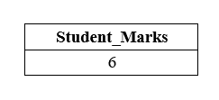

# SQL 计数位置

> 原文：<https://www.javatpoint.com/sql-count-where>

SQL Count()函数也可以与 SELECT 语句中的 WHERE 子句一起使用。

带 WHERE 子句的 Count()只返回表中与 WHERE 子句中指定的条件相匹配的行。

### 带 WHERE 子句的 SQL Count()函数的语法

```

SELECT COUNT(Column_Name) FROM Table_Name WHERE [Condition];

```

### 带有 WHERE 子句的 SQL 计数函数示例

**示例 1:** 首先创建一个表，然后运行 count 函数。

以下 CREATE TABLE 语句创建了包含五个字段的 Cars_Details 表:

```

CREATE TABLE Cars_Details
(
Car_Number INT PRIMARY KEY,
Car_Model INT,
Car_Name VARCHAR (50),
Car_Price INT NOT NULL,
Car_AmountINT NOT NULL
) ;

```

以下插入查询将汽车记录插入汽车详细信息表:

```

INSERT INTO Cars_Details (Car_Number, Car_Model, Car_Name, Car_Amount, Car_Price) 
VALUES (2578, 2018, Creta, 3, 1500000),
(9258, 2019, Audi, 2, 3000000), 
(8233, 2018, Venue, 6, 900000),
(8990, 2018, Nexon, 7, 700000),
(7085, 2020, Mercedes, 6, 8000000),
(1258, 2021, Thar, 2, 1500000),
(2564, 2019, Jaguar, 4, 6000000),
(9578, 2020, Scorpio, 8, 1800000);

```

下面的 SELECT 查询显示了**Cars _ Details**表的数据:

```

SELECT * FROM Cars_Details;

```

| 卡号 | 大屠杀 | 汽车 _ 金额 | 反复无常 |
| Two thousand five hundred and seventy-eight | 白垩 | three | Nine hundred thousand |
| Nine thousand two hundred and fifty-eight | 奥迪 | Two | One million one hundred thousand |
| Eight thousand two hundred and thirty-three | 犯罪地点 | six | Nine hundred thousand |
| Eight thousand nine hundred and ninety | 连锁反应 | seven | Seven hundred thousand |
| Seven thousand and eighty-five | 梅塞德斯 | six | Eight million |
| One thousand two hundred and fifty-eight | 同ＴＡＨＲ | Two | One million five hundred thousand |
| Two thousand five hundred and sixty-four | 美洲虎 | four | Six million |
| Nine thousand five hundred and seventy-eight | 天蝎座的人 | eight | One million eight hundred thousand |

以下查询显示车号大于等于 7000 的汽车的总值:

```

SELECT COUNT(Car_Name) As "Number_of_Cars"FROM Cars_Details WHERE Car_Number >= 7000;

```

**输出:**


**示例 2:** 以下查询使用 CREATE TABLE 语句创建 **College_Student_Details** 表:

```

CREATE TABLE College_Student_Details
(
Student_ID INT NOT NULL, 
Student_Name varchar(100),
Student_Course varchar(50),
Student_Age INT, 
Student_Marks INT
); 

```

以下 SQL 查询使用 INSERT INTO 语句将学生的记录插入到上表中:

```

INSERT INTO College_Student_Details VALUES (101, Anuj, B.tech, 20, 88);
INSERT INTO College_Student_Details VALUES (102, Raman, MCA, 24, 98);
INSERT INTO College_Student_Details VALUES (104, Shyam, BBA, 19, 92);
INSERT INTO College_Student_Details VALUES (107, Vikash, B.tech, 20, 78);
INSERT INTO College_Student_Details VALUES (111, Monu, MBA, 21, 65);
INSERT INTO College_Student_Details VALUES (114, Jones, B.tech, 18, 93);
INSERT INTO College_Student_Details VALUES (121, Parul, BCA, 20, 97);
INSERT INTO College_Student_Details VALUES (123, Divya, B.tech, 21, 89);
INSERT INTO College_Student_Details VALUES (128, Hemant, MBA, 23, 90);
INSERT INTO College_Student_Details VALUES (130, Nidhi, BBA, 20, 88);
INSERT INTO College_Student_Details VALUES (132, Priya, MBA, 22, 99);
INSERT INTO College_Student_Details VALUES (138, Mohit, MCA, 21, 92);

```

让我们使用下面的 SELECT 语句来查看上表的记录:

```

SELECT * FROM College_Student_Details;

```

| 学生标识 | 学生名 | 学生 _ 课程 | 学生 _ 年龄 | 学生分数 |
| One hundred and one | 阿努伊 | B.tech | Twenty | Eighty-eight |
| One hundred and two | 拉曼 | 微通道结构(MicroChannel Architecture) | Twenty-four | Ninety-eight |
| One hundred and four | 嘘！嘘 | BBA | Nineteen | Ninety-two |
| One hundred and seven | 维卡什 | B.tech | Twenty | seventy-eight |
| One hundred and eleven | 联安观察团 | 工商管理硕士 | Twenty-one | Sixty-five |
| One hundred and fourteen | 琼斯 | B.tech | Eighteen | Ninety-three |
| One hundred and twenty-one | 毛 | 喹啉甲酸 | Twenty | Ninety-seven |
| One hundred and twenty-three | 迪维亚 | B.tech | Twenty-one | eighty-nine |
| One hundred and twenty-eight | 赫曼特 | 工商管理硕士 | Twenty-three | Ninety |
| One hundred and thirty | 尼迪 | BBA | Twenty | Eighty-eight |
| One hundred and thirty-two | 普利娅 | 工商管理硕士 | Twenty-two | Ninety-nine |
| One hundred and thirty-eight | 莫伊特 | 微通道结构(MicroChannel Architecture) | Twenty-one | Ninety-two |

以下计数查询显示**学生分数**大于 90 的学生总数:

```

SELECT COUNT(*) As "Number_of_Students"FROM Collge_Student_Details WHERE Student_Marks > 90;

```

**输出:**



* * *