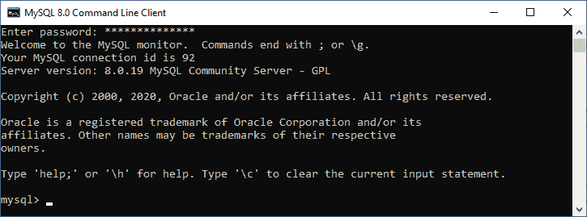
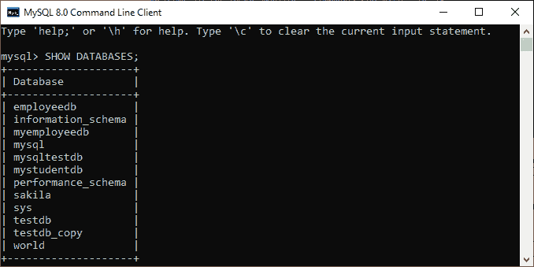
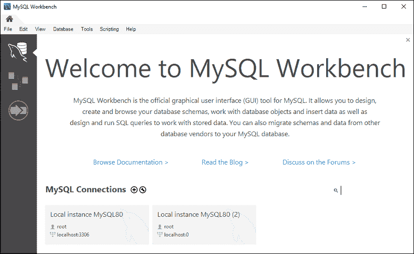
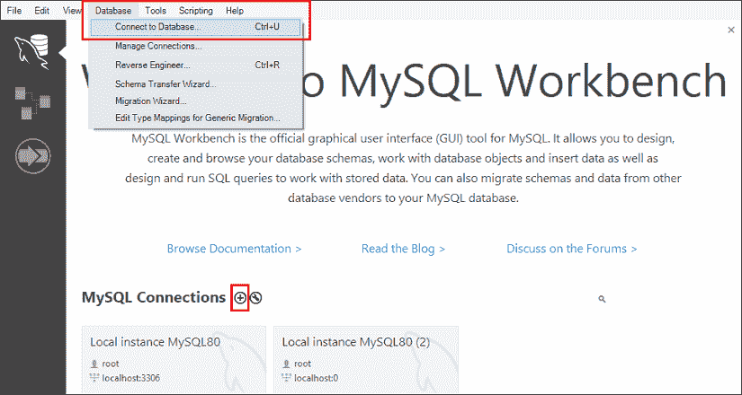
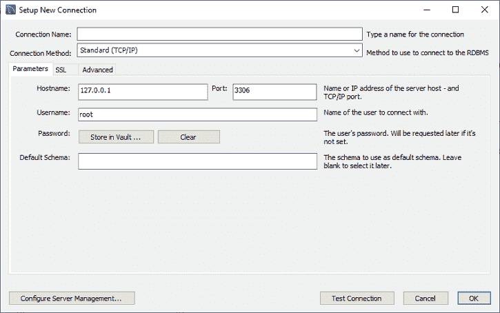
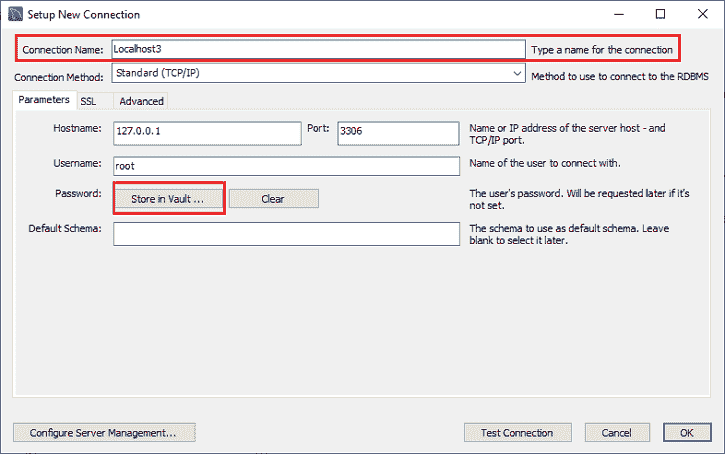
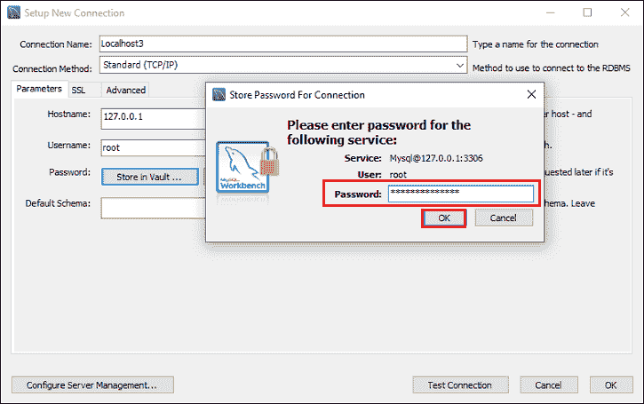
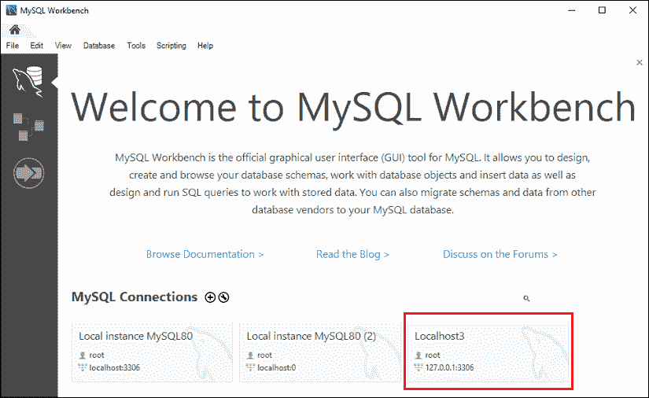
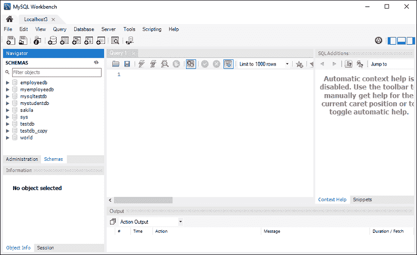

# MySQL 连接

> 原文：<https://www.javatpoint.com/mysql-connection>

连接是允许用户与数据库服务器软件连接的计算机科学设施。**用户可以连接数据库服务器，无论是在同一台机器上还是远程位置**。因此，如果我们想与数据库服务器合作，以结果集的形式发送命令和接收答案，我们需要连接。在本文中，我们将学习如何以各种方式连接到 MySQL Server。

## MySQL 连接类型

MySQL 提供了各种连接数据库服务器的方式。**一旦我们安装了 MySQL Server，我们就可以使用下面列出的任何客户端程序来连接它**:

1.  命令行客户端
2.  MySQL 工作台
3.  PHP 脚本。

### 使用命令行客户端的 MySQL Server 连接

MySQL 命令行客户端程序以交互和非交互模式提供与数据库服务器的交互。我们可以在 MySQL 的安装文件夹的 **bin 目录中看到这个程序。我们可以通过导航到 MySQL 安装文件夹的 bin 目录来打开 MySQL 命令提示符，并键入:**

```sql

MySQL

```

如果我们在**路径**中找到 MySQL 程序，我们可以使用下面的命令连接到 MySQL Server:

```sql

mysql -u root -p

```

在语法中， **-u root 表示**我们将使用 root 用户帐户连接到 MySQL Server， **-p** 指示 MySQL 询问密码。

接下来，我们需要输入根用户帐户的密码，然后按**进入**。如果一切正常，它应该给出如下屏幕:



该屏幕表示我们已经成功连接到 MySQL 数据库服务器，在这里我们可以发送命令并以结果集的形式接收答案。

假设我们想要显示当前服务器中所有可用的数据库；我们可以使用如下命令:

```sql

mysql> SHOW DATABASES;

```

它将给出以下输出:



如果想要**断开打开的 MySQL 数据库服务器**，需要使用 exit 命令。

```sql

mysql> EXIT;

```

### 使用 MySQL 工作台连接到数据库服务器

我们可以通过以下步骤在 workbench 中连接到 MySQL 数据库服务器:

**第一步**:启动 MySQL 工作台。我们应该会看到以下屏幕:



**第二步**:导航至菜单栏，点击**【数据库】**选择**连接数据库**选项或按 **CTRL+U** 命令。我们也可以通过点击 MySQL 连接旁边的**加号(+)按钮**来连接数据库服务器。请参见下图:



**第三步**:选择任意一个选项后，我们会得到如下画面:



**第四步**:填充框创建连接，如**连接名称**、**用户名**，随你便。默认情况下，用户名是**根**，但是我们也可以在用户名文本框中用不同的用户名来更改它。填写完所有框后，点击**储存在金库...按钮**写入给定用户帐户的密码。



**第五步**:我们会出现一个新的窗口写密码，点击**确定**按钮。



**第六步**:输入所有细节后，点击**测试连接**测试数据库连接是否成功。如果连接成功，点击**确定**按钮。


**第 7 步**:再次点击**确定**按钮保存连接设置。完成所有设置后，我们可以在 **MySQL Connections** 下看到这个连接，用于连接到 MySQL 数据库服务器。参见下面的输出，其中我们有 **Localhost3** 连接名称:



**第 8 步**:现在，我们可以点击这个新创建的连接，它显示当前的模式和一个用于输入查询的窗格:



### 使用 PHP 脚本连接到 MySQL Server

使用 PHP 脚本连接 MySQL 数据库服务器最简单的方法就是使用 **mysql_connect()函数**。该函数需要**五个参数**，当连接成功时返回 MySQL 链接标识符。如果连接失败，返回**假**。

**语法**

以下是使用 PHP 脚本的 MySQL 连接的语法:

```sql

connection mysql_connect(server, user, passwordd, new_link, client_flag);

```

**我们来解释一下 mysql_connect()函数参数:**

**服务器**:是运行数据库服务器的主机名称。默认情况下，它的值将是 lcalhost:3306。

**用户**:是访问数据库的用户的名字。如果我们不指定此字段，它将采用默认值，即拥有服务器进程的用户名。

**密码**:是你要访问其数据库的用户的密码。如果我们不指定此字段，它将假定默认值为空密码。

**New_link** :如果我们用 mysql_connect()函数中相同的参数进行第二次调用，mysql 不会建立新的连接。相反，我们将获得已经打开的数据库连接的标识符。

**客户端标志**:该参数包含以下常量的组合:

*   MYSQL_CLIENT_SSL:它使用 SSL 加密。
*   MYSQL _ CLIENT _ CONSTRUCT:它使用压缩协议。
*   MYSQL_CLIENT_IGNORE_SPACE:它在函数名后提供空格。
*   MYSQL_CLIENT_INTERACTIVE:它在关闭连接之前提供了一个超时。

如果我们想要**断开与 MySQL 数据库服务器**的连接，我们可以使用另一个名为**的 PHP 函数 mysql_close()。**它只接受一个参数，该参数将是 mysql_connect()函数返回的连接。其语法如下:

```sql

bool mysql_close ( resource $link_identifier );

```

如果我们不指定任何资源，MySQL 将关闭最后打开的数据库。当连接成功关闭时，此函数返回 true。否则返回 FALSE 值。

**例**

以下示例解释了如何使用 PHP 脚本连接到 MySQL Server:

```sql

<html>
   <head>
      <title>MySQL Server Connection</title>
   </head>
   <body>
      <?php
         $servername = 'localhost:3306';
         $username = 'javatpoint';
         $dbpass = 'jtp123';
         $conn = mysql_connect($servername, $username, $password);        
         if(! $conn ) {
            die('Connection failed: ' . mysql_error());
         }
         echo 'Connection is successful';
         mysql_close($conn);
      ?>
   </body>
</html>  

```

* * *