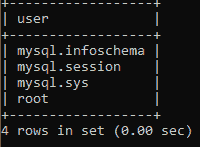
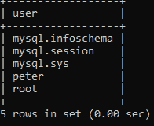

# MySQL 创建用户

> 原文：<https://www.javatpoint.com/mysql-create-user>

MySQL 用户是 MySQL 服务器的 **USER** 表中的记录，包含 MySQL 帐户的登录信息、帐户权限和主机信息。在 MySQL 中创建一个用户来访问和管理数据库是至关重要的。

MySQL Create User 语句允许我们在数据库服务器中创建新的用户帐户。它为新帐户提供身份验证、SSL/TLS、资源限制、角色和密码管理属性。它还使我们能够控制最初应该锁定或解锁的帐户。

如果要使用创建用户，需要有创建用户语句的**全局**权限，或者 MySQL 系统模式的**插入**权限。当您创建一个已经存在的用户时，它会给出一个错误。但是如果使用， **IF NOT EXISTS** 子句，该语句会为每个已经存在的命名用户给出警告，而不是错误消息。

## 为什么用户要求在 MySQL 服务器上？

当 MySQL 服务器安装完成后，它只有一个 **ROOT** 用户帐户来访问和管理数据库。但是，有时，您希望将数据库访问权授予其他人，而不授予他们完全控制权。在这种情况下，您将创建一个非根用户，并授予他们访问和修改数据库的特定权限。

**语法**

以下语法用于在数据库服务器中创建用户。

```

CREATE USER [IF NOT EXISTS] account_name IDENTIFIED BY 'password';

```

在上面的语法中，**账户名**有两部分一个是**用户名**，另一个是**主机名**，中间用 **@** 符号隔开。这里，用户名是用户的名称，主机名是用户可以从其连接到数据库服务器的主机的名称。

```

username@hostname

```

主机名是可选的。如果您没有给出主机名，用户可以从服务器上的任何主机进行连接。没有主机名的用户帐户名可以写成:

```

username@%

```

#### 注意:“创建用户”会创建一个具有完全访问权限的新用户。所以，如果你想给用户特权，就需要使用 GRANT 语句。

## MySQL 创建用户示例

以下是在 MySQL 服务器数据库中创建新用户所需的步骤。

**第一步:**使用 **mysql 客户端工具**打开 MySQL 服务器。

**第二步:**输入账户密码，按回车键。

```

Enter Password: ********

```

**第三步:**执行以下命令，显示当前 MySQL 服务器中的所有用户。

```

mysql> select user from mysql.user;

```

我们将获得如下输出:



**步骤 4:** 使用以下命令创建新用户。

```

mysql> create user peter@localhost identified by 'jtp12345';

```

现在，运行命令再次显示所有用户。



在上面的输出中，我们可以看到用户**彼得**已经创建成功。

**步骤 5:** 现在，我们将使用 IF NOT EXISTS 子句和 CREATE USER 语句。

```

mysql> CREATE USER IF NOT EXISTS adam@localhost IDENTIFIED BY 'jtp123456';

```

## 授予新用户权限

MySQL 服务器为新用户帐户提供多种类型的权限。下面给出了一些最常用的权限:

1.  **所有权限:**它允许新用户帐户的所有权限。
2.  **CREATE:** 它使用户帐户能够创建数据库和表。
3.  **DROP:** 它使用户帐户能够删除数据库和表。
4.  **DELETE:** 使用户账户可以从特定的表中删除行。
5.  **INSERT:** 它使用户帐户能够向特定的表中插入行。
6.  **SELECT:** 使用户账户可以读取数据库。
7.  **更新:**使用户账户能够更新表格行。

如果您想将所有权限授予新创建的用户，请执行以下命令。

```

mysql> GRANT ALL PRIVILEGES ON * . * TO peter@localhost;

```

如果您想赋予新创建的用户特定的权限，请执行以下命令。

```

mysql> GRANT CREATE, SELECT, INSERT ON * . * TO peter@localhost;

```

有时候，你想**刷新**一个用户账户的所有权限，对于立即发生的变化，键入以下命令。

```

FLUSH PRIVILEGES;

```

如果您想查看用户的现有权限，请执行以下命令。

```

mysql> SHOW GRANTS for username;

```

* * *