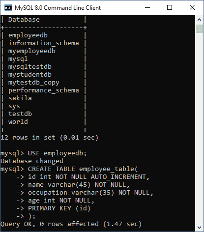
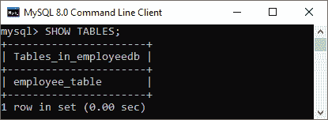
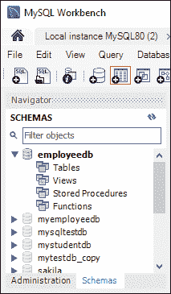
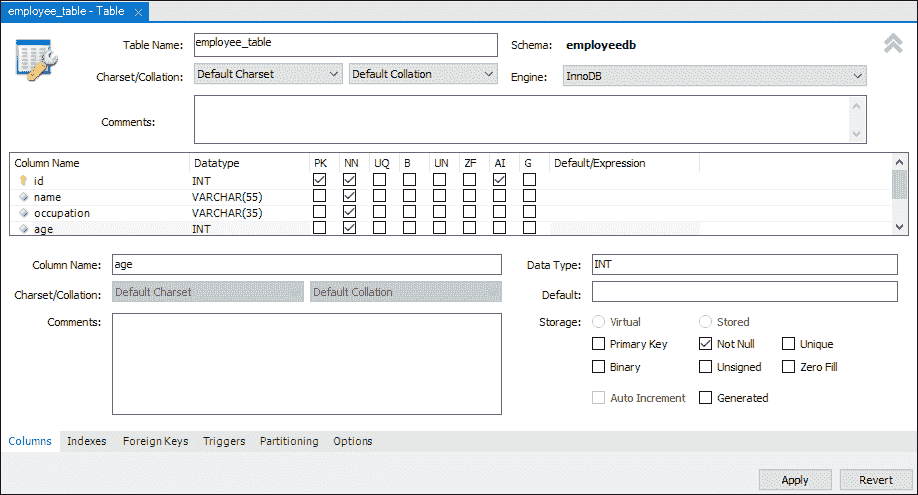
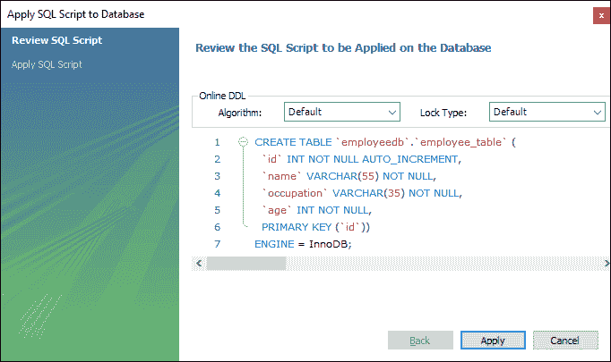
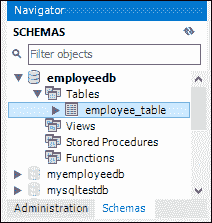

# MySQL CREATE TABLE

> 原文：<https://www.javatpoint.com/mysql-create-table>

表格用于以行和列的形式组织数据，并用于以结构格式存储和显示记录。它类似于电子表格应用程序中的工作表。一个表创建命令需要**三样东西**:

*   表的名称
*   字段名称
*   每个字段的定义

MySQL 允许我们创建一个表进入数据库主要有**两种方式**:

1.  MySQL 命令行客户端
2.  MySQL 工作台

### MySQL 命令行客户端

[MySQL](https://www.javatpoint.com/mysql-tutorial) 允许我们使用 **[CREATE TABLE](https://www.javatpoint.com/mysql-create-table)** 命令在数据库中创建一个表。以下是在数据库中创建 MySQL 表的通用**语法**。

```
CREATE TABLE [IF NOT EXISTS] table_name(
	column_definition1,
	column_definition2,
	........,
	table_constraints
);

```

**参数说明**

上述语法的参数描述如下:

| 参数 | 描述 |
| 数据库名称 | 这是一个新表的名称。它在我们选择的 MySQL 数据库中应该是唯一的。当我们在已经存在的所选数据库中创建一个表时， **IF NOT EXIST** 子句避免了一个错误。 |
| 列定义 | 它指定列的名称以及每列的数据类型。表定义中的列由逗号运算符分隔。列定义的语法如下:
**列 _ 名称 1 数据 _ 类型(大小)【空&#124;非空】** |
| 表 _ 约束 | 它指定了表约束，如主键、唯一键、外键、检查等。 |

**例**

让我们通过一个例子来了解如何在数据库中创建一个表。打开 MySQL 控制台，写下密码，如果我们在安装过程中设置过的话。现在打开要在其中创建表的数据库。在这里，我们将使用以下语句在数据库**“employeedb”**中创建一个表名**“employee _ table”**:

```
mysql> CREATE TABLE employee_table(
	id int NOT NULL AUTO_INCREMENT,
	name varchar(45) NOT NULL,
	occupation varchar(35) NOT NULL,
	age int NOT NULL,
	PRIMARY KEY (id)
);

```

#### 注:
1。这里，NOT NULL 是一个字段属性，使用它是因为我们不希望这个字段为 NULL。如果我们试图创建一个空值的记录，那么 MySQL 将会产生一个错误。
2。字段属性 AUTO _ INVENTION 指定 MySQL 继续，并将下一个可用的数字添加到 id 字段中。主键用于定义列的唯一性。我们可以使用由逗号分隔的多个列来定义主键。

**创建 MySQL 表的可视化表示:**



我们需要使用以下命令来查看新创建的表:

```
mysql> SHOW TABLES;

```

它看起来像下面的输出:



**见表结构:**

我们可以使用以下命令来查看新创建的表的信息或结构:

```
mysql> DESCRIBE employee_table;

```

它看起来像这样:


### 使用 MySQL 工作台创建表

它是一个可视化的图形用户界面工具，用于快速有效地创建数据库、表、索引、视图和存储过程。要使用这个工具创建一个新的数据库，我们首先需要启动 [MySQL 工作台](https://www.javatpoint.com/mysql-workbench)，并使用您想要的用户名和密码登录。它将显示以下屏幕:


现在执行以下创建表的步骤:

1.进入导航标签，点击**模式菜单**。在这里，我们可以看到所有以前创建的数据库。现在我们准备好选择在其中创建表的数据库。

2.选择数据库，双击它，我们会得到数据库下的子菜单。这些**子菜单**是表格、视图、函数和存储过程，如下图所示。



3.选择表格子菜单，右键点击，选择**创建表格**选项。我们还可以点击创建新表格图标(显示为红色矩形)来创建表格。

4.在新表格屏幕上，我们需要填写所有细节来创建表格。在这里，我们将输入表名(**例如**、employee_table)，并使用默认的排序规则和引擎。

5.在中间窗口内单击并填写列详细信息。这里，列名包含主键(PK)、非空(NN)、唯一索引(UI)、二进制(B)、无符号数据类型(UN)、自动增量(AI)等多种属性。下面的屏幕解释得更清楚了。填写完所有细节后，点击**应用**按钮。



6.一旦您单击应用按钮，它将打开 SQL 语句窗口。再次点击应用按钮执行语句，点击**完成**按钮保存更改。



7.现在，转到模式菜单，选择包含新创建的表的数据库，如下图所示。



* * *