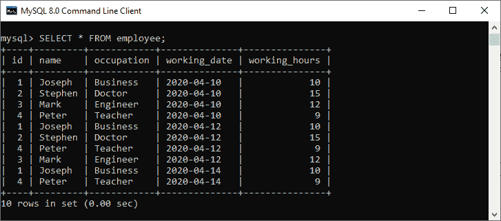
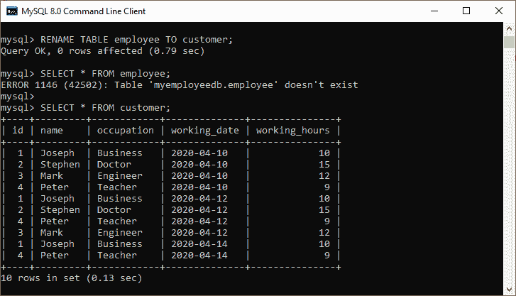
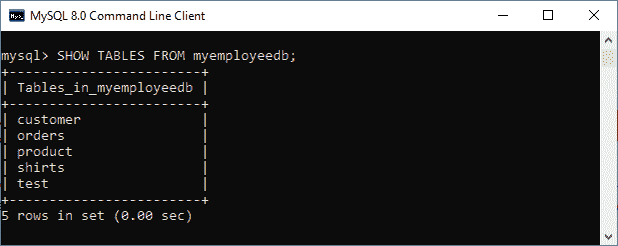
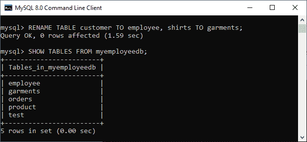

# MySQL 重命名表

> 原文：<https://www.javatpoint.com/mysql-rename-table>

有时我们的表名没有意义，所以需要重命名或更改表名。MySQL 提供了一种有用的语法，可以重命名当前数据库中的一个或多个表。

### 句法

以下是用于更改表名的语法:

```sql

mysql> RENAME old_table TO new_table;

```

这里我们要确定 **new_table_name** 一定不存在， **old_table_name** 应该存在于数据库中。否则，它将抛出一条错误消息。这是为了确保在执行此语句之前，表没有被锁定，也没有活动的事务。

#### 注意:如果我们使用 RENAME TABLE 语句，它需要对现有表具有 ALTER 和 DROP TABLE 权限。此外，此语句不能更改临时表的名称。

我们也可以使用 MySQL **RENAME TABLE** 语句，用一条语句更改多个表名，如下所示:

```sql

RENAME TABLE old_tab1 TO new_tab1,
             old_tab2 TO new_tab2, old_tab3 TO new_tab3; 

```

从 **MySQL 8.0.13** 版本开始，我们可以用 LOCK 语句更改锁定的旧表名，并且还使用了 WRITE LOCK 子句。例如，以下是有效的语句:

```sql

mysql> LOCK TABLE old_tab_name1 WRITE;
RENAME TABLE old_tab_name1 TO new_tab_name1,
             new_tab_name1 TO new_tab_name2;

```

不允许使用以下语句:

```sql

mysql> LOCK TABLE old_tab_name1 READ;
RENAME TABLE old_tab_name1 TO new_tab_name1,
             new_tab_name1 TO new_tab_name2;

```

在 MySQL 8.0.13 版本之前，我们不能更改用 LOCK TABLE 语句锁定的表名。

MySQL 还使用 RENAME TABLE 语句将一个表从一个数据库移动到另一个数据库，如下所示:

```sql

mysql> RENAME TABLE current_db.tablel_name TO other_db.tablel_name;

```

### MySQL 重命名表示例

让我们通过各种例子来理解 RENAME TABLE 语句在 MySQL 中是如何工作的。假设我们有一个名为 **EMPLOYEE** 的表，由于某种原因，需要将其更改为名为 **CUSTOMER** 的表。

**表名:员工**



接下来，执行以下语法来更改表名:

```sql

mysql> RENAME employee TO customer;

```

**输出**

我们将看到名为“employee”的表将被更改为新的表名“customer”:



在上面的输出中，我们可以看到，如果我们在执行 RENAME TABLE 语句后使用表名 employee，它将抛出一条错误消息。

### 如何重命名多个表

MySQL 中的 RENAME TABLE 语句还允许我们在一条语句中更改多个表名。请参见以下声明:

假设我们的数据库“ **myemployeedb** ”具有以下表格:



如果我们想将表名客户更改为员工，将表名衬衫更改为服装，请执行以下语句:

```sql

mysql> RENAME TABLE customer TO employee, shirts TO garments;

```

**输出**

我们可以看到，表名顾客转化为员工和表名衬衫转化为服装已经成功更名。



### 使用 ALTER 语句重命名表

ALTER TABLE 语句也可以用来重命名当前数据库中的现有表。以下是 ALTER TABLE 语句的语法:

```sql

ALTER TABLE old_table_name RENAME TO new_table_name;

```

请参见以下查询，该查询将现有的表名服装更改为新的表名衬衫:

```sql

mysql> ALTER TABLE garments RENAME TO shirts:

```

**输出**

在这里，我们可以看到，表名服装更名为表名衬衫。


### 如何重命名临时表

临时表允许我们保留临时数据，这些数据仅在当前会话中可见且可访问。因此，首先，我们需要使用以下语句创建一个临时表:

```sql

mysql> CREATE TEMPORARY TABLE Students( name VARCHAR(40) NOT NULL, total_marks DECIMAL(12,2) NOT NULL DEFAULT 0.00, total_subjects INT UNSIGNED NOT NULL DEFAULT 0);  

```

接下来，在该表中插入值:

```sql

mysql> INSERT INTO Students(name, total_marks, total_subjects) VALUES ('Joseph', 150.75, 2), ('Peter', 180.75, 2);

```

接下来，运行 show table 命令来检查临时表:

```sql

mysql> SELECT * FROM Students;

```

现在，运行以下命令来更改临时表的名称:

```sql

mysql> RENAME TABLE Students TO student_info;

```

它将抛出一条错误消息，如下所示:


因此，MySQL 允许 ALTER table 语句重命名临时表:

```sql

mysql> ALTER TABLE Students RENAME TO student_info;

```

**输出**


* * *