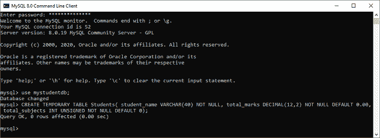
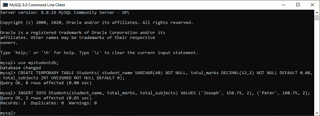
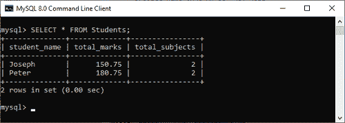
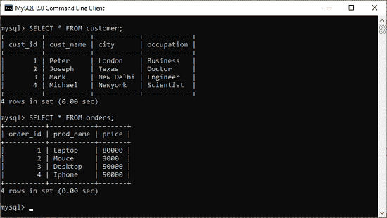

# MySQL 临时表

> 原文：<https://www.javatpoint.com/mysql-temporary-table>

MySQL 有一个功能，可以创建一个名为**临时表**的特殊表，允许我们**保存临时数据**。我们可以在特定会话中多次重用这个表。从【3.23 版及以上版本的用户可以在 MySQL 中使用，所以如果我们使用旧版本，这个表就不能使用了。此表仅在**当前会话**中可见且可访问。只要当前会话关闭或用户终止连接，MySQL 就会自动删除该表。我们也可以使用 **[DROP TABLE](https://www.javatpoint.com/mysql-drop-table)** 命令，在用户不打算使用该表时，明确删除该表。

如果我们使用一个 **[PHP](https://www.javatpoint.com/php-tutorial) 脚本**来运行代码，只要脚本执行完毕，这个表就会自动删除。如果用户通过 MySQL 客户端与服务器连接，则该表将一直存在，直到用户关闭 MySQL 客户端程序或终止连接或手动删除该表。

临时表提供了一个非常有用和灵活的功能，允许我们快速完成复杂的任务，例如当我们查询需要带有 [JOIN](https://www.javatpoint.com/mysql-join) 子句的单个 [SELECT 语句](https://www.javatpoint.com/mysql-select)的数据时。在这里，用户可以使用这个表来保存输出，并执行另一个查询来处理它。

[MySQL](https://www.javatpoint.com/mysql-tutorial) 中的一个临时表有很多特性，如下所示:

*   MySQL 使用 CREATE TEMPORARY TABLE 语句来创建一个临时表。
*   此语句只能在 MySQL Server 拥有 CREATE TEMPORARY TABLES 权限时使用。
*   创建它的客户端可以看到并访问它，这意味着两个不同的客户端可以使用同名的临时表，而不会相互冲突。因为这个表只能被创建它的客户看到。因此，用户不能在同一个会话中创建两个同名的临时表。
*   当用户关闭会话或手动终止连接时，MySQL 中的一个临时表将被自动删除。
*   用户可以创建一个与数据库中普通表同名的临时表。例如，如果用户创建了一个名为 student 的临时表，那么现有的 student 表将无法访问。因此，用户对学生表执行任何查询，现在将引用临时学生表。当用户移除临时表时，永久学生表再次变得可访问。

### 创建临时表的语法

在 MySQL 中，创建临时表的语法与创建普通表语句的语法相同，除了 TEMPLATE 关键字。让我们看看下面创建临时表的语句:

```

mysql> CREATE TEMPORARY TABLE table_name (
   column_1, column_2, ..., table_constraints
);

```

如果用户想要创建一个结构与数据库中现有表相同的临时表，则不能使用上面的语句。相反，我们使用下面给出的语法:

```

Mysql> CREATE TEMPORARY TABLE temporary_table_name SELECT * FROM original_table_name LIMIT 0;

```

### MySQL 临时表示例

让我们了解如何在 MySQL 中创建临时表。执行以下语句，在选定的数据库中创建临时表:

```

mysql> CREATE TEMPORARY TABLE Students( student_name VARCHAR(40) NOT NULL, total_marks DECIMAL(12,2) NOT NULL DEFAULT 0.00, total_subjects INT UNSIGNED NOT NULL DEFAULT 0);

```

我们可以看到下图:



接下来，我们需要在临时表中插入值:

```

mysql>INSERT INTO Students(student_name, total_marks, total_subjects) VALUES ('Joseph', 150.75, 2), ('Peter', 180.75, 2);

```

执行上述语句后，它将给出以下输出:



现在，运行以下查询来获得结果:

```

mysql> SELECT * FROM Students;

```

成功执行上述语句后，我们将获得如下输出:



需要注意的是，当我们运行一个 **[SHOW TABLES](https://www.javatpoint.com/mysql-show-list-tables)** 命令时，那么我们的临时表将不会显示在列表中。此外，如果我们关闭当前会话，然后执行 SELECT 语句，我们将收到一条消息，说数据库中没有可用的数据，甚至临时表也不存在。

### 其结构基于普通表的临时表

在本例中，我们将创建一个临时表，其结构基于数据库中已经可用的表。

假设我们的数据库有如下永久表:



这里，临时表的结构是通过使用 SELECT 语句创建的，并使用 INNER JOIN 子句合并两个表，然后根据价格对它们进行排序。在 MySQL 提示符下编写以下语句:

```

CREATE TEMPORARY TABLE temp_customers
SELECT c.cust_name, c.city, o.prod_name, o.price 
FROM orders o
INNER JOIN customer c ON c.cust_id = o.order_id
ORDER BY o.price DESC;

```

当我们执行上面的语句时，我们将得到以下消息:


现在，运行以下命令查看临时表:

```

mysql> SELECT * FROM temp_customers;

```


我们也可以从上面的临时表“ **temp_customers** ”中进行查询，类似于从永久表中查询数据。以下查询更清楚地解释了这一点:

```

Mysql> SELECT cust_name, prod_name, price FROM temp_customers;

```

执行上述语句后，它将给出如下输出:


#### 注意:我们可以使用 IF NOT EXISTS 关键字来避免“表已经存在”的错误。

### 如何在 MySQL 中删除临时表

MySQL 允许我们使用 [DROP TABLE](https://www.javatpoint.com/mysql-drop-table) 语句删除临时表。但是，在 DROP TABLE 语句中使用**临时**关键字是一个很好的做法。这个关键字帮助我们避免在当前会话中临时表和永久表同名时删除永久表的错误。因此，建议使用以下查询来删除临时表:

```

mysql> DROP TEMPORARY TABLE table_name;

```

该查询不会删除数据库的永久表，这意味着它只删除临时表。如果我们试图用这个语句删除一个永久表，它会抛出一个错误消息，说您正在删除的表是未知的。例如，如果我们想删除上面的临时表“temp_customers”，我们需要使用以下语句:

```

mysql> DROP TEMPORARY TABLE top_customers;

```

* * *