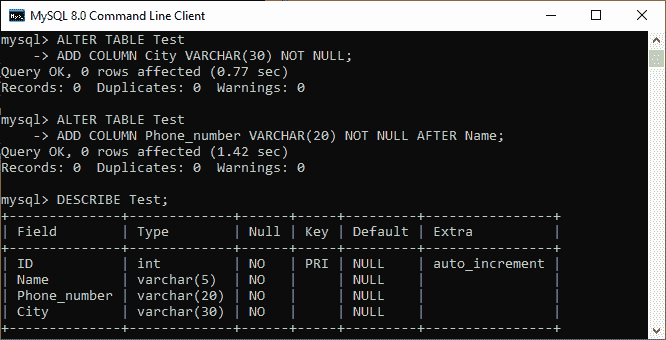
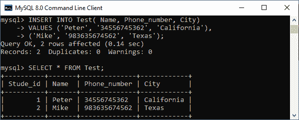
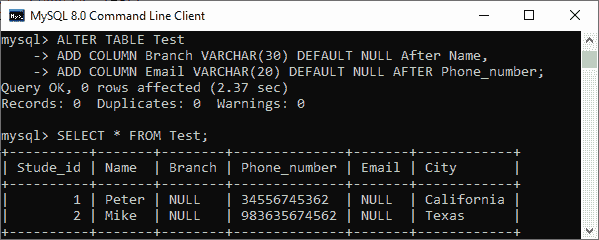
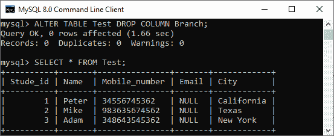

# MySQL 添加/删除列

> 原文：<https://www.javatpoint.com/mysql-add-delete-column>

列是表格中可能包含文本、数字和图像的一系列单元格。每列为表中的每一行存储一个值。在本节中，我们将讨论如何在现有表中添加或删除列。

### 如何在 MySQL 表中增加一列？

[MySQL](https://www.javatpoint.com/mysql-tutorial) 允许 **ALTER TABLE ADD COLUMN** 命令向现有表添加新列。以下是执行此操作的语法:

```sql

ALTER TABLE table_name 
	ADD COLUMN column_name column_definition [FIRST|AFTER existing_column];

```

在上图中，

*   首先，我们需要指定表名。
*   接下来，在 ADD COLUMN 子句之后，我们必须指定新列的名称及其定义。
*   最后，我们需要指定 FIRST 或 AFTER 关键字。FIRST 关键字用于将列添加为表的第一列。AFTER 关键字用于在现有列之后添加新列。如果我们没有提供这些关键字，默认情况下，MySQL 会将新列添加为表中的最后一列。

有时需要在现有表格中增加**多列**。然后，我们可以使用如下语法:

```sql

ALTER TABLE table_name 
	ADD COLUMN column_name1 column_definition [FIRST|AFTER existing_column],
	ADD COLUMN column_name2 column_definition [FIRST|AFTER existing_column];

```

### MySQL 添加列示例

让我们借助各种例子来理解它。这里，我们将使用以下语句创建一个名为**“Test”**的表:

```sql

CREATE TABLE Test (
	Stude_id int AUTO_INCREMENT PRIMARY KEY,
	Name varchar(55) NOT NULL
);

```

表格结构如下图所示:


创建表后，我们希望向测试表中添加一个名为 City 的新列。由于我们没有在列名之后明确指定新的列位置，MySQL 将把它作为最后一列添加。

```sql

ALTER TABLE Test 
ADD COLUMN City VARCHAR(30) NOT NULL;

```

接下来，我们要在**测试**表中添加一个名为**电话号码**的新列。这一次，我们将明确指定新的列位置，以便 MySQL 将该列添加到指定的位置。

```sql

ALTER TABLE Test 
ADD COLUMN Phone_number VARCHAR(20) NOT NULL AFTER Name;

```

在下面的输出中，我们可以看到这两列在指定位置成功添加。



让我们使用 [INSERT 语句](https://www.javatpoint.com/mysql-insert)将一些数据添加到测试表中，如下所示:

```sql

INSERT INTO Test( Name, Phone_number, City) 
VALUES ('Peter', '34556745362', 'California'),
('Mike', '983635674562', 'Texas');

```

会是这样的。



假设我们想在测试表中添加多个列**(分支，电子邮件)**。在这种情况下，执行如下语句:

```sql

ALTER TABLE Test 
ADD COLUMN Branch VARCHAR(30) DEFAULT NULL After Name,
ADD COLUMN Email VARCHAR(20) DEFAULT NULL AFTER Phone_number;

```

需要注意的是，“分支”和“电子邮件”列被赋予默认值**空值**。但是，测试表已经有了数据，所以 MySQL 将对这些新列使用空值。

我们可以验证测试表中的记录，如下所示:



如果我们不小心用现有的列名添加了一个新的列，MySQL 会**抛出一个错误**。例如，执行以下发出错误的语句:

```sql

ALTER TABLE Test 
ADD COLUMN City VARCHAR(30) NOT NULL;

```

我们将收到以下错误消息。


### 如何重命名 MySQL 表中的一列？

MySQL 允许 **ALTER TABLE CHANGE COLUMN** 语句用新名称更改旧列。以下是执行此操作的语法:

```sql

ALTER TABLE table_name 
	CHANGE COLUMN old_column_name new_column_name column_definition [FIRST|AFTER existing_column];

```

在上图中，

*   首先，我们需要指定表名。
*   接下来，在 CHANGE COLUMN 子句之后，我们必须指定旧的列名和新的列名及其定义。我们必须指定列定义，即使它不会改变。
*   最后，我们需要指定 FIRST 或 AFTER 关键字。当我们需要在特定位置更改列名时，它是可选的。

**MySQL RENAME COLUMN 示例**

这个例子展示了我们如何更改 MySQL 表中的列名:

```sql

ALTER TABLE Test
  CHANGE COLUMN Phone_number Mobile_number
    varchar(20) NOT NULL;

```

该语句将测试表中的列名**电话号码**更改为新名称**手机号码**。下面的输出解释得更清楚。


### 如何从 MySQL 表中删除一列？

有时，我们希望从表中删除一列或多列。MySQL 允许 **ALTER TABLE DROP COLUMN** 语句从表中删除该列。以下是执行此操作的语法:

```sql

ALTER TABLE table_name 	DROP COLUMN column_name;

```

在上图中，

*   首先，我们需要指定要从中删除列的**表名**。
*   接下来，在 **DROP COLUMN** 子句之后，我们必须指定要从表中删除的列名。需要注意的是，COLUMN 关键字在 DROP COLUMN 子句中是可选的。

如果我们想从表中删除**多列**，请执行以下语句:

```sql

ALTER TABLE table_name
DROP COLUMN column_1,
DROP COLUMN column_2,
......;

```

**MySQL DROP COLUMN 示例**

这个例子解释了我们如何从 MySQL 表中删除一列。在这里，我们将采取一个表格**“测试”**我们已经创建较早，看起来像下图:


假设我们想从测试表中删除一个列名**“分支”**。为此，请执行以下语句:

```sql

ALTER TABLE Test DROP COLUMN Branch;

```

成功执行后，我们可以验证下面的结果，其中从表中删除了一个列分支:



在某些情况下，需要从表中删除多列。为此，我们需要执行以下语句:

```sql

ALTER TABLE Test
	DROP COLUMN Mobile_number,
	DROP COLUMN Email;

```

该命令将删除这两列。我们可以使用下图中给出的查询进行验证。


**从表中删除一列前，记住以下要点:**

MySQL 使用关系数据库，其中一个表的模式可以依赖于另一个表的列。因此，当我们从一个表中删除一列时，它也会影响所有相关的表。删除列时，请考虑以下几点:

*   当我们从表中删除列时，它将影响所有关联的对象，如触发器、存储过程和视图。假设我们删除了触发器中引用的一列。删除该列后，触发器将失效。
*   被删除的列依赖于其他应用程序代码，也必须被更改，这需要时间和精力。
*   当我们从大型表中删除一列时，它将影响数据库在删除期间的性能。

* * *