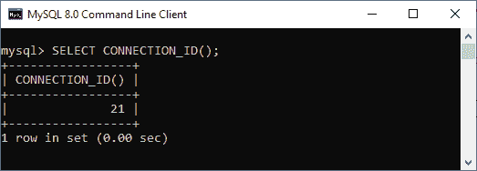
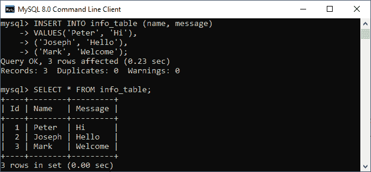
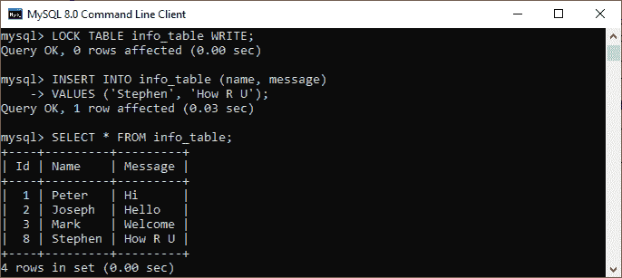

# MySQL 表锁定

> 原文：<https://www.javatpoint.com/mysql-table-locking>

锁是一种与表相关联的机制，用于限制对表中数据的未授权访问。 **MySQL 允许客户端会话显式获取表锁，以配合其他会话访问表的数据**。MySQL 还允许表锁定，以防止在特定时期内对同一表进行未经授权的修改。

MySQL 中的会话只能为自己获取或释放表上的锁。因此，一个会话不能为其他会话获取或释放表锁。需要注意的是，我们必须拥有表锁定和表锁定选择权限。

MySQL 中的锁表主要是**用来解决并发问题**。它将在运行事务时使用，即首先从表(数据库)中读取一个值，然后将其写入表(数据库)。

[MySQL](https://www.javatpoint.com/mysql-tutorial) 提供**两种锁**到桌子上，分别是:

**读取锁:**该锁允许用户仅从表中读取数据。

**写锁:**该锁允许用户对表进行读写操作。

需要注意的是，MySQL 中使用的默认存储引擎是 InnoDB。InnoDB 存储引擎不需要手动锁定表，因为 MySQL 会自动对 InnoDB 表使用行级锁定。因此，我们可以在同一个表上同时执行多个事务来进行读写操作，而无需让彼此等待。所有其他存储引擎都使用 MySQL 中的表锁定。

在理解表锁定概念之前，首先，我们将使用如下语句创建一个名为“ **info_table** ”的新表:

```

CREATE TABLE info_table ( 
    Id INT NOT NULL AUTO_INCREMENT, 
    Name VARCHAR(50) NOT NULL, 
    Message VARCHAR(80) NOT NULL,
    PRIMARY KEY (Id) 
);

```

### MySQL LOCK TABLES 语句

以下是允许我们显式获取表锁的语法:

```

LOCK TABLES table_name [READ | WRITE];

```

在上面的语法中，我们在**锁定表**关键字后指定了要获取锁的**表名**。我们可以指定**锁类型**，读或写。

我们还可以通过使用带有锁类型的逗号分隔的表名列表来锁定 MySQL 中的多个表。请参见以下语法:

```

LOCK TABLES tab_name1 [READ | WRITE], 
            tab_name2 [READ | WRITE],...... ;

```

### MySQL 解锁表语句

以下是允许我们**为 MySQL 中的一个表释放锁**的语法:

```

mysql> UNLOCK TABLES;

```

## 锁定类型

让我们详细了解锁的类型。

### 读取锁

以下是读取锁的特性:

*   同时，MySQL 允许多个会话获取一个表的 READ 锁。并且所有其他会话都可以读取该表，而无需获取锁。
*   如果会话持有表的读锁，它们就不能对表执行写操作。这是因为 READ 锁只能从表中读取数据。所有其他未获得读取锁的会话都无法在不释放读取锁的情况下将数据写入表中。写操作进入等待状态，直到我们没有释放读锁。
*   当会话正常或异常终止时，MySQL 隐式释放表的所有类型的锁。该特性也与写锁相关。

让我们举个例子来看看在给定的场景下，读取锁在 MySQL 中是如何工作的。我们将首先连接到数据库，并使用 **CONNECTION_ID()** 函数，该函数在第一个会话中给出当前的连接 ID，如下所示:

```

mysql> SELECT CONNECTION_ID();

```

请参见以下输出:



接下来，我们将使用下面的语句在 **info_table** 中插入几行:

```

mysql> INSERT INTO info_table (name, message) 
VALUES('Peter', 'Hi'),
('Joseph', 'Hello'),
('Mark', 'Welcome');

```

现在，使用下面的语句验证表中的数据:

```

mysql> SELECT * FROM info_table;

```

我们应该看到如下输出:



现在，我们将执行 LOCK TABLE 语句来获取该表的锁:

```

mysql> LOCK TABLE info_table READ;

```

之后，我们将尝试在 info_table 中插入一条新记录，如下所示:

```

mysql> INSERT INTO info_table (name, message) 
VALUES ('Suzi', 'Hi');

```

我们将获得以下输出，其中 MySQL 发出以下消息**“表‘info _ Table’被读取锁锁定，无法更新”**。


因此，我们可以看到，一旦对表获取了 READ 锁，我们就不能在同一个会话中向表中写入数据。

现在，我们将从不同的会话检查 READ 锁是如何工作的。首先，我们将连接到数据库并查看连接 id:


接下来，我们将查询 info_table 中的数据，该表返回如下输出:


然后，在该表中插入一些行，如下所示:

```

mysql> INSERT INTO info_table (name, message) 
VALUES ('Stephen', 'Hello');

```

我们应该看到如下输出:


在上面的输出中，我们可以看到第二个会话的插入操作处于**等待状态**。这是由于 READ 锁造成的，第一个会话已经在表上获取了该锁，但尚未释放。

在第一个会话中，我们可以使用 **SHOW PROCESSLIST** 语句看到关于它们的详细信息。请参见以下输出:


最后，我们需要在第一个会话中使用 **UNLOCK TABLES** 语句来释放锁。现在，我们能够在第二个会话中执行 INSERT 操作。

### 写锁

以下是写锁的特性:

*   它是持有表锁的会话，可以从表中读取和写入数据。
*   它是唯一一个通过持有锁来访问表的会话。并且所有其他会话都不能访问该表的数据，直到 WRITE 锁被释放。

让我们举一个例子，看看在给定的场景下，WRITE 锁在 MySQL 中是如何工作的。在第一个会话中，我们将使用下面的语句获取一个写锁:

```

mysql> LOCK TABLE info_table WRITE;

```

然后，我们将在 info_table 中插入一条新记录，如下所示:

```

mysql> INSERT INTO info_table (name, message) 
VALUES ('Stephen', 'How R U');

```

上述说法奏效了。现在，我们可以使用 SELECT 语句来验证输出:



同样，我们将尝试从第二个会话访问(读/写)该表:

```

INSERT INTO info_table (name, message) 
VALUES ('George', 'Welcome');

SELECT * FROM info_table;

```

我们可以看到，这些操作被置于等待状态。使用 SHOW PROCESSLIST 语句查看有关它们的详细信息:


最后，我们将从第一个会话中释放锁。现在，我们可以执行挂起的操作。

### 读锁定与写锁定

*   读锁类似于“**”共享的**”锁，因为多个线程可以同时获取。
*   写锁是“**独占的**锁，因为另一个线程无法读取它。
*   我们不能同时在表上提供读写锁。
*   读锁的**优先级比写锁低**，这样可以确保尽快更新。

* * *