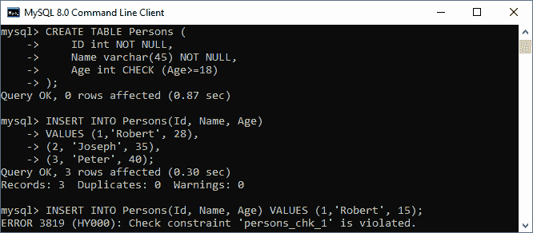
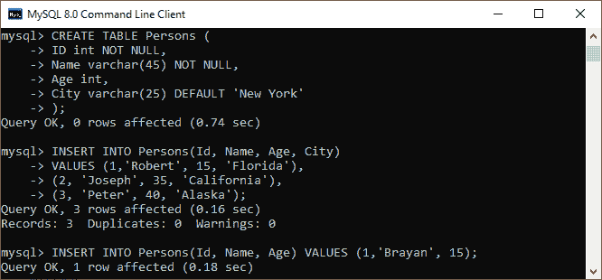
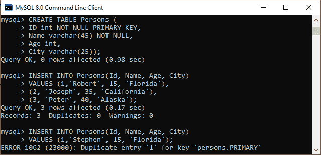
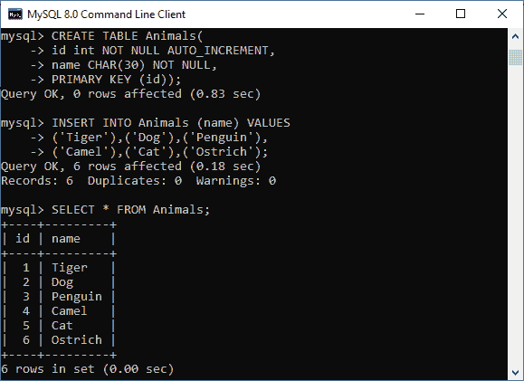
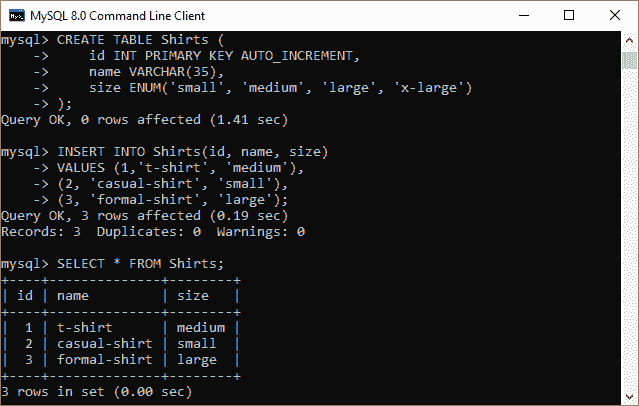
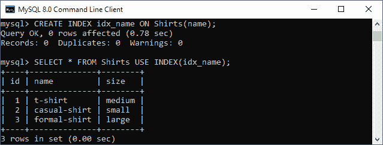
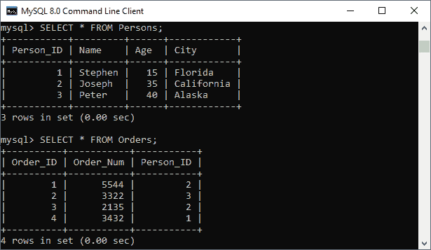

# MySQL 约束

> 原文：<https://www.javatpoint.com/mysql-constraints>

MySQL 中的约束用于指定允许或限制表中存储哪些值/数据的规则。它们提供了一种合适的方法来确保表内数据的准确性和完整性。它还有助于限制将插入表中的数据类型。如果约束和数据操作之间发生任何中断，则操作失败。

### MySQL 约束的类型

MySQL 中的约束分为两种类型:

1.  **列级约束:**这些约束仅应用于限制特定列数据类型的单个列。
2.  **表级约束:**这些约束应用于整个表，限制了整个表的数据类型。

### 如何在 MySQL 中创建约束

我们可以在使用 CREATE TABLE 语句创建的表中定义约束。MySQL 还使用 ALTER TABLE 语句来指定现有表模式情况下的约束。

### 句法

以下是在表中创建约束的语法:

```sql

CREATE TABLE new_table_name (
    col_name1 datatype constraint,
    col_name2 datatype constraint,
    col_name3 datatype constraint,
    .........
);

```

### MySQL 中使用的约束

以下是 MySQL 中最常用的约束:

*   不为空
*   支票
*   系统默认值
*   主关键字
*   自动增量
*   独一无二的
*   指数
*   ENUM
*   外键

让我们详细讨论一下这些限制。

### 非空约束

此约束指定列不能有空值。下面的语句创建了一个带有非空约束的表。

```sql

mysql> CREATE TABLE Student(Id INTEGER, LastName TEXT NOT NULL, FirstName TEXT NOT NULL, City VARCHAR(35));

```

执行下面列出的查询，了解其工作原理:

```sql

mysql> INSERT INTO Student VALUES(1, 'Hanks', 'Peter', 'New York');

mysql> INSERT INTO Student VALUES(2, NULL, 'Amanda', 'Florida'); 

```

**输出**


在上图中，我们可以看到第一个 INSERT 查询执行正确，但是第二个语句失败并给出一个错误，说列 LastName 不能为 null。

### 唯一约束

此约束确保插入到列中的所有值都是唯一的。这意味着列不能存储重复的值。MySQL 允许我们在一个表中使用多个带有 UNIQUE 约束的列。下面的语句创建了一个带有 UNIQUE 约束的表:

```sql

mysql> CREATE TABLE ShirtBrands(Id INTEGER, BrandName VARCHAR(40) UNIQUE, Size VARCHAR(30));

```

执行下面列出的查询，了解其工作原理:

```sql

mysql> INSERT INTO ShirtBrands(Id, BrandName, Size) VALUES(1, 'Pantaloons', 38), (2, 'Cantabil', 40);

mysql> INSERT INTO ShirtBrands(Id, BrandName, Size) VALUES(1, 'Raymond', 38), (2, 'Cantabil', 40); 

```

**输出**

在下面的输出中，我们可以看到第一个 INSERT 查询执行正确，但是第二个语句失败并给出一个错误，该错误表示:密钥 BrandName 的重复条目“Cantabil”。


### 检查约束

它控制特定列中的值。它确保列中插入的值必须满足给定的条件。换句话说，它确定与列关联的值在给定条件下是否有效。

在 8.0.16 版本之前，MySQL 使用此约束语法的有限版本，如下所示:

```sql

CHECK (expr)

```

在 8.0.16 版本之后，MySQL 对所有存储引擎使用 CHECK 约束，即表约束和列约束，如下所示:

```sql

[CONSTRAINT [symbol]] CHECK (expr) [[NOT] ENFORCED]

```

让我们理解 CHECK 约束在 MySQL 中是如何工作的。例如，以下语句创建了一个“人员”表，该表在“年龄”列上包含 CHECK 约束。CHECK 约束确保在列中插入的值必须满足给定的条件，这意味着人的年龄应该大于或等于 18 岁:

```sql

mysql> CREATE TABLE Persons (
    ID int NOT NULL,
    Name varchar(45) NOT NULL,
    Age int CHECK (Age>=18)
);

```

执行列出的查询，将值插入表中:

```sql

mysql> INSERT INTO Persons(Id, Name, Age) 
VALUES (1,'Robert', 28), (2, 'Joseph', 35), (3, 'Peter', 40);

mysql> INSERT INTO Persons(Id, Name, Age) VALUES (1,'Robert', 15);

```

**输出**

在下面的输出中，我们可以看到第一个 INSERT 查询成功执行，但是第二个语句失败并给出一个错误，该错误表示:键 Age 违反了 CHECK 约束。



### 默认约束

这个约束用于为我们没有指定任何值的特定列设置默认值。这意味着列必须包含一个值，包括空值。

例如，下面的语句创建了一个表“Persons”，其中包含对“City”列的 DEFAULT 约束。如果我们没有为“城市”列指定任何值，它将插入默认值:

```sql

mysql> CREATE TABLE Persons (
    ID int NOT NULL,
    Name varchar(45) NOT NULL,
    Age int,
    City varchar(25) DEFAULT 'New York'
);

```

执行列出的查询，将值插入表中:

```sql

mysql> INSERT INTO Persons(Id, Name, Age, City) 
VALUES (1,'Robert', 15, 'Florida'), 
(2, 'Joseph', 35, 'California'), 
(3, 'Peter', 40, 'Alaska');

mysql> INSERT INTO Persons(Id, Name, Age) VALUES (1,'Brayan', 15);

```

**输出**

在下面的输出中，我们可以看到包含所有字段的第一个 insert 查询成功执行，而第二个 insert 语句不包含“City”列，但也成功执行。这是因为它有一个默认值。



现在，执行以下语句来验证第 4 列的默认值:

```sql

mysql> SELECT * FROM Persons;

```

我们可以看到它工作得很完美。它意味着默认值“纽约”自动存储在“城市”列中。


### 主键约束

此约束用于唯一标识表中的每条记录。如果列包含主键约束，则它不能为空。一个表可能有重复的列，但它只能包含一个主键。它总是在列中包含唯一的值。

下面的语句创建了一个表“Person”，并更清楚地解释了这个主键的用法:

```sql

CREATE TABLE Persons (
	ID int NOT NULL PRIMARY KEY, 
	Name varchar(45) NOT NULL, 
	Age int, 
	City varchar(25));

```

接下来，使用 insert 查询将数据存储到表中:

```sql

INSERT INTO Persons(Id, Name, Age, City) 
VALUES (1,'Robert', 15, 'Florida') , 
(2, 'Joseph', 35, 'California'), 
(3, 'Peter', 40, 'Alaska');

INSERT INTO Persons(Id, Name, Age, City) 
VALUES (1,'Stephen', 15, 'Florida');

```

**输出**

在下面的输出中，我们可以看到第一个插入查询成功执行。而第二个 insert 语句失败，并给出一个错误，指出:主键列的条目重复。



### 自动增量约束

每当我们在表中插入一条新记录时，这个约束会自动生成一个唯一的数字。通常，我们将此约束用于表中的主键字段。

我们可以通过下面的例子来理解，在动物表中，id 列将自动递增:

```sql

mysql> CREATE TABLE Animals(
id int NOT NULL AUTO_INCREMENT, 
name CHAR(30) NOT NULL, 
PRIMARY KEY (id));

```

接下来，我们需要将这些值插入“动物”表:

```sql

mysql> INSERT INTO Animals (name) VALUES 
('Tiger'),('Dog'),('Penguin'), 
('Camel'),('Cat'),('Ostrich');

```

现在，执行下面的语句来获取表数据:

```sql

mysql> SELECT * FROM Animals;

```

**输出**

在输出中，我们可以看到我没有为自动递增列指定任何值，所以 MySQL 自动为这个字段生成一个序列顺序中唯一的数字。



### 枚举约束

MySQL 中的 ENUM 数据类型是一个字符串对象。它允许我们在创建表时限制从列规范的允许值列表中选择的值。它是枚举的缩写，这意味着每列可以有一个指定的可能值。它使用数字索引(1，2，3…)来表示字符串值。

下图创建了一个名为“衬衫”的表，该表包含三列:id、名称和大小。列名“size”使用包含小、中、大和 x 大尺寸的 ENUM 数据类型。

```sql

mysql> CREATE TABLE Shirts (  
    id INT PRIMARY KEY AUTO_INCREMENT,   
    name VARCHAR(35),   
    size ENUM('small', 'medium', 'large', 'x-large')  
);

```

接下来，我们需要使用以下语句将值插入“衬衫”表:

```sql

mysql> INSERT INTO Shirts(id, name, size)   
VALUES (1,'t-shirt', 'medium'),   
(2, 'casual-shirt', 'small'),   
(3, 'formal-shirt', 'large');

```

现在，执行 SELECT 语句，查看表中插入的值:

```sql

mysql> SELECT * FROM Shirts;

```

**输出**

我们将获得以下输出:



### 下标约束

这个约束允许我们非常快速和容易地从表中创建和检索值。可以使用一列或多列创建索引。它为每一行分配一个 ROWID，就像它们被插入到表中一样。

下图创建了一个名为“衬衫”的表，该表包含三列:id、名称和大小。

```sql

mysql> CREATE TABLE Shirts (  
    id INT PRIMARY KEY AUTO_INCREMENT,   
    name VARCHAR(35),   
    size ENUM('small', 'medium', 'large', 'x-large')  
);

```

接下来，我们需要使用以下语句将值插入“衬衫”表:

```sql

mysql> INSERT INTO Shirts(id, name, size)   
VALUES (1,'t-shirt', 'medium'),   
(2, 'casual-shirt', 'small'),   
(3, 'formal-shirt', 'large');

```

现在，执行以下语句来创建索引:

```sql

mysql> CREATE INDEX idx_name ON Shirts(name);

```

我们可以使用下面的查询来使用索引列检索数据:

```sql

mysql> SELECT * FROM Shirts USE INDEX(idx_name);

```

**输出**

出现以下输出:



### 外键约束

此约束用于将两个表链接在一起。它也被称为参考键。外键列与另一个表的主键字段匹配。这意味着一个表中的外键字段引用另一个表的主键字段。

让我们考虑一下这些表格的结构:人员和订单。

**表:人员**

```sql

CREATE TABLE Persons (
	Person_ID int NOT NULL PRIMARY KEY, 
	Name varchar(45) NOT NULL, 
	Age int, 
	City varchar(25)
);

```

**表:订单**

```sql

CREATE TABLE Orders (
    Order_ID int NOT NULL PRIMARY KEY,
    Order_Num int NOT NULL,
    Person_ID int,
    FOREIGN KEY (Person_ID) REFERENCES Persons(Person_ID)
);

```

在上面的表结构中，我们可以看到“订单”表中的“人员标识”字段指向“人员”表中的“人员标识”字段。“人员标识”是“人员”表中的主键，而“订单”表中的“人员标识”列是外键。

**输出**

我们的表格包含以下数据:



* * *