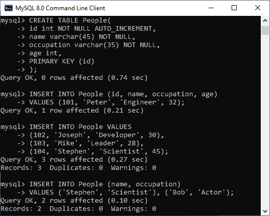
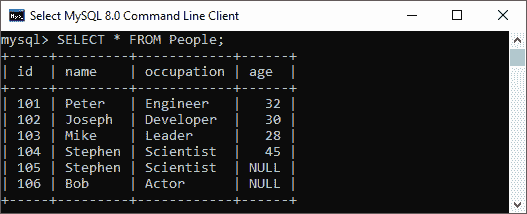

# MySQL INSERT 语句

> 原文：<https://www.javatpoint.com/mysql-insert>

MySQL INSERT 语句用于在数据库内的 MySQL 表中存储或添加数据。在 MySQL 中，我们可以使用一个查询以两种方式执行记录插入:

1.  在单行中插入记录
2.  在多行中插入记录

### 语法:

以下是在 [MySQL](https://www.javatpoint.com/mysql-tutorial) 表中插入一条记录的 **SQL INSERT INTO** 命令的通用语法:

```
INSERT INTO table_name ( field1, field2,...fieldN )  
VALUES  
( value1, value2,...valueN );  

```

在上面的语法中，我们首先必须指定表名和逗号分隔的列列表。其次，我们在 values 子句后提供了对应于列名的值列表。

#### 注意:字段名称是可选的。如果我们想指定部分值，字段名是必需的。它还确保列名和值应该相同。此外，列的位置和相应的值必须相同。

如果我们想在单个命令中插入**多条记录**，请使用以下语句:

```
INSERT INTO table_name VALUES
( value1, value2,...valueN )
( value1, value2,...valueN )
...........
( value1, value2,...valueN );  

```

在上面的语法中，值字段中的所有行都应该用逗号分隔。

### MySQL 插入示例

让我们借助多个例子来理解 [INSERT 语句](https://www.javatpoint.com/mysql-insert)在 MySQL 中是如何工作的。首先，使用以下命令在数据库中创建一个表“**人物**:

```
CREATE TABLE People(
	id int NOT NULL AUTO_INCREMENT,
	name varchar(45) NOT NULL,
	occupation varchar(35) NOT NULL,
	age int,
	PRIMARY KEY (id)
);

```

**1。**如果我们想要为所有字段存储单个记录，请使用如下语法:

```
INSERT INTO People (id, name, occupation, age) 
VALUES (101, 'Peter', 'Engineer', 32);

```

**2。**如果我们想存储多条记录，可以使用以下语句，在这些语句中，我们可以指定所有字段名称，也可以不指定任何字段。

```
INSERT INTO People VALUES
(102, 'Joseph', 'Developer', 30),
(103, 'Mike', 'Leader', 28),
(104, 'Stephen', 'Scientist', 45);

```

**3。**如果我们想在不给出所有字段的情况下存储记录，我们使用以下**部分字段**语句。在这种情况下，必须指定字段名称。

```
INSERT INTO People (name, occupation) 
VALUES ('Stephen', 'Scientist'), ('Bob', 'Actor');

```

在下面的输出中，我们可以看到所有的 INSERT 语句都已成功执行，并且正确地将值存储在表中。



我们可以使用下面的语法来显示**人**表的记录:

```
mysql> SELECT * FROM People;

```

我们将获得如下输出:



### 在 MySQL 表中插入日期:

我们还可以使用 INSERT 语句在 MySQL 表中添加日期。MySQL 提供了几种存储日期的数据类型，如日期、时间戳、日期时间和年份。MySQL 中日期的**默认格式为 **YYYY-MM-DD** 。**

这种格式有以下描述:

*   **YYYY:** 代表四位数年份，比如 2020 年。
*   **MM:** 表示两位数的月份，如 01、02、03、12。
*   **DD:** 表示两位数的日子，如 01、02、03、31。

以下是在 MySQL 表中插入日期的基本语法:

```
INSERT INTO table_name (column_name, column_date) VALUES ('DATE: Manual Date', '2008-7-04'); 

```

如果我们想以 mm/dd/yyyy 格式插入日期，则需要使用以下语句:

```
INSERT INTO table_name VALUES (STR_TO_DATE(date_value, format_specifier));

```

* * *