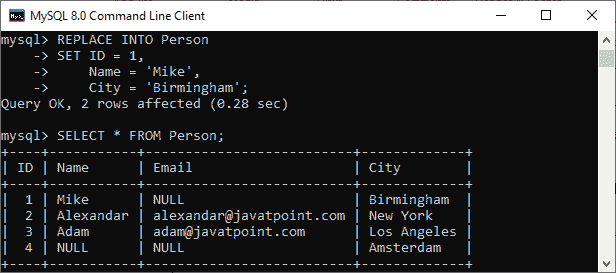
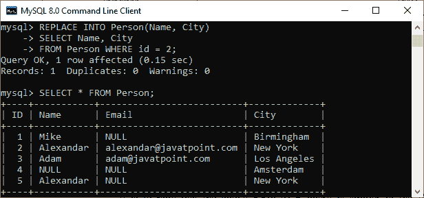

# MySQL REPLACE

> 原文：<https://www.javatpoint.com/mysql-replace>

MySQL 中的 REPLACE 语句是 SQL 标准的扩展。此语句的工作方式与 INSERT 语句相同，只是如果旧行与表中新记录的主键或唯一索引相匹配，则此命令会在添加新行之前删除旧行。

当我们想要将现有记录更新到表中以保持它们的更新时，这个语句是必需的。如果我们为此使用标准的插入查询，它将给出主键的重复条目或唯一键错误。在这种情况下，我们将使用 REPLACE 语句来执行我们的任务。REPLACE 命令需要两个**可能的**动作中的一个发生:

*   如果没有找到与现有数据行匹配的值，则执行标准的 INSERT 语句。

*   如果找到重复记录，replace 命令将删除现有行，然后在表中添加新记录。

在 REPLACE 语句中，更新分两步执行。首先，它将删除现有记录，然后添加新更新的记录，类似于标准的 INSERT 命令。因此，我们可以说 REPLACE 语句执行两个标准功能， **DELETE** 和 **INSERT** 。

**语法**

以下是 [MySQL](https://www.javatpoint.com/mysql-tutorial) 中 **REPLACE** 语句的语法:

```

REPLACE [INTO] table_name(column_list)
VALUES(value_list);

```

**MySQL REPLACE 示例**

让我们借助一个例子来理解 MySQL 中 REPLACE 语句的工作原理。首先，我们将使用以下语句创建一个名为**“人”**的表:

```

CREATE TABLE Person (
  ID int AUTO_INCREMENT PRIMARY KEY,
  Name varchar(45) DEFAULT NULL,
  Email varchar(45) DEFAULT NULL UNIQUE,
  City varchar(25) DEFAULT NULL
);

```

接下来，我们需要使用如下的 **INSERT** 语句将记录填入表中:

```

INSERT INTO Person(ID, Name, Email, City) 
VALUES (1,'Mike', 'mike@javatpoint.com', 'California'), 
(2, 'Alexandar', 'alexandar@javatpoint.com', 'New York'), 
(3, 'Adam', 'adam@javatpoint.com', 'Los Angeles'),
(4, 'Peter', 'Peter@javatpoint.com', 'Alaska');

```

执行 [**选择**语句](https://www.javatpoint.com/mysql-select)来验证可以在以下输出中显示的记录:


将数据验证到表中后，我们可以使用 replace 语句用新行替换任何旧行。执行以下语句，更新 id 为 4 的人的**城市。**

```

REPLACE INTO Person (id, city)
VALUES(4,'Amsterdam');

```

上述语句成功执行后，需要再次查询 Person 表的数据来验证替换。


**名称**和**邮件**列中的值现在为**空**。这是因为 REPLACE 语句的工作原理如下:

*   该语句首先尝试在 Person 表中插入一个新行。但是插入新行失败，因为 id = 4 已经存在于表中。
*   所以这个语句首先删除 id = 4 的行，然后插入一个与阿姆斯特丹 id 和城市相同的新行。因为我们没有指定名称和电子邮件列的值，所以它被设置为空。

### 更新一行的 MySQL REPLACE 语句

我们可以使用下面的 REPLACE 语句将行数据更新到表中:

```

REPLACE INTO table
SET column1 = value1, column2 = value2;

```

除了 REPLACE 关键字外，以上语法与 [UPDATE 语句](https://www.javatpoint.com/mysql-update)相似。需要注意的是，我们不能在本声明中使用 [WHERE 子句](https://www.javatpoint.com/mysql-where)。

执行下面的示例，该示例使用 REPLACE 语句将名为 **Mike** 的人的城市从**加州**更新为**伯明翰**。

```

REPLACE INTO Person
SET ID = 1,
    Name = 'Mike',
    City = 'Birmingham';

```

验证该表后，我们可以看到以下输出:



如果我们没有在 **SET 子句**中指定列的值，这个命令就像 [**UPDATE 语句**](https://www.javatpoint.com/mysql-update) 一样工作，这意味着 REPLACE 语句将使用该列的默认值。

### MySQL REPLACE 从 SELECT 语句中插入数据。

我们可以使用下面的 REPLACE INTO 语句，用查询返回的数据将数据插入到表中。

```

REPLACE INTO table1(column_list)
SELECT column_list
FROM table2
WHERE condition;

```

需要注意的是，上面的 REPLACE 查询类似于**INSERT in SELECT**语句。执行下面的示例，该示例使用 REPLACE INTO 语句复制同一表中的一行。

```

REPLACE INTO Person(Name, City)
SELECT Name, City 
FROM Person WHERE id = 2;

```

验证该表后，我们将获得以下输出。在这个输出中，我们可以看到同一表中的一行的副本被成功添加。



* * *