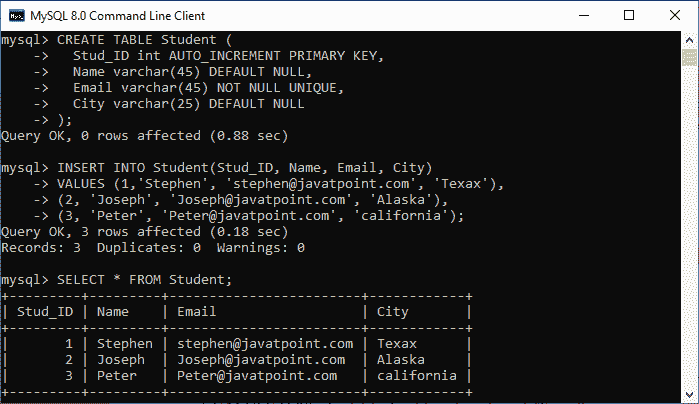
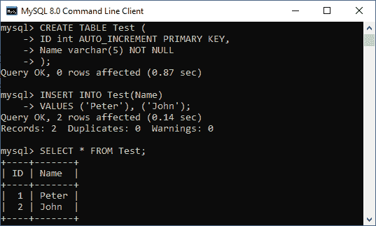
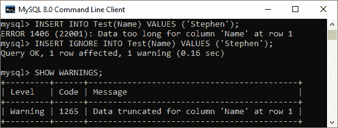

# MySQL INSERT IGNORE

> 原文：<https://www.javatpoint.com/mysql-insert-ignore>

MySQL 中的 Insert Ignore 语句有一个特殊的特性，每当我们在表中插入一行或多行时，都会忽略**无效行**。我们可以通过下面的解释来理解它，其中一个表包含一个主键列。

主键列不能将重复值存储到表中。**例如，student_roll_number** 对于每个学生来说应该总是唯一的。同样，公司中的**员工 id** 应该始终与员工表不同。当我们试图将重复记录插入到具有主键列的表中时，会产生一条错误消息。但是，如果我们使用 INSERT IGNORE 语句将重复的行添加到具有主键列的表中，MySQL 不会产生任何错误。当我们试图批量插入记录时，该语句是首选的，并且产生的错误会中断执行过程。因此，它不会将任何记录存储到表中。在这种情况下，INSERT IGNORE 语句只生成警告。

以下是 INSERT IGNORE 语句避免错误的情况:

*   当我们试图在表的列具有主键或唯一键约束的情况下插入重复键时。
*   当我们试图在表的列有非空约束的情况下添加空值时。
*   当我们试图将记录插入分区表时，输入的值与列出的分区格式不匹配。

### 句法

以下是在 MySQL 中使用 INSERT IGNORE 语句的语法:

```sql

INSERT IGNORE INTO table_name (column_names)
VALUES ( value_list), ( value_list) .....;

```

### MySQL 插入忽略示例

借助一个例子，让我们了解 INSERT IGNORE 语句在 [MySQL](https://www.javatpoint.com/mysql-tutorial) 中是如何工作的。首先，我们需要使用以下语句创建一个名为**“学生”**的表:

```sql

CREATE TABLE Student (
  Stud_ID int AUTO_INCREMENT PRIMARY KEY,
  Name varchar(45) DEFAULT NULL,
  Email varchar(45) NOT NULL UNIQUE,
  City varchar(25) DEFAULT NULL
);

```

**唯一的**约束确保我们不能在**电子邮件栏**中插入重复的值。接下来，需要将记录插入到表中。我们可以执行下面的语句将数据添加到表中:

```sql

INSERT INTO Student(Stud_ID, Name, Email, City) 
VALUES (1,'Stephen', 'stephen@javatpoint.com', 'Texax'), 
(2, 'Joseph', 'Joseph@javatpoint.com', 'Alaska'), 
(3, 'Peter', 'Peter@javatpoint.com', 'california');

```

最后，执行 **SELECT** 语句验证插入操作:

```sql

SELECT * FROM Student;

```

我们可以看到下面的输出，其中我们在表中有**三个**行:



让我们执行下面的语句，该语句将尝试向表中添加两条记录:

```sql

INSERT INTO Student(Stud_ID, Name, Email, City) 
VALUES (4,'Donald', 'donald@javatpoint.com', 'New York'), 
(5, 'Joseph', 'Joseph@javatpoint.com', 'Chicago');

```

它将产生一个错误: ***错误 1062 (23000):关键学生的重复条目“[【电子邮件保护】](/cdn-cgi/l/email-protection)”。*电子邮件“**因为电子邮件紫罗兰的独特约束。

现在，让我们看看如果在上面的查询中使用 INSERT IGNORE 语句会发生什么:

```sql

INSERT IGNORE INTO Student(Stud_ID, Name, Email, City) 
VALUES (4,'Donald', 'donald@javatpoint.com', 'New York'), 
(5, 'Joseph', 'Joseph@javatpoint.com', 'Chicago');

```

MySQL 将产生一条消息:一行被添加，另一行被忽略。

```sql

1 row affected, 1 warning(s): 1062 Duplicate entry for key email.
Records: 2  Duplicates: 1  Warning: 1

```

我们可以使用**显示警告**命令来查看详细的警告:


因此，我们可以说，如果我们使用 INSERT IGNORE 语句，MySQL 会给出警告，而不是发出错误。

### MySQL 插入忽略和严格模式

在 MySQL 中，严格模式处理将使用插入或更新语句添加到表中的无效或缺失值 。如果严格模式为**开**，并且我们试图使用 [INSERT 语句](https://www.javatpoint.com/mysql-insert)将无效值添加到表中，该语句将被中止，并且我们将获得一条错误消息。

然而，如果我们使用 INSERT IGNORE 命令，MySQL 会产生一条警告消息，而不是抛出一个错误。此外，在将值插入到表中之前，该语句会尝试截断值以使其有效。

让我们借助一个例子来理解它。首先，我们将使用下面的语句创建一个名为**“Test”**的表:

```sql

CREATE TABLE Test (
	ID int AUTO_INCREMENT PRIMARY KEY,
	Name varchar(5) NOT NULL
);

```

在上表中，名称列只接受长度小于等于**五个字符**的字符串。现在，执行下面的语句将记录插入到一个表中。

```sql

INSERT INTO Test(Name)
VALUES ('Peter'), ('John');

```

我们可以看到，指定的名称验证了名称列约束，因此它将被成功添加。执行 SELECT 语句来验证结果。它将给出如下输出:



接下来，插入长度大于 5 的名称:

```sql

INSERT INTO Test(Name) VALUES ('Stephen');

```

由于严格模式为 ON，MySQL 不会添加值并给出错误消息。但是，如果我们使用 INSERT IGNORE 语句插入相同的字符串，它将给出警告消息，而不是引发错误。

```sql

INSERT IGNORE INTO Test(Name) VALUES ('Stephen');

```

最后，我们执行了 SHOW WARNINGS 命令来检查警告消息。下面的输出更清楚地解释了这一点，显示了 MySQL 在将数据插入表之前尝试截断数据。



* * *