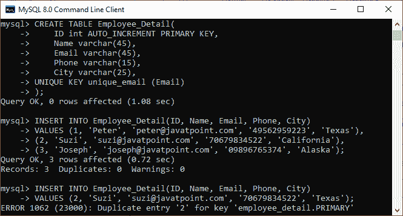

# MySQL UNIQUE INDEX

> 原文：<https://www.javatpoint.com/mysql-unique-index>

索引是一个将无序列表转换成有序列表的过程，这使我们能够更快地检索记录。 ***它为出现在索引列*** 中的每个值创建一个条目。它有助于在 MySQL 中搜索表时最大限度地提高查询效率。在没有索引的情况下，我们需要扫描整个表来查找相关信息。MySQL 索引的工作方式类似于图书索引。

通常，我们使用主键约束来强制一个或多个列的唯一性值。但是，我们只能为每个表使用一个主键。因此，如果我们想使多组列具有唯一的值，将不会使用主键约束。

[MySQL](https://www.javatpoint.com/mysql-tutorial) 允许另一个称为**唯一索引**的约束来强制一个或多个列中值的唯一性。我们可以在单个表中创建多个 UNIQUE 索引，这在主键约束下是不可能的。

### 句法

以下是用于在 MySQL 表中创建唯一索引的通用语法:

```sql

CREATE UNIQUE INDEX index_name
ON table_name (index_column1, index_column2,...);

```

MySQL 允许使用 UNIQUE Key 语句在一列或多列中强制执行唯一性值的另一种方法。我们可以在这里阅读更多关于[唯一键](https://www.javatpoint.com/mysql-unique-key)的信息。

如果我们在表中使用 UNIQUE 约束，MySQL 会在幕后自动创建一个 UNIQUE 索引。以下语句解释了如何在创建表时创建唯一约束。

```sql

CREATE TABLE table_name(  
  col1 col_definition,  
  col2 col_definition,  
  ...  
  [CONSTRAINT constraint_name]  
  UNIQUE Key (column_name(s))  
);  

```

#### 注意:建议在创建表时使用约束名称。如果我们省略约束名，MySQL 会自动为这个列生成一个名称。

**唯一索引和空值**

MySQL 中的空值考虑与其他数据库相似的不同值。因此，我们可以在 UNIQUE 索引列中存储多个空值。MySQL 的这个特性有时被报告为 bug，但它不是 bug。

### MySQL 唯一索引示例

让我们借助一个例子来理解它。假设我们希望在数据库应用程序中管理员工详细信息，在该应用程序中，我们需要唯一的电子邮件列。执行以下语句，创建一个带有唯一约束的表**“雇员 _ 详细信息”**:

```sql

CREATE TABLE Employee_Detail(  
    ID int AUTO_INCREMENT PRIMARY KEY,   
    Name varchar(45),   
    Email varchar(45),  
    Phone varchar(15),   
    City varchar(25),
    UNIQUE KEY unique_email (Email)
);

```

如果我们执行下面的语句，我们可以看到 MySQL 为 Employee_Detail 表的 **Email** 列创建了一个 UNIQUE 索引:

```sql

SHOW INDEXES FROM Employee_Detail;

```

在下面的屏幕中，我们可以看到电子邮件列是作为唯一索引创建的。


接下来，我们将使用以下语句向表中插入记录:

```sql

INSERT INTO Employee_Detail(ID, Name, Email, Phone, City)  
VALUES (1, 'Peter', 'peter@javatpoint.com', '49562959223', 'Texas'),  
(2, 'Suzi', 'suzi@javatpoint.com', '70679834522', 'California'),  
(3, 'Joseph', 'joseph@javatpoint.com', '09896765374', 'Alaska');

```

上面的语句执行成功，因为所有列都是唯一的。如果我们插入一条电子邮件为 **[【邮件受保护】](/cdn-cgi/l/email-protection)** 的记录，我们会得到重复的错误消息。

```sql

mysql> INSERT INTO Employee_Detail(ID, Name, Email, Phone, City) 
VALUES (2, 'Suzi', 'suzi@javatpoint.com', '70679834522', 'Texas');  

```

以下输出更清楚地解释了上述所有步骤:



假设我们希望 Employee_Detail 表的**名称**和**电话**也是唯一的。在这种情况下，我们将使用下面的语句为这些列创建唯一索引:

```sql

CREATE UNIQUE INDEX index_name_phone
ON Employee_Detail (Name, Phone);

```

如果我们再次执行 **SHOW INDEX** 语句，我们可以看到 MySQL 也为名称和电话列创建了一个 UNIQUE INDEX**INDEX _ name _ phone**。


将此记录添加到表中会产生错误。这是因为名字和电话的组合已经存在。

```sql

mysql> INSERT INTO Employee_Detail(ID, Name, Email, Phone, City) 
VALUES (4, 'Joseph', 'joseph@javatpoint.com', '09896765374', 'Texas');  

```

查看以下输出:


* * *