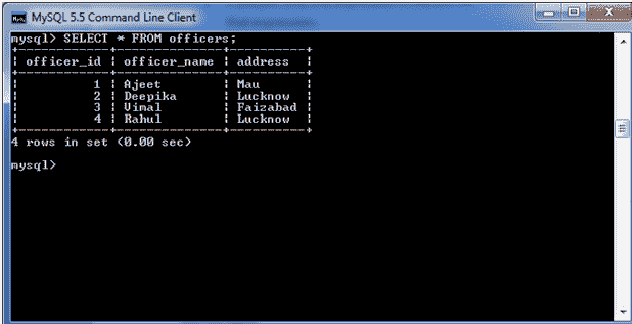
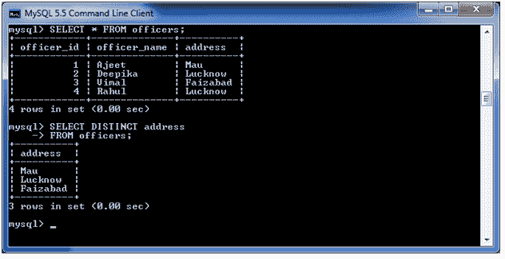
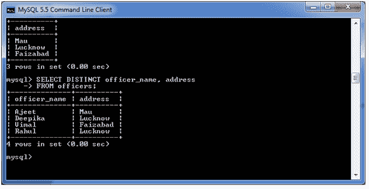

# MySQL 独特子句

> 原文：<https://www.javatpoint.com/mysql-distinct>

MySQL DISTINCT 子句用于从表中删除重复的记录，并且只获取唯一的记录。DISTINCT 子句仅用于 SELECT 语句。

**语法:**

```sql
SELECT DISTINCT expressions
FROM tables
[WHERE conditions];

```

## 因素

**表达式:**指定要检索的列或计算。

**表:**指定从中检索记录的表的名称。FROM 子句中必须至少列出一个表。

**所在条件:**可选。它指定了选择记录必须满足的条件。

**注:**

*   如果在 DISTINCT 子句中只放入一个表达式，查询将返回该表达式的唯一值。
*   如果在 DISTINCT 子句中放入多个表达式，查询将检索所列表达式的唯一组合。
*   在 MySQL 中，DISTINCT 子句不会忽略空值。因此，如果在您的 SQL 语句中使用 distinct 子句，您的结果集将包含空值作为 DISTINCT 值。

## 单表达式 MySQL DISTINCT 子句

如果使用单个表达式，那么 MySQL DISTINCT 子句将返回一个具有唯一记录的字段(没有重复记录)。

**见表:**



**使用以下查询:**

```sql
SELECT DISTINCT address
FROM officers;

```



## 具有多个表达式的 MySQL DISTINCT 子句

如果在 DISTINCT 子句中使用多个表达式，那么 MySQL DISTINCT 子句将从 SELECT 语句中的多个字段中删除重复项。

**使用以下查询:**

```sql
SELECT DISTINCT officer_name, address
FROM officers;

```

