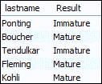

# MySQL IF()

> 原文：<https://www.javatpoint.com/mysql-if>

在这一节中，我们将学习 **IF()函数**在 MySQL 中的工作原理。IF 函数是 MySQL 控制流函数的一部分，它根据给定的条件返回一个值。换句话说，IF 函数用于验证 MySQL 中的一个[函数。当给定条件评估为真时，IF 函数返回一个值**是**，当条件评估为假时，返回一个值**否**。它返回字符串或数字形式的值，具体取决于使用该函数的上下文。有时，该功能被称为 **IF-ELSE** 和 **IF THAN ELSE** 功能。](https://www.javatpoint.com/mysql-functions)

IF 函数采用三个表达式，其中第一个表达式将被求值。如果第一个表达式的计算结果为 true，而不是 null，也不是零，它将返回第二个表达式。如果结果为假，则返回第三个表达式。

### 句法

```

IF ( expression 1, expression 2, expression 3)

```

### 参数

| 参数 | 要求 | 描述 |
| 表达式 1 | 需要 | 这是一个值，用于验证。 |
| 表达式 2 | 可选择的 | 当条件评估为真时，它返回一个值。 |
| 表达式 3 | 可选择的 | 当条件评估为 false 时，它返回一个值。 |

## 默认退货类型

中频函数的返回类型可以计算如下:

*   如果表达式 2 或表达式 3 都是字符串或产生一个字符串，结果总是一个字符串。
*   如果表达式 2 或表达式 3 给出一个浮点值，结果总是一个浮点值。
*   如果表达式 2 或表达式 3 是整数，结果总是整数。

## MySQL 版本支持

中频功能可以支持以下 [MySQL 版本](https://www.javatpoint.com/mysql-versions):

*   MySQL 8.0
*   MySQL 5.7
*   MySQL 5.6
*   MySQL 5.5
*   MySQL 5.1
*   MySQL 5.0
*   MySQL 4.1
*   MySQL 4.0
*   MySQL 3.23.3

#### 注意:IF 函数不同于 IF 语句。所以不要混淆 IF 函数和 IF 语句。

让我们通过下面的例子来理解 MySQL IF 函数。我们可以直接在 SELECT 语句中使用 IF 函数。

### 例 1

```

SELECT IF(200>350,'YES','NO');

```

在上面的函数中，(200>350)是一个条件，它被求值。如果条件为真，则返回一个值**是**，如果条件为假，则返回**否**。

**输出:**

```
NO

```

### 例 2

```

SELECT IF(251 = 251,' Correct','Wrong');

```

在上面的函数中，(251 = 251)是一个条件，它被求值。如果条件为真，则返回值**正确，**，如果条件为假，则返回**错误**输出。

**输出:**

```
Correct

```

### 例 3

```

SELECT IF(STRCMP('Rinky Ponting','Yuvraj Singh')=0, 'Correct', 'Wrong');

```

上面的例子比较了两个字符串。如果两个字符串相同，则返回**修正**。否则，中频功能返回**错误的**输出。

**输出:**

```
Wrong

```

### 例 4

在这里，我们将创建一个表“**学生**”，并执行 IF 功能。


现在，运行以下 [MySQL 查询](https://www.javatpoint.com/mysql-queries)。此语句返回学生表的**姓氏**，其中如果**年龄**大于 20，则返回**成熟**。否则，中频功能返回**未成熟**。

```

SELECT lastname,
IF(age>20,"Mature","Immature")  
As Result
FROM student;

```

**输出:**

当上述 [MySQL](https://www.javatpoint.com/mysql-tutorial) 语句运行成功后，会给出如下输出。



* * *