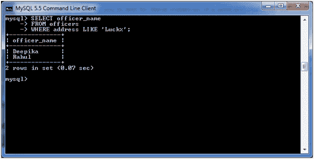
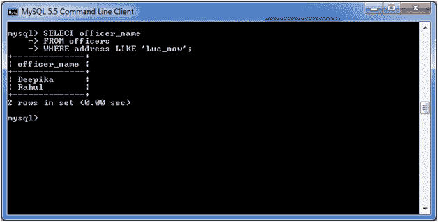
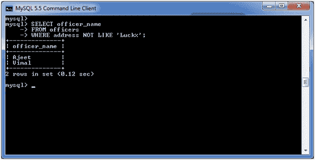

# MySQL LIKE 条件

> 原文：<https://www.javatpoint.com/mysql-like>

在 MySQL 中，LIKE 条件用于执行模式匹配，以找到正确的结果。它与 WHERE 子句组合用于 SELECT、INSERT、UPDATE 和 DELETE 语句中。

**语法:**

```sql
expression LIKE pattern [ ESCAPE 'escape_character' ]

```

## 因素

**表达式:**指定一个列或字段。

**模式:**是包含模式匹配的字符表达式。

**escape_character:** 可选。它允许您测试通配符的文本实例，如%或 _。如果不提供转义符， [MySQL](https://www.javatpoint.com/mysql-tutorial) 假设“\”是转义符。

## 类似 MySQL 的例子

## 1)使用百分比通配符:

考虑一个包含以下数据的“官员”表。


**执行以下查询:**

```sql
 SELECT officer_name
FROM officers
WHERE address LIKE 'Luck%';

```

**输出:**



## 2)使用 _(下划线)通配符:

在这个例子中，我们也使用相同的表格“官员”。

**执行以下查询:**

```sql

 SELECT officer_name
 FROM officers
 WHERE address LIKE 'Luc_now';

```

**输出:**



## 3)使用非运算符:

还可以在 MySQL LIKE 条件下使用 NOT 运算符。此示例显示了%通配符与非运算符的用法。

考虑一个包含以下数据的“官员”表。


**执行以下查询:**

```sql
SELECT officer_name
FROM officers
WHERE address NOT LIKE 'Luck%';

```

**输出:**



#### 注意:在上面的例子中，你可以看到地址不像“运气%”只显示。

* * *