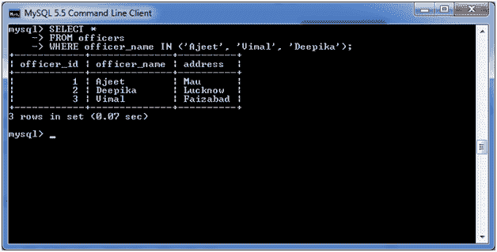
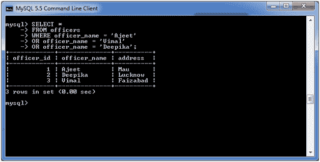

# MySQL 处于运行状态

> 原文：<https://www.javatpoint.com/mysql-in>

MySQL IN 条件用于减少在 SELECT、INSERT、UPDATE 和 DELETE 语句中使用多个 OR 条件。

## 语法:

```sql
expression IN (value1, value2, .... value_n);

```

## 因素

**表达式:**指定要测试的值。

**值 1，值 2，...或者 value_n:** 这些是针对表达式进行测试的值。如果这些值中的任何一个与表达式匹配，那么输入条件将计算为真。这是测试任何一个值是否匹配表达式的快速方法。

## 示例中的 MySQL

考虑一个表格“官员”，有以下数据。


**执行以下查询:**

```sql
SELECT *
FROM officers
WHERE officer_name IN ('Ajeet', 'Vimal', 'Deepika');

```

**输出:**



让我们看看为什么它优于或条件:

**执行以下查询:**

```sql
SELECT *
FROM officers
WHERE officer_name = 'Ajeet'
OR officer_name = 'Vimal'
OR officer_name = 'Deepika';

```

**输出:**



它也会产生同样的结果。所以 IN 条件优于 OR 条件，因为它的代码数最少。

* * *