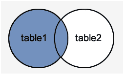
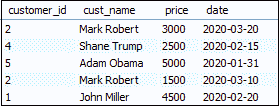
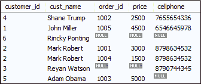
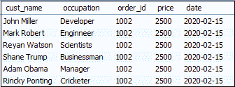

# MySQL LEFT JOIN

> 原文：<https://www.javatpoint.com/mysql-left-join>

MySQL 中的左连接用于查询多个表中的记录。此子句类似于内部联接子句，可以与 SELECT 语句一起在 FROM 关键字之后立即使用。当我们使用 Left Join 子句时，它将返回第一个(左侧)表中的所有记录，甚至没有从第二个(右侧)表中找到匹配的记录。如果在右侧表中找不到任何匹配记录，则返回 null。

换句话说，Left Join 子句返回左表中的所有行和右表中匹配的记录，如果没有找到匹配的记录，则返回 Null。这个连接也可以称为**左外连接**子句。因此，Outer 是与左连接一起使用的可选关键字。

我们可以通过下面的可视化表示来理解它，其中 Left Joins 返回左侧表中的所有记录，并且只返回右侧表中的匹配记录:



### MySQL 左连接语法

以下语法解释了联接两个或多个表的左联接子句:

```sql

SELECT columns  
FROM table1  
LEFT [OUTER] JOIN table2  
ON Join_Condition;

```

在上面的语法中，**表 1** 是左表，**表 2** 是右表。该子句根据指定的**连接条件**，返回表 1 中的所有记录和表 2 中的匹配记录。

### MySQL 左连接示例

让我们举一些例子来理解左连接或左外连接子句的工作原理:

### 用于连接两个表的左连接子句

在这里，我们将创建两个表“**客户”**和“**订单”**，其中包含以下数据:

**表:客户**


**表:订单**


要从两个表中选择记录，请执行以下查询:

```sql

SELECT customers.customer_id, cust_name, price, date
FROM customers
LEFT JOIN orders ON customers.customer_id = orders.customer_id;

```

成功执行查询后，它将给出以下输出:



### 带 USING 子句的 MySQL 左连接

表客户和订单具有相同的列名，即 customer_id。在这种情况下，MySQL 左连接也可以与 USING 子句一起使用来访问记录。以下语句使用带有 using 关键字的 Left Join 子句返回客户 id、客户名称、职业、价格和日期。

```sql

SELECT customer_id, cust_name, occupation, price, date
FROM customers
LEFT JOIN orders USING(customer_id);

```

上面的语句将给出以下输出:


### 带有分组依据子句的 MySQL 左连接

左连接也可以与 GROUP BY 子句一起使用。以下语句使用左连接子句和 GROUP BY 子句返回客户 id、客户名称、资格、价格和日期。

```sql

SELECT customers.customer_id, cust_name, qualification, price, date
FROM customers
LEFT JOIN orders ON customers.customer_id = orders.customer_id
GROUP BY price;

```

上面的语句将给出以下输出:


### 带 WHERE 子句的左连接

WHERE 子句用于从表中返回**过滤器**结果。以下示例用左连接子句说明了这一点:

```sql

SELECT customer_id, cust_name, occupation, price, date
FROM customers
LEFT JOIN orders 
USING(customer_id) WHERE price>2500;

```

该语句给出以下结果:


### MySQL 左连接多个表

我们已经创建了两个名为“**客户”**和“**订单”**的表。让我们再创建一个表，并将其命名为“**联系人”，其中包含以下数据:**


执行以下语句来连接三个表客户、订单和联系人:

```sql

SELECT customers.customer_id, cust_name, order_id, price, cellphone
FROM customers
LEFT JOIN contacts ON customer_id = contact_id
LEFT JOIN orders ON customers.customer_id = orders.customer_id ORDER BY income;

```

成功执行上述查询后，它将给出以下输出:



### 使用 LEFT JOIN 子句获取不匹配的记录

在这种情况下，当我们希望在表中获取不包含来自另一个表的任何匹配数据行的记录时，LEFT JOIN 子句也很有用。

我们可以通过下面的例子来理解，它使用 LEFT JOIN 子句来查找没有手机号码的客户:

```sql

SELECT customer_id, cust_name, cellphone, homephone
FROM customers
LEFT JOIN contacts ON customer_id = contact_id
WHERE cellphone IS NULL ;

```

上面的语句返回以下输出:


### MySQL 左连接中 WHERE 和 ON 子句的区别

在左连接中，条件 WHERE 和 on 给出了不同的结果。我们可以看到以下查询来了解它们的区别:

**WHERE 子句**

```sql

SELECT cust_name, occupation, order_id, price, date
FROM customers
LEFT JOIN orders 
USING(customer_id) WHERE price=2500;

```

它将返回以下输出:


**开子句**

```sql

SELECT cust_name, occupation, order_id, price, date
FROM customers LEFT JOIN orders ON price=2500;

```

它将给出以下输出:



#### 注意:内部联接子句中的 WHERE 和 ON 条件总是返回相同的结果。

* * *