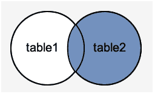
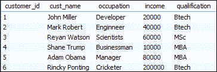
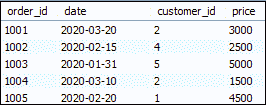
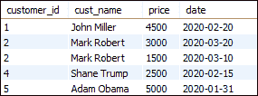

# 用法实例

> 原文：<https://www.javatpoint.com/mysql-right-join>

右连接用于连接两个或多个表，并返回右表中的所有行，以及满足连接条件的其他表中的结果。如果它从左侧表中找到不匹配的记录，它将返回空值。它类似于左连接，只是它给出了连接表的相反结果。它也被称为右外连接。因此，Outer 是与 Right Join 一起使用的可选子句。

我们可以通过下面的可视化表示来理解它，其中右外连接返回左侧表中的所有记录，并且只返回另一个表中的匹配记录:



### 右连接语法

以下是连接表**表 1** 和**表 2** 的右连接语法:

```sql

SELECT column_list
FROM Table1
RIGHT [OUTER] JOIN Table2 
ON join_condition;

```

#### 注意:在右连接中，如果表包含相同的列名，那么 ON 和 USING 子句给出相同的结果。

让我们看看右连接是如何工作的。

这个连接开始从右边的表中选择列，并匹配左边表中该表的每条记录。如果两个记录都满足给定的联接条件，它会将所有列合并到一个新的行集中，该行集将作为输出返回。如果右侧表的行在左侧表中找不到任何匹配的行，它会将右侧表中的行与空值组合在一起。这意味着，右连接返回右侧表中的所有数据，无论它是否与左侧表中的行匹配。

### MySQL 右连接示例

让我们举几个例子来理解右连接子句的作用:

### 用于连接两个表的右连接子句

在这里，我们将创建两个表“**客户”**和“**订单”**，其中包含以下数据:

**表:客户**



**表:订单**



要使用右连接从两个表中选择记录，请执行以下查询:

```sql

SELECT customers.customer_id, cust_name, price, date
FROM customers
RIGHT JOIN orders ON customers.customer_id = orders.customer_id
ORDER BY  customer_id;

```

或者，

```sql

SELECT customers.customer_id, cust_name, price, date
FROM customers
RIGHT JOIN orders USING(customer_id)
ORDER BY  customer_id;

```

成功执行上述查询后，它将给出等效的输出:



### 右连接 WHERE 子句

[MySQL](https://www.javatpoint.com/mysql-tutorial) 使用 [WHERE 子句](https://www.javatpoint.com/mysql-where)从表中提供**过滤器**结果。以下示例用右连接子句说明了这一点:

```sql

SELECT * FROM customers
RIGHT JOIN orders USING(customer_id)
WHERE price>2500 AND price<5000;

```

该语句给出以下结果:


### MySQL 右连接多个表

我们已经创建了两个表，名为“**客户”**和“**订单”**。让我们再创建一个表，并将其命名为包含以下数据的“**联系人:**


执行以下语句来连接三个表客户、订单和联系人:

```sql

SELECT customers.customer_id, cust_name, order_id, price, cellphone
FROM customers
RIGHT JOIN contacts ON customer_id = contact_id
RIGHT JOIN orders ON customers.customer_id = orders.customer_id ORDER BY order_id;

```

成功执行上述查询后，它将给出以下输出:


### 使用右连接子句获取不匹配的记录

在这种情况下，当我们希望在表中获取不包含来自另一个表的任何匹配数据行的记录时，Right Join 子句也很有用。

我们可以用下面的例子来理解，这个例子使用了 RIGHT JOIN 子句来寻找一个没有**手机**号码的客户:

```sql

SELECT customer_id, cust_name, cellphone, homephone
FROM customers
RIGHT JOIN contacts ON customer_id = contact_id
WHERE cellphone IS NULL
ORDER BY cellphone;

```

上面的语句返回以下输出:


* * *