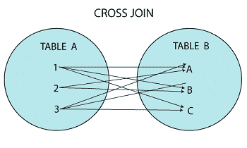
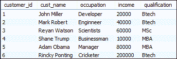
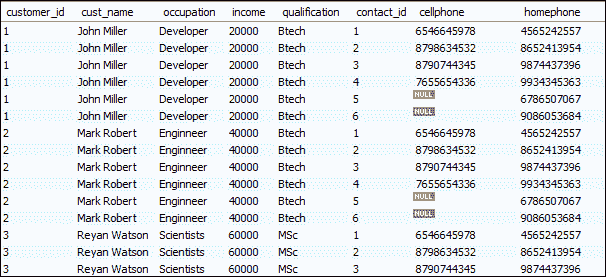
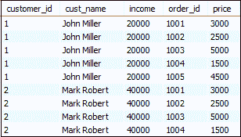

# MySQL CROSS JOIN

> 原文：<https://www.javatpoint.com/mysql-cross-join>

MySQL CROSS JOIN 用于组合两个或多个表的所有可能性，并返回包含所有贡献表中每一行的结果。交叉连接也称为笛卡尔连接，它提供所有关联表的笛卡尔乘积。笛卡尔乘积可以解释为第一个表中的所有行乘以第二个表中的所有行。它类似于内部联接，其中联接条件不适用于此子句。

我们可以用下面的可视化表示来理解它，其中 CROSS JOIN 返回表 1 和表 2 中的所有记录，并且每一行都是两个表的行的组合。



### MySQL 交叉连接语法

CROSS JOIN 关键字总是与 SELECT 语句一起使用，并且必须写在 FROM 子句之后。以下语法从两个连接表中提取所有记录:

```

SELECT column-lists
FROM table1
CROSS JOIN table2;

```

在上面的语法中，column-list 是要返回的列或字段的名称，table1 和 table2 是从中获取记录的表名。

### MySQL 交叉连接示例

让我们举一些例子来理解左连接或左外连接子句的工作原理:

### 用于连接两个表的交叉连接子句

在这里，我们将创建两个表**“客户”**和**“联系人”**，其中包含以下数据:

**表:客户**



**表格:联系人**


要从两个表中获取所有记录，请执行以下查询:

```

SELECT *
FROM customers
CROSS JOIN contacts;

```

成功执行查询后，它将给出以下输出:



当 CROSS JOIN 语句执行时，您会发现它显示了 42 行。这意味着客户表中的七行乘以联系人表中的六行。

#### 注意:为了避免两次重复列的结果，建议使用单独的列名，而不是 SELECT *语句。

### MySQL 交叉连接中的模糊列问题

有时，我们需要从多个表中获取选定的列记录。这些表可以包含一些类似的列名。在这种情况下，MySQL CROSS JOIN 语句会抛出一个错误:列名不明确。这意味着列的名称在两个表中都存在，MySQL 不知道要显示哪一列。下面的例子解释得更清楚:

```

SELECT customer_id, cust_name, income, order_id, price
FROM customer
CROSS JOIN orders;

```

上面的 CROSS JOIN 抛出一个错误，如下图所示:


这个问题可以通过在列名之前使用表名来解决。上述查询可以改写为:

```

SELECT customer.customer_id, customer.cust_name, customer.income, orders.order_id, orders.price
FROM customer
CROSS JOIN orders;

```

执行上述查询后，我们将获得以下输出:



### 带 WHERE 子句的左连接

WHERE 子句用于从表中返回**过滤器**结果。以下示例用 CROSS JOIN 子句说明了这一点:

```

SELECT customers.customer_id, customers.cust_name, customers.income, orders.order_id, orders.price
FROM customers
CROSS JOIN orders
USING(customer_id) WHERE price>1500 AND price<5000;

```

该语句给出以下结果:


### MySQL 交叉连接多个表

我们已经创建了两个名为“**客户”**和“**订单”**的表。让我们再创建一个表，并将其命名为“**联系人”，其中包含以下数据:**


在这里，我们将使用三个表来解释交叉连接和左连接。执行以下语句来连接三个表客户、订单和联系人。在该语句中，首先在订单和联系人之间完成 CROSS JOIN，然后根据指定的条件执行 LEFT JOIN。

```

SELECT * FROM customer
LEFT JOIN(orders CROSS JOIN contacts)
ON customer.customer_id=contact_id
ORDER BY income;

```

成功执行上述查询后，它将给出以下输出:


* * *