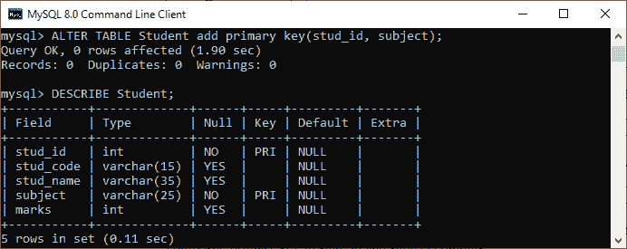

# MySQL 复合密钥

> 原文：<https://www.javatpoint.com/mysql-composite-key>

MySQL 中的复合键是表中两列或两列以上的组合，它允许我们唯一地标识表中的每一行。是一种由多列组成的**候选键**类型。MySQL 只在它们组合时才保证列的唯一性。如果他们单独采取了行动，这种独特性就无法保持。

当主键、超级键或候选键与多个属性组合时，它们可以被称为复合键。当表需要唯一地标识具有多个属性的每个记录时，复合键非常有用。复合键中使用的列可以有不同的数据类型。因此，在 [MySQL](https://www.javatpoint.com/mysql-tutorial) 中，组成复合键的列不需要是相同的数据类型。

复合键可以通过两种方式添加:

1.  使用创建语句
2.  使用 ALTER 语句

让我们详细看看这两种方式。

### 使用 CREATE 语句的复合键

在这里，我们将了解复合键在 MySQL 中是如何工作的。让我们首先创建一个表**“产品”**，使用以下语句:

```

CREATE TABLE Product (
	Prod_ID int NOT NULL, 
	Name varchar(45), 
	Manufacturer varchar(45),
	PRIMARY KEY(Name, Manufacturer)
);

```

在上面的陈述中，我们创建了一个复合主节点，其列名为**名称**和**制造商**。

我们可以使用下面的命令进行验证:

```

DESCRIBE Product;

```

成功执行后，我们可以看到 Key 列有两个 **PRI** 。这意味着我们已经成功地在“名称”和“制造商”列中添加了复合主键。


接下来，我们需要将这些值插入下表中:

```

INSERT INTO Product (Prod_ID, Name, Manufacturer)
VALUES (101, 'Soap', 'Hamam'),
(102, 'Shampoo', 'Teresme'),
(103, 'Oil', 'Daber Almond');

```

接下来，执行下面的命令来显示表数据:

```
SELECT * FROM Product;

```

它将给出如下输出:


再次执行下面的 insert 语句，以便更清楚地理解组合键:

```

INSERT INTO Product (Prod_ID, Name, Manufacturer)
VALUES (101, 'Soap', 'Hamam');

INSERT INTO Product (Prod_ID, Name, Manufacturer)
VALUES (101, 'Soap', 'LUX');

```

在下面的输出中，我们可以看到，如果我们尝试添加相同产品名称和制造商的组合，那么它会抛出一个错误，说:【product.primary 的重复条目。

如果我们执行第二个 insert 语句，它将被成功地添加到表中。这是因为我们可以在产品列中插入任意数量的肥皂，但是制造商列应该不同。


因此，我们可以说复合键总是强制该表的列的唯一性，该表有两个键。

### 使用 ALTER TABLE 语句的复合键

ALTER 语句总是用来修改现有的表。有时需要添加复合键来唯一标识具有多个属性的表的每个记录。在这种情况下，我们使用 [ALTER TABLE 语句](https://www.javatpoint.com/mysql-alter-table)。

让我们首先使用下面的语句创建一个“学生”表:

```

CREATE TABLE Student(
  stud_id int NOT NULL,
  stud_code varchar(15),
  stud_name varchar(35),
  subject varchar(25),
  marks int
);

```

现在，执行 ALTER TABLE 语句添加一个复合主键，如下所示:

```

ALTER TABLE Student add primary key(stud_id, subject);

```

我们可以使用以下命令来验证添加到表中的复合主键是否存在:

```

DESCRIBE Student;

```

在输出中，我们可以看到键列有 PRI，这意味着我们已经成功地将复合主键添加到了 **stud_id** 和 **subject** 列中。



* * *