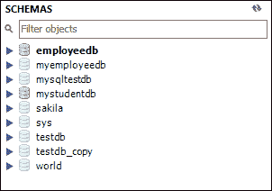
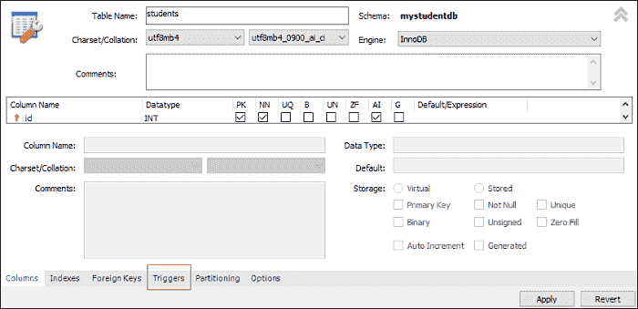
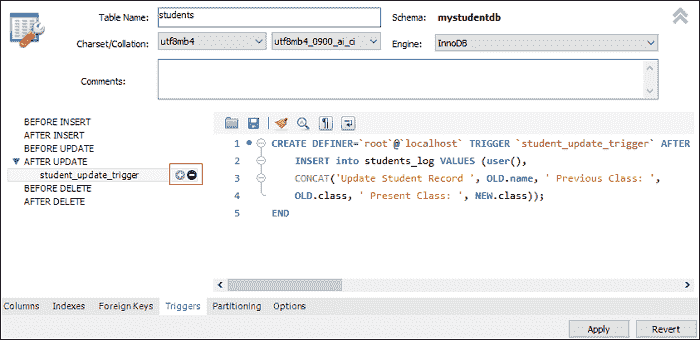

# MySQL DROP 触发器

> 原文：<https://www.javatpoint.com/mysql-drop-trigger>

我们可以使用 **DROP TRIGGER** 语句在 MySQL 中删除/删除/移除一个触发器。从表中移除触发器时，您必须非常小心。因为一旦我们删除了触发器，它就无法恢复。如果找不到触发器，DROP TRIGGER 语句将引发错误。

MySQL 允许我们主要通过两种方式删除/删除/移除触发器:

1.  MySQL 命令行客户端
2.  MySQL 工作台

### MySQL 命令行客户端

我们可以使用具有以下语法的 DROP TRIGGER 语句从数据库中删除现有触发器:

```

DROP TRIGGER [IF EXISTS] [schema_name.]trigger_name;

```

### 参数说明

删除触发器语法中使用的参数解释如下:

| 参数 | 描述 |
| 触发器名称 | 它是我们要从数据库服务器中删除的触发器的名称。这是必需的参数。 |
| 架构名称 | 这是触发器所属的数据库名称。如果我们跳过此参数，该语句将从当前数据库中移除触发器。 |
| 如果存在 | 它是一个可选参数，只有当触发器存在于数据库服务器上时，它才会有条件地删除触发器。 |

如果我们移除不存在的触发器，我们将得到一个错误。然而，如果我们指定了 IF EXISTS 子句，那么 [MySQL](https://www.javatpoint.com/mysql-tutorial) 给出的是**注释**而不是错误。

需要注意的是，在对与触发器关联的表执行 DROP TRIGGER 语句之前，我们必须拥有 TRIGGER 权限。此外，删除表将自动删除与该表关联的所有触发器。

## MySQL DROP 触发器示例

让我们通过一个例子来看看如何删除与表关联的触发器。首先，我们将使用下面的语句**显示所选数据库中所有可用的触发器**:

```

mysql> SHOW TRIGGERS IN employeedb;

```

执行该语句后，我们可以看到有两个触发器名为**before _ update _ samples**和 **sales_info_before_update** 。请参见下图:


如果我们想删除**before _ update _ sales**触发器，请执行以下语句:

```

mysql> DROP TRIGGER employeedb.before_update_salaries;

```

它将成功地从数据库中删除一个触发器。如果我们再次执行上面的语句，它将返回一条错误消息。查看输出:


如果我们使用 **IF EXISTS** 子句再次执行上述语句，它将返回警告消息，而不是产生错误。查看输出:

```

mysql> DROP TRIGGER IF EXISTS employeedb.before_update_salaries;

```


当使用 IF EXISTS 时，我们可以执行 **SHOW WARNING** 语句，为不存在的触发器生成**注释**。查看输出:


### 如何在 MySQL 工作台中 Drop 触发器？

要在工作台创建一个 [AFTER UPDATE 触发器](mysql-after-update-trigger)，我们首先**启动 MySQL 工作台**并使用用户名和密码登录。我们将获得如下用户界面:


现在，请执行以下步骤来删除或销毁与该表关联的触发器:

1.进入**导航**选项卡，点击**模式**菜单。它将显示 MySQL 数据库服务器中所有可用的数据库。



2.选择数据库(例如 **mystudentdb** )。然后，双击选定的模式。它显示包含表、视图、函数和存储过程的**子菜单**。请参见下面的屏幕。


3.展开**表格**子菜单，选择一个与触发器关联的表格。再次展开选中的**表- >触发**；我们将获得下图:


4.现在，右击所选表格，选择 **[【变更表格】](https://www.javatpoint.com/mysql-alter-table)** 选项，屏幕如下:



5.现在，点击上一节**红色矩形框**中显示的 **[触发](https://www.javatpoint.com/mysql-trigger)** 标签。您会注意到有一个 **(+)和(-)图标按钮**来添加或删除触发器:



6.现在，点击 **(-)按钮**将永久移除与表格相关联的触发器。

* * *