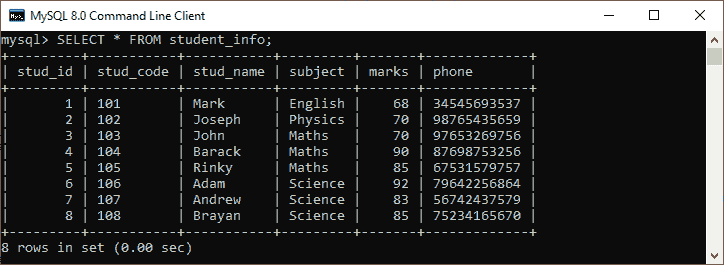
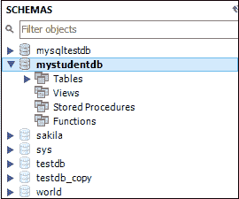
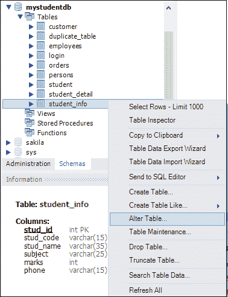
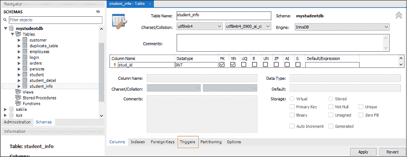
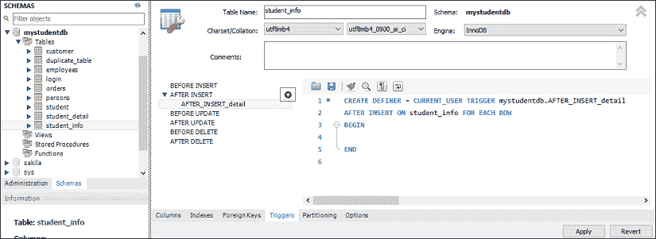
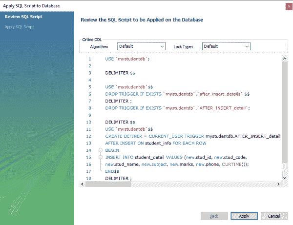
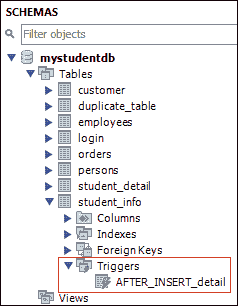

# 插入触发器后的 MySQL

> 原文：<https://www.javatpoint.com/mysql-after-insert-trigger>

MySQL 中的“插入后触发器”在表中发生插入事件时自动调用。在本文中，我们将学习如何使用其语法和示例来创建 after insert 触发器。

### 句法

以下是在 MySQL 中创建 **AFTER INSERT** [触发器的语法:](mysql-trigger)

```sql

CREATE TRIGGER trigger_name 
AFTER INSERT
ON table_name FOR EACH ROW
trigger_body ;

```

“插入后”触发器语法参数可以解释如下:

*   首先，我们将指定我们想要创建的触发器的**名称。它在模式中应该是唯一的。**
*   第二，我们将指定**触发动作时间**，应该是 AFTER INSERT 子句来调用触发器。
*   第三，我们将指定与触发器关联的表的**名称。必须写在 ON 关键字之后。如果我们不指定表名，触发器就不存在。**
*   最后，我们将指定包含一个或多个语句的**触发器主体**，以便在触发器被激活时执行。

如果我们想要执行多个语句，我们将使用包含一组 SQL 查询的 **BEGIN END** 块来定义触发器的逻辑。请参见以下语法:

```sql

DELIMITER $$ 
CREATE TRIGGER trigger_name AFTER INSERT
ON table_name FOR EACH ROW
BEGIN
   variable declarations
   trigger code
END$$
DELIMITER ;

```

### 限制

*   我们可以访问**新的**值，但是**不能在“插入后”触发器中更改它们**。
*   我们无法访问 **OLD** 如果我们试图访问 OLD 值，我们将会得到一个错误，因为在 INSERT 触发器上没有 OLD。
*   我们不能在**视图**上创建“插入后”触发器。

### 插入后触发器示例

让我们通过一个例子来了解如何使用 [MySQL](https://www.javatpoint.com/mysql-tutorial) 中的 **[CREATE TRIGGER](mysql-create-trigger)** 语句来创建 AFTER INSERT 触发器。

假设我们创建了一个名为“ **student_info** 的表，如下所示:

```sql

CREATE TABLE student_info (
  stud_id int NOT NULL,
  stud_code varchar(15) DEFAULT NULL,
  stud_name varchar(35) DEFAULT NULL,
  subject varchar(25) DEFAULT NULL,
  marks int DEFAULT NULL,
  phone varchar(15) DEFAULT NULL,
  PRIMARY KEY (stud_id)
)

```

接下来，我们将在该表中插入一些记录，然后执行 [SELECT 语句](https://www.javatpoint.com/mysql-select)查看表数据，如下所示:



同样，我们将创建名为**“student _ detail”**的新表，如下所示:

```sql

CREATE TABLE student_detail (
  stud_id int NOT NULL,
  stud_code varchar(15) DEFAULT NULL,
  stud_name varchar(35) DEFAULT NULL,
  subject varchar(25) DEFAULT NULL,
  marks int DEFAULT NULL,
  phone varchar(15) DEFAULT NULL,
  Lasinserted Time,
  PRIMARY KEY (stud_id)
);

```

接下来，我们将使用 CREATE TRIGGER 语句在**学生信息**表上的 _insert_details 触发器之后创建一个**。在表上执行插入操作后，将触发此触发器。**

```sql

mysql> DELIMITER //
mysql> Create Trigger after_insert_details
AFTER INSERT ON student_info FOR EACH ROW
BEGIN
INSERT INTO student_detail VALUES (new.stud_id, new.stud_code, 
new.stud_name, new.subject, new.marks, new.phone, CURTIME());
END //

```

如果触发器创建成功，我们将获得如下输出:


### 如何调用 AFTER INSERT 触发器？

我们可以使用以下语句来调用上面创建的触发器:

```sql

mysql> INSERT INTO student_info VALUES 
(10, 110, 'Alexandar', 'Biology', 67, '2347346438');

```

执行更新查询后修改的表是 student_detail。我们可以使用 SELECT 语句进行验证，如下所示:

```sql

mysql> SELECT * FROM student_detail;

```


在这个输出中，我们可以看到，在向 student_info 表中插入值时，student_detail 表将通过调用触发器自动填充记录。

### 如何在 MySQL 工作台中创建 AFTER INSERT 触发器？

要使用此工具创建一个插入后触发器，我们首先需要**启动 [MySQL 工作台](https://www.javatpoint.com/mysql-workbench)** ，并使用我们之前创建的用户名和密码登录。我们将获得如下屏幕:


现在，请执行以下步骤来创建“插入后”触发器:

1.转到导航选项卡，点击包含 MySQL Server 中所有可用数据库的**模式菜单**。

2.选择数据库(例如 mystudentdb)，双击它，显示包含表、视图、函数和存储过程的**子菜单**。请参见下面的屏幕。



3.展开**表格子菜单**，选择要创建触发器的表格。选择表格后，右键单击所选表格(**例如**、mystudentdb)，然后单击“更改表格”选项。请参见下图:



4.点击**更改表格**选项，屏幕如下:



5.现在，点击上一部分红色矩形框中显示的**触发标签**，然后选择插入后的计时/事件**。我们会注意到有一个 **(+)图标**按钮来添加触发器。点击该按钮，我们将获得基于选择定时/事件的触发器默认代码:**



6.现在，完成触发代码，再次检查它们，如果没有发现错误，单击应用按钮。



7.点击应用按钮后，点击**完成按钮**完成。


8.如果我们查看模式菜单，我们可以在**学生信息**表下看到 **AFTER_INSERT_detail** 触发器，如下所示:



* * *