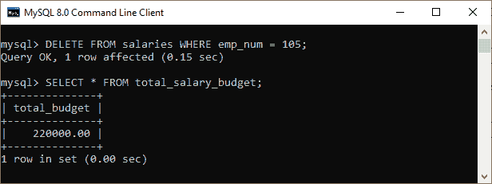
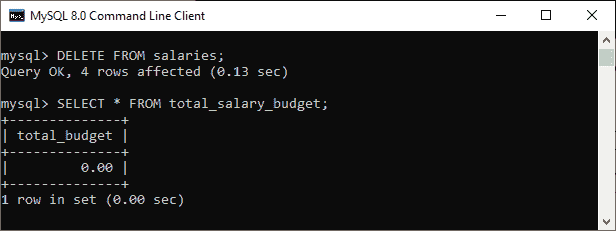
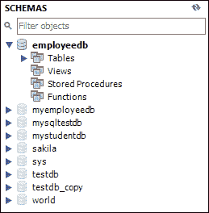
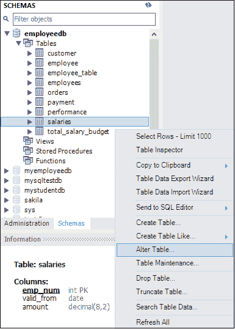
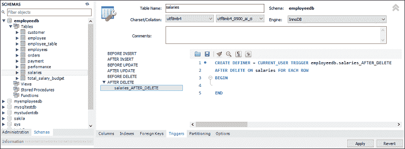
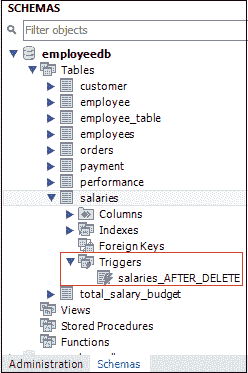

# 删除触发器后的 MySQL

> 原文：<https://www.javatpoint.com/mysql-after-delete-trigger>

每当对表触发删除事件时，都会自动调用 MySQL 中的 AFTER DELETE 触发器。在本文中，我们将学习如何创建 AFTER DELETE 触发器及其语法和示例。

### 句法

以下是在 MySQL 中创建删除后的**触发器的语法:**

```sql

CREATE TRIGGER trigger_name 
AFTER DELETE
ON table_name FOR EACH ROW
Trigger_body ;

```

“删除后”触发器语法参数可以解释如下:

*   首先，我们将指定我们想要创建的触发器的**名称。它在模式中应该是唯一的。**
*   第二，我们会指定**触发动作时间**，应该是 AFTER DELETE。该触发器将在表上的每一行更改发生后被调用。
*   第三，我们将指定与触发器关联的表的**名称。必须写在 ON 关键字之后。如果我们不指定表名，触发器就不存在。**
*   最后，我们将指定**触发器主体**，它包含一条语句，用于在触发器被激活时执行。

如果我们想要执行多个语句，我们将使用包含一组 SQL 查询的 **BEGIN END** 块来定义触发器的逻辑。请参见以下语法:

```sql

DELIMITER $$ 
CREATE TRIGGER trigger_name AFTER DELETE
ON table_name FOR EACH ROW
BEGIN
   variable declarations
   trigger code
END$$
DELIMITER ;

```

### 限制

*   我们可以访问旧行，但不能在“删除后”触发器中更新它们。
*   我们无法访问新行。这是因为不存在新行。
*   我们不能在视图上创建 AFTER DELETE 触发器。

### 删除后触发示例

让我们通过一个例子来了解如何在 MySQL 中使用 [CREATE TRIGGER 语句创建 AFTER DELETE 触发器。](mysql-create-trigger)

假设我们创建了一个名为**工资**的表来存储员工的工资信息，如下所示:

```sql

CREATE TABLE salaries (
    emp_num INT PRIMARY KEY,
    valid_from DATE NOT NULL,
    amount DEC(8 , 2 ) NOT NULL DEFAULT 0
);

```

接下来，我们将使用下面的语句在该表中插入一些记录:

```sql

INSERT INTO salaries (emp_num, valid_from, amount)
VALUES
    (102, '2020-01-10', 45000),
    (103, '2020-01-10', 65000),
    (105, '2020-01-10', 55000),
    (107, '2020-01-10', 70000),
    (109, '2020-01-10', 40000);

```

执行 SELECT 查询以查看表数据。


第三，我们将创建另一个名为 **total_salary_budget** 的表，该表保存薪资表中的薪资信息。

```sql

CREATE TABLE total_salary_budget(
    total_budget DECIMAL(10,2) NOT NULL
);

```

第四，我们将使用 **SUM()** 函数从薪资表中返回薪资总额，并将此信息保存在 total_salary_budget 表中:

```sql

mysql> INSERT INTO total_salary_budget (total_budget)
SELECT SUM(amount) FROM salaries;

```

执行 SELECT 语句来验证该表:


然后，我们将创建一个 AFTER DELETE 触发器，在从薪资表中删除一行后，该触发器将薪资总额更新到 total_salary_budget 表中。

```sql

DELIMITER $$

CREATE TRIGGER after_delete_salaries
AFTER DELETE
ON salaries FOR EACH ROW
BEGIN
   UPDATE total_salary_budget SET total_budget = total_budget - old.amount;
END$$ 

DELIMITER ;

```


在这个触发器中，我们首先在 _ delete _ salaries 之后指定了触发器名称。然后，指定触发事件。第三，我们指定了与触发器关联的表名。最后，我们在触发器体内编写了触发器逻辑，在从薪资表中删除一行后，将薪资总额更新到 total_salary_budget 表中。

### 如何调用 AFTER DELETE 触发器？

首先，我们将使用以下语句从薪资表中删除薪资，以调用上面创建的触发器:

```sql

mysql> DELETE FROM salaries WHERE emp_num = 105;

```

接下来，我们将从 total_salary_budget 表中查询数据。我们可以看到该表在执行查询后被修改了。请参见以下输出:

```sql

mysql> SELECT * FROM total_salary_budget;

```



在输出中，我们可以看到删除的工资减少了 total_budget。

第三，我们将从薪资表中删除所有数据:

```sql

mysql> DELETE FROM salaries;

```

同样，我们将从 total_salary_budget 表中查询数据。我们可以看到触发器在执行查询后将表更新为零。请参见以下输出:



### 如何在 MySQL 工作台中创建 AFTER DELETE 触发器？

要使用此工具创建一个插入后触发器，我们首先需要**启动 [MySQL 工作台](https://www.javatpoint.com/mysql-workbench)** ，并使用我们之前创建的用户名和密码登录。我们将获得如下屏幕:


现在，请执行以下步骤来创建 AFTER DELETE 触发器:

1.转到导航选项卡，点击**模式菜单**，该菜单包含 [MySQL](https://www.javatpoint.com/mysql-tutorial) 服务器中所有可用的数据库。

2.选择数据库(例如， **employeedb** ，双击它，显示包含表、视图、函数和存储过程的**子菜单**。请参见下面的屏幕。



3.展开**表格子菜单**，选择要创建触发器的表格。选择表格后，右键单击所选表格(**例如**、薪资)，然后单击 **[更改表格](https://www.javatpoint.com/mysql-alter-table)** 选项。请参见下图:



4.点击**更改表格**选项，屏幕如下:


5.现在，点击上一节红色矩形框中显示的 **[触发](https://www.javatpoint.com/mysql-trigger)选项卡**，然后选择【删除】后的计时/事件**。我们会注意到有一个(+)图标按钮来添加触发器。点击该按钮，我们将获得基于选择定时/事件的触发器默认代码:**

**

6.现在，完成触发代码，再次查看，如果没有发现错误，点击**应用**按钮。


7.点击应用按钮后，点击**完成按钮**完成。


8.如果我们查看模式菜单，可以看到**薪资**表下的**薪资 _AFTER_DELETE** 触发器如下:



* * ***