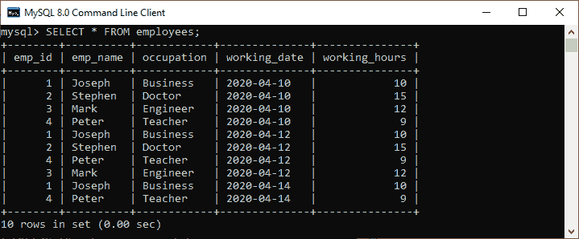

# MySQL sum()函数

> 原文：<https://www.javatpoint.com/mysql-sum>

MySQL sum()函数用于返回表达式的合计值。如果结果集没有任何行，则返回**空值**。它是 MySQL 中聚合函数的一种。

### 句法

以下是 MySQL 中 sum()函数的语法:

```sql
SELECT SUM(aggregate_expression)  
FROM tables  
[WHERE conditions];

```

### 参数说明

**aggregate_expression:** 它指定了我们要计算总和的列或表达式。

**table_name:** 它指定了我们要从中检索记录的表。FROM 子句中必须至少列出一个表。

**所在条件:**可选。它指定了要选择的记录必须满足的条件。

### MySQL sum()函数示例

假设我们的数据库有一个名为**员工**的表，有以下数据。现在，我们将通过各种例子来理解这个函数:



**1。基本示例**

执行以下查询，计算表中所有员工的总工作时间:

```sql
mysql> SELECT SUM(working_hours) AS "Total working hours" FROM employees;

```

**输出:**

我们将得到如下结果:


**2。带 WHERE 子句的 MySQL sum()函数**

此示例用于根据 WHERE 子句中指定的条件返回结果。执行以下查询，计算**工作时间> = 12** 的员工的总工作时间。

```sql
mysql> SELECT SUM(working_hours) AS "Total working hours" FROM employees WHERE working_hours>=12;

```

**输出:**

该语句将给出如下输出:


**3。带有 GROUP BY 子句的 MySQL sum()函数**

我们还可以使用 SUM()函数和 GROUP BY 子句来返回每个组的合计值。例如，此语句通过使用 SUM()函数和 GROUP BY 子句来计算每个员工的总工作时间，如下查询所示:

```sql
mysql> SELECT emp_id, emp_name, occupation, SUM(working_hours) AS "Total working hours" FROM employees GROUP BY occupation;

```

**输出:**

在这里，我们可以看到每个员工的总工作时间是根据他们的职业分组计算的。


**4。带 HAVING 子句的 MySQL sum()函数**

HAVING 子句用于通过 MySQL 中的 sum()函数过滤组。执行以下语句，计算所有员工的工作时间，根据他们的职业对他们进行分组，并返回总工作时间为> 24 的结果。

```sql
mysql> SELECT emp_id, emp_name, occupation, 
SUM(working_hours) Total_working_hours 
FROM employees 
GROUP BY occupation 
HAVING SUM(working_hours)>24;

```

**输出:**


**5。带 DISTINCT 子句的 MySQL sum()函数**

MySQL 使用 DISTINCT 关键字从列名中删除**重复的**行。此子句还可以与 sum()函数一起使用，以返回表中存在的唯一记录数的合计值。

执行以下查询，删除 employee 表的 working _ hours 列中的重复记录，然后计算总和:

```sql
mysql> SELECT emp_name, occupation, 
SUM(DISTINCT working_hours) Total_working_hours
FROM employees 
GROUP BY occupation;

```

**输出:**


* * *