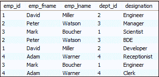

# MySQL GROUP_CONCAT()函数

> 原文：<https://www.javatpoint.com/mysql-group_concat-function>

MySQL 中的 GROUP_CONCAT()函数是一种聚合函数。此函数用于使用各种子句将多行中的字符串连接成单个字符串。如果该组至少包含一个非空值，它将始终返回一个字符串值。否则，您将得到一个空值。

以下是 GROUP_CONCAT()函数的语法:

```sql

GROUP_CONCAT(
    DISTINCT expression
    ORDER BY expression
    SEPARATOR sep
);

```

或者，

```sql

mysql> SELECT c1, c2, ....., cN
GROUP_CONCAT ( 
   [DISTINCT] c_name1 
   [ORDER BY]  
   [SEPARATOR] ) 
FROM table_name GROUP BY c_name2;

```

在这个语法中，

*   c1，c2，…，cN 是表列。
*   c_name1 是一个表列，其值将被连接成每个组的单个字符串。
*   c_name2 是执行分组的表列。

GROUP_CONCAT()函数的选项解释如下:

**Distinct:** 该子句在进行串联之前删除组中的重复值。

**排序依据:**允许我们按照升序或降序对分组数据进行排序，然后进行拼接。默认情况下，它以升序执行排序。但是，您可以显式地使用 DESC 选项按降序对值进行排序。

**分隔符:**默认情况下，该子句使用逗号(，)运算符作为分隔符。如果要更改默认分隔符，可以指定文字值。

#### 注意:这个函数总是根据指定的参数返回二进制或非二进制字符串值的结果。默认情况下，它返回等于 1024 的字符串值的最大长度。如果想增加这个长度，可以使用 group_concat_max_len 系统变量。

### GROUP_CONCAT()示例

让我们创建一个表雇员来理解这个函数如何在使用不同查询的 [MySQL](https://www.javatpoint.com/mysql-tutorial) 中工作。



**1。使用简单查询**

```sql

mysql> SELECT emp_id, emp_fname, emp_lname, dept_id, 
GROUP_CONCAT(designation) as "designation" FROM employee group by emp_id;

```

该语句将给出以下输出:


**2。使用 DISTINCT 子句**

```sql

mysql> SELECT emp_fname, dept_id, 
GROUP_CONCAT(DISTINCT designation) as "designation" FROM employee group by emp_id;

```

成功执行上述语句后，我们将获得以下输出:


**3。使用分隔符子句**

```sql

mysql>SELECT emp_fname, 
GROUP_CONCAT(DISTINCT designation SEPARATOR '; ') as "designation" FROM employee group by emp_id; 

```

这里，separator 子句将默认的返回字符串逗号(，)更改为分号(；)和一个空白字符。

上面的语句将给出以下输出:


### GROUP_CONCAT()和 CONCAT_WS()

现在，您已经了解了 GROUP_CONCAT()函数的工作原理。有时，我们可以将这个函数与 CONCAT_WS()函数一起使用，这样会得到更有用的结果。以下陈述更清楚地解释了这一点:

```sql

mysql>SELECT GROUP_CONCAT(CONCAT_WS(', ', emp_lname, emp_fname) SEPARATOR ';') as employeename FROM employee;

```

在这个语句中，CONCAT_WS()函数首先将每个员工的名字和姓氏连接起来，得到员工的全名。接下来，我们使用带有分号(；)separator 子句将所有员工的列表放在一行中。最后，执行语句。成功执行后，我们将获得以下输出:


该函数在单行中返回结果，而不是值列表。因此，我们不能使用运算符中的[来处理 GROUP_CONCAT()函数。如果我们在这个函数中使用一个输入操作符，那么查询将不起作用，因为输入操作符接受一个值列表，而不是一个字符串。](https://www.javatpoint.com/mysql-in)

* * *