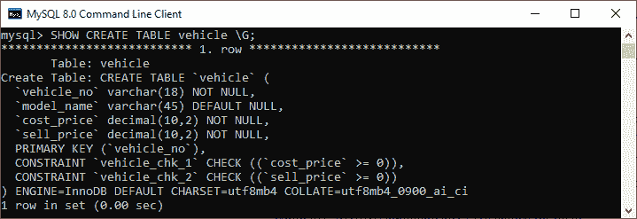
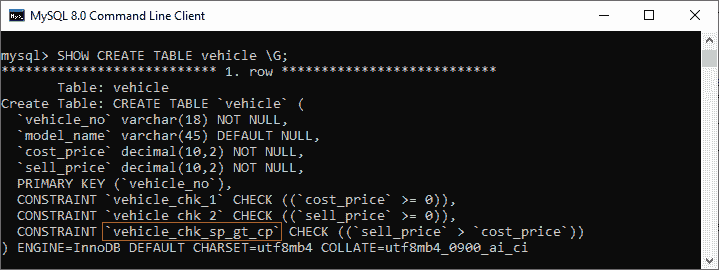

# MySQL CHECK CONSTRAINT

> 原文：<https://www.javatpoint.com/mysql-check-constraint>

检查约束是控制特定列中值的完整性约束。它确保列中插入或更新的值必须与给定的条件相匹配。换句话说，它**确定在给定条件下与列相关联的值是否有效**。

在 8.0.16 版本之前，MySQL 使用这个约束的有限版本。在以前的版本中，我们可以创建这个约束，但是它不起作用。这意味着它的语法是受支持的，但不适用于数据库。在早期版本中，CREATE TABLE 语句可以包含一个 CHECK 约束，但是它们被 MySQL 解析和忽略。在以前的版本中，我们可以使用以下语法:

```sql

CHECK (expr)  

```

如果我们使用以前的版本并希望使用检查约束，我们可以通过使用带有检查选项的视图或触发器来模拟它来使用约束。

8.0.16 版之后， [MySQL](https://www.javatpoint.com/mysql-tutorial) 对所有存储引擎使用 CHECK 约束，即表约束和列约束:

```sql

[CONSTRAINT [symbol]] CHECK (expr) [[NOT] ENFORCED]  

```

在这个语法中，我们首先需要为我们想要创建的检查约束编写名称。如果我们不写它，MySQL 会按照下面的约定自动生成一个名称:

```sql

table_name_chk_n

```

这里， **n** 表示数字，例如用户表的 CHECK 约束名称将是 user_chk_1、user_chk_2 等等。接下来，我们需要为每个表记录指定一个**布尔表达式**，该表达式应被评估为真或未知。如果此表达式返回 FALSE，则给定值会发生约束冲突。

第三，我们可以选择使用强制子句来验证检查约束是否被强制。如果我们想要创建并强制执行约束，请使用 ENQUIRED 或省略子句。如果您想创建一个没有强制执行的约束，请使用 NOT implemented 子句。

我们之前讨论过 CHECK 约束可以用作 MySQL 中的表约束或列约束。如果我们将 CHECK 约束指定为一个表，它可能会应用于多个列。相比之下，如果我们已经为一个列定义了这个约束，那么它可以被引用到唯一定义它的列。

## MySQL 检查约束示例

通过各种例子，让我们了解如何对列和表使用 check 约束。

### 1)带列的 MySQL CHECK 约束

下面的语句创建了一个名为 **vehicle** 的新表，我们在其中指定了列上的检查约束:

```sql

CREATE TABLE vehicle (
    vehicle_no VARCHAR(18) PRIMARY KEY,
    model_name VARCHAR(45),
    cost_price DECIMAL(10,2 ) NOT NULL CHECK (cost_price >= 0),
    sell_price DECIMAL(10,2) NOT NULL CHECK (sell_price >= 0)
);

```

在报表中，我们可以看到**两个 CHECK 约束列**，分别是**成本价**和**卖价**列。如前所述，如果我们没有显式指定检查约束名称，MySQL 会自动为它们命名。

我们可以使用 **SHOW CREATE TABLE** 语句显示带有 CHECK 约束名称的表信息，如下所示:

```sql

mysql> SHOW CREATE TABLE vehicle;

```

我们应该得到下面的输出，在这里我们可以看到 MySQL 为检查约束生成了名称 **vehicle_chk_1** 和 **vehicle_chk_2** 。



接下来，我们将使用下面的语句向表中插入一些记录:

```sql

mysql> INSERT INTO vehicle(vehicle_no, model_name, cost_price, sell_price) 
VALUES('S2001', 'Scorpio', 950000, 1000000),
('M3000', 'Mercedes', 2500000, 3000000);

```

该语句执行正确，因为它不违反检查约束条件。每当我们在 check constraint 列中插入或更新一个值，导致布尔表达式的计算不正确时，MySQL 都会反对这一更改，并给出一条错误消息。请参阅下面的陈述，该陈述试图将新记录插入车辆表中:

```sql

mysql> INSERT INTO vehicle(vehicle_no, model_name, cost_price, sell_price) 
VALUES('R0001', 'Rolls Royas', 75000000, -85000000);

```

执行此语句后， **MySQL 发出如下错误**:

```sql

ERROR 3819 (HY000): Check constraint 'vehicle_chk_2' is violated.

```


我们会得到这个错误，因为 sell_price value 列是负的，通过评估表达式 **price > = 0** 到 **FALSE** 违反了检查约束规则。

### 2)带表的 MySQL CHECK 约束

首先，我们将使用下面的语句删除上表:

```sql

mysql> DROP TABLE IF EXISTS vehicle;

```

接下来，我们将使用以下语句再次创建具有一个检查约束的相同表名车辆:

```sql

CREATE TABLE vehicle (
	vehicle_no VARCHAR(18) PRIMARY KEY,
	model_name VARCHAR(45),
	cost_price DECIMAL(10,2 ) NOT NULL CHECK (cost_price >= 0),
	sell_price DECIMAL(10,2) NOT NULL CHECK (sell_price >= 0),
	CONSTRAINT vehicle_chk_sp_gt_cp CHECK(sell_price > cost_price)
);

```

在这个语句中，我们可以看到一个新的子句，它定义了一个表 CHECK 约束，以确保 **sell_price 总是高于 cost_price** ，如下所示:

```sql

CONSTRAINT vehicle_chk_sp_gt_cp CHECK(sell_price > cost_price)

```

由于我们已经明确定义了检查约束的名称，MySQL 在表定义中添加了这个具有指定名称的新约束。我们可以再次使用 SHOW CREATE TABLE 语句来显示带有 CHECK 约束名称的表定义，如下所示:



在输出结果中，我们可以看到 MySQL 在列列表之后的表描述的末尾为一个表生成了 check constraints 名称，如红色矩形框所示。

接下来，我们将向表中添加一些记录，如下所示:

```sql

mysql> INSERT INTO vehicle(vehicle_no, model_name, cost_price, sell_price) 
VALUES('S2001', 'Avenger', 250000, 275000),
('M3000', 'Apache', 120000, 125000);

```

该语句执行正确，因为它不违反检查约束条件。同样，我们将尝试在表中插入一条新记录，其**卖价小于成本价**:

```sql

INSERT INTO vehicle (vehicle_no, model_name, cost_price, sell_price) 
VALUES('R0001', 'Honda', 80000, 70000);

```

由于违反了约束，MySQL 拒绝了该更改并给出了一条错误消息。请参见以下输出:


### 如何删除检查约束？

我们可以使用以下语句从表或列中删除 check 约束:

```sql

ALTER TABLE table_name DROP CHECK constraint_name;
Or,
ALTER TABLE table_name DROP CONSTRAINT constraint_name;

```

**例如**，如果我们想从表车辆中删除检查约束，我们可以执行如下语句:

```sql

mysql> ALTER TABLE vehicle DROP CHECK vehicle_chk_sp_gt_cp;

```

此语句删除指定的约束。经过验证，我们可以在输出中看到指定的约束名称已经被成功删除。


* * *