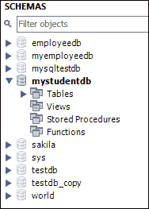
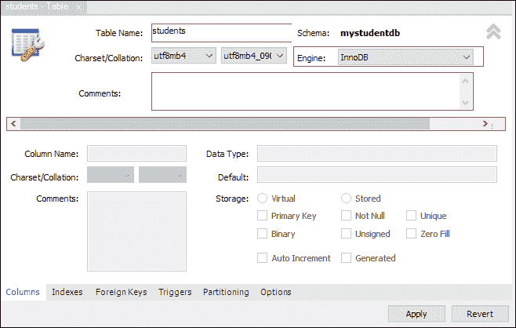
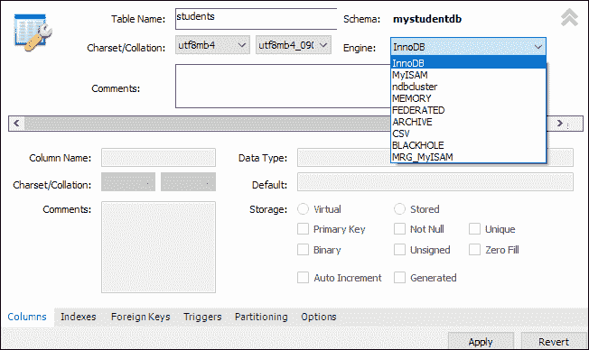
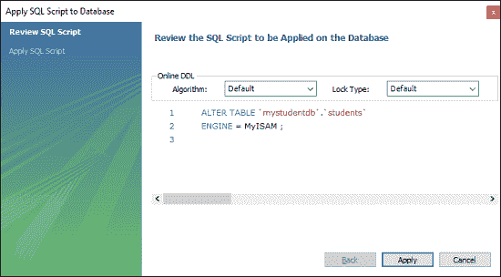

# MySQL 变更存储引擎

> 原文：<https://www.javatpoint.com/mysql-change-storage-engine>

MySQL **存储引擎用于最大化数据库**的性能。它处理在数据库中存储和管理信息的创建、读取和更新操作。在本文中，我们将学习如何更改 MySQL 中的存储引擎。

**以下是 [MySQL](https://www.javatpoint.com/mysql-tutorial) 中提供不同功能和特性**的各种存储引擎支持:

*   是啊
*   我的天
*   合并
*   InnoDB
*   内存(堆)
*   档案馆
*   地热与温泉
*   战斗支援车
*   联邦的

如果我们想知道我们的 MySQL 服务器支持哪些存储引擎，我们需要使用下面的查询。

```

mysql> SHOW ENGINES;

```

它返回以下输出:


**支持栏**值表示当前服务器中是否可以使用引擎。**是、否**或**默认**的值显示表类型为**可用，不可用**，当前设置为默认存储引擎的**可用。**

### 如何显示表格的当前存储引擎？

我们可以通过下面讨论的几种方式获得表的当前存储引擎:

1.显示表的当前存储引擎的第一种方式是在 **information_schema** 数据库中。**例如**，如果我们在 **mystudentdb** 数据库中有一个名为**学生**的表，我们可以使用以下查询来获取当前的存储引擎:

```

mysql> SELECT engine FROM information_schema.tables
WHERE table_schema = 'mystudentdb' AND table_name = 'students';

```

我们将获得以下输出:


2.显示表格当前存储引擎的第二种方法是使用**显示表格状态**命令。**例如**，如果我们想要获取名为**学生**的表的存储引擎，我们可以使用如下查询:

```

mysql> SHOW TABLE STATUS LIKE 'students';

```

我们将获得下面的输出，其中我们可以看到红色矩形框中的当前存储引擎:


3.在表格中显示当前存储引擎的第三种方法是使用 **SHOW CREATE TABLE** 命令。**例如**，如果我们想要获取名为**学生**的表的存储引擎，我们可以使用如下查询:

```

mysql> SHOW CREATE TABLE students \G;

```

我们将获得下面的输出，其中我们可以看到红色矩形框中的当前存储引擎:


### MySQL 中如何更换存储引擎？

我们可以看到，MySQL 显示的**‘学生’**表使用了 **InnoDB** 存储引擎。有时候，我们想要改变存储引擎。在这种情况下，我们可以使用以下语句:

```

ALTER TABLE table_name ENGINE engine_name;

```

我们已经使用 **SHOW ENGINES** 语句看到了 MySQL 服务器中当前支持的所有存储引擎。如果我们想将“学生”表的存储引擎从 InnoDB 更改为任何其他引擎，我们可以使用如下语句:

```

mysql> ALTER TABLE students ENGINE = 'MYISAM';

```

执行此语句后，我们将获得以下输出:


我们可以通过再次显示当前存储命令来验证它。参见以下输出，其中 InnoDB 引擎更改为 **MyISAM** 引擎:


### 如何在 MySQL Workbench 中更改存储引擎？

我们首先启动该工具，并使用用户名和密码登录，以在 MySQL 工作台中更改所需表的存储引擎。现在，我们需要执行以下步骤来更改存储引擎:

1.转到**导航选项卡**并点击**模式菜单**，其中所有先前创建的数据库都可用。选择您想要的数据库(例如， **mstudentdb** )。它将弹出以下选项。



2.展开**表格子菜单**，选择要更改的存储引擎的表格。选择表格后，右键单击所选表格(例如**学生**，然后单击**更改表格**选项。点击更改表格选项，我们将获得如下屏幕:



3.接下来，点击上一步红色矩形框中显示的**引擎**选项；我们将获得 MySQL 中所有当前支持的存储引擎的名称。请参见下面的屏幕:



4.现在，从给定选项中选择所需的存储引擎，并点击**应用**按钮。它将显示以下屏幕:



5.最后我们会再次点击应用按钮，如果没有发现错误，点击**完成**按钮，完成更换存储引擎的过程。


在本教程中，我们学习了如何显示 MySQL 中当前支持的存储引擎，获取表的当前存储引擎，并将一个引擎更改为另一个引擎。

* * *