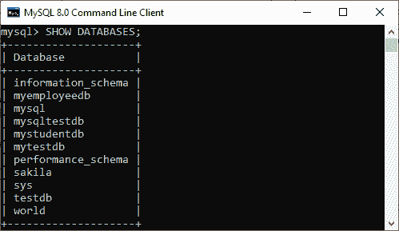
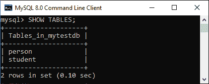
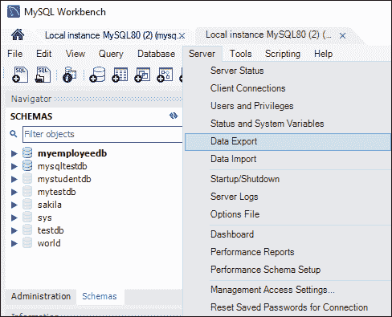
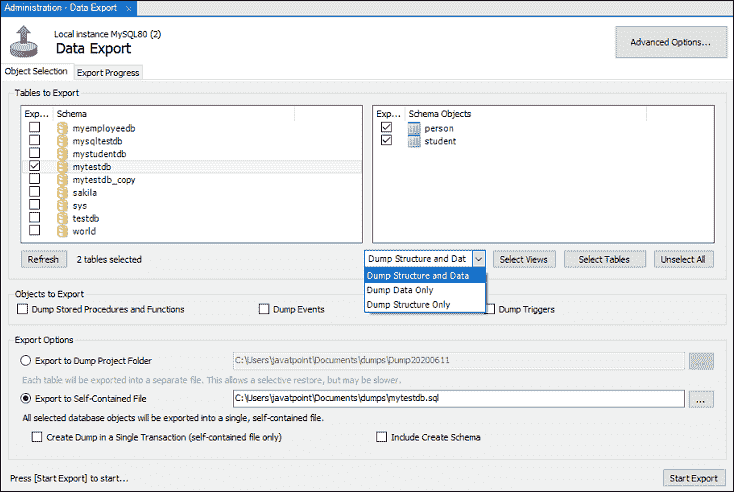
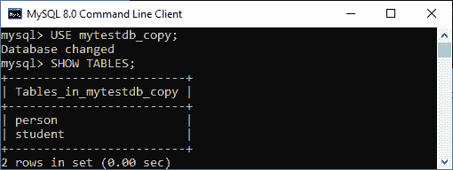
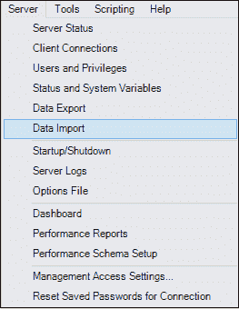
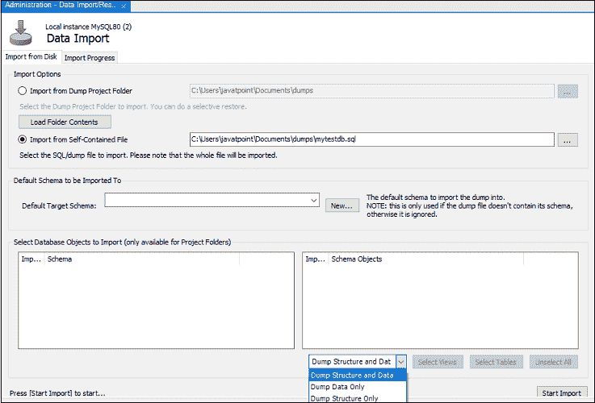

# MySQL 导出和导入数据库

> 原文：<https://www.javatpoint.com/mysql-export-and-import-database>

### 如何在 MySQL 中导出和导入数据库？

MySQL 中的数据库导出和导入是将数据从一个地方移动到另一个地方的过程。导出和导入是备份重要数据或在不同版本之间传输数据的有用方法。例如，我们有一个对我们的业务至关重要的通讯录数据库。有必要把它放在一个安全的地方。因此，我们需要将它导出到安全的地方，每当它从原始位置丢失时，我们可以使用导入选项来恢复它。

在 MySQL 中，我们可以主要通过两种方式导出和导入数据库:

1.  命令行工具
2.  MySQL 工作台

让我们详细讨论一下数据库导出和导入的两种方式。

### MySQL 导出数据库

### 命令行工具

在这里，我们将看到数据库导出，包括使用命令行工具的表。因此，使用用户名和密码打开命令行工具，并执行以下步骤:

**步骤 1:** 执行下面的语句，显示 [MySQL](https://www.javatpoint.com/mysql-tutorial) 服务器上所有可用的数据库。

```

mysql> SHOW DATABASES;

```

我们将获得以下输出:



**步骤 2:** 从上面的数据库中，我们将获取一个名为**“mytestdb”**的数据库，该数据库包含下表:



**步骤 3:** 访问存储数据库的计算机上的命令行。如果您对计算机有物理访问权限，您可以打开 DOS 或终端窗口来访问命令行。**例如**，如果我们已经在 **C 文件夹**中安装了 MySQL，复制下面的文件夹粘贴到我们的 DOS 命令中。现在，按下**回车键**。

```

C:\Users\javatpoint> CD C:\Program Files\MySQL\MySQL Server 8.0\bin

```

**第四步:**现在，我们使用 **mysqldump** 工具导出数据库。该工具使用 MySQL 用户的登录凭据进行操作。以下命令用于将数据库导出到所需位置。

```

$ mysqldump -u username -p database_name > desiredplace\dbname.sql

```

**-u:** 它保证了 MySQL 用户名会被遵守。
**用户名:**是我们可以登录数据库的用户名。
**-p:** 确保与用户名关联的密码。
**database_name:** 是我们要导出的一个数据库的名称。
>:保证输出位置。
**desired place \ dbname.sql:**desired _ place 是我们要导出的文件夹，db name . SQL 是输出将与之一起保存的文件。

在下面的语句中，我们将给出一个用户名: **root** ，数据库名: **mytestdb** ，文件夹名: **BackupFile** ，输出数据库名: **testdb.sql.** 现在，按回车键。

```

mysqldump -u root -p mytestdb > D:\BackupFile\testdb.sql

```

**第五步:**按回车键后，会询问我们指定的用户名的密码。然后，再次按回车键。它将使用**创建备份文件。指定位置的 sql 后缀**。我们将获得如下输出，这意味着数据库导出成功:


最后，我们可以验证导出数据库，包括指定文件夹中的表。

### MySQL 工作台

在这里，我们将看到数据库导出，包括使用 [MySQL 工作台](https://www.javatpoint.com/mysql-workbench)的表。所以打开工作台，输入用户名的密码。

**第一步:**进入菜单栏，点击服务器。出现一个弹出屏幕，然后选择**数据导出**选项，如该屏幕所示。它将打开一个数据导出设置和选项的新窗口。



**第二步:**选择任何你想要的数据库。它还将在窗口的左侧部分显示相应的表格。在这里，我们将选择 **mytestdb** 数据库。我们还可以选择多个数据库复选框，将数据库包含在导出文件中。同样，我们可以选择多个表。



**步骤 3:** 选择数据库后，包括所有表，进入下拉设置，选择任意可用选项。

*   **转储数据和结构:**将保存表结构和数据行。
*   **仅转储数据:**它将仅保存表中插入的行。
*   **只转储结构:**只保存表结构，表结构是我们定义的数据库列和数据类型。

**第 4 步:**在导出选项中，我们可以看到两个单选按钮，解释如下。

*   **导出到转储项目文件夹:**它会将所有表保存为一个文件夹下的单独的 SQL 文件。当您逐个表地导入或恢复导出文件时，这将非常有用。
*   **导出到自包含文件:**它将所有数据库和表存储在一个 SQL 文件中。当您想要使用单个 SQL 文件导入所有数据库、表和数据行时，这是一个很好的选择。

我们可以选择自己选择的出口路径。在这里，我将保持默认设置。

**第五步:**点击开始导出按钮，显示进度条和日志。现在，我们可以验证系统中文档文件夹中的导出文件。


### MySQL 导入数据库

### 命令行工具

在这里，我们将看到数据库导入，包括使用命令行工具的表。因此，使用用户名和密码打开命令行工具，并执行以下步骤:

**步骤 1:** 使用下面的语句创建一个名为**“mytestdb _ copy”**的空白数据库:

```

mysql> CREATE DATABASE mytestdb_copy;

```

**步骤 2:** 接下来，我们需要执行下面的命令来验证它没有任何表。

```

mysql> USE mytestdb_copy;
mysql> SHOW TABLES;

```

我们可以看到以下输出:


**步骤 3:** 访问存储数据库的计算机上的命令行。如果您对计算机有物理访问权限，您可以打开 DOS 或终端窗口来访问命令行。**例如**，如果我们已经在 **C 文件夹**中安装了 MySQL，复制下面的文件夹链接，粘贴到你的 DOS 命令中。现在，按回车键。

```

C:\Users\javatpoint> CD C:\Program Files\MySQL\MySQL Server 8.0\bin

```

**步骤 4:** 接下来，我们将使用以下命令在您想要的数据库中导入转储文件。

```

$ mysql -u username -p database_name < desiredplace\dbname.sql

```

在下面的语句中，我们将给出一个用户名: **root** ，数据库名: **mytestdb_copy** ，备份文件位置: **BackupFile** ，输入数据库名: **testdb.sql** 。现在，按回车键。

```

$ mysql -u root -p mytestdb_copy < D:\BackupFile\testdb.sql

```

**第五步:**按回车键后，会询问我们指定的用户名的密码。然后，再次按回车键。如果命令执行正确，它不会在屏幕上显示任何内容。我们将看到下面的屏幕，表示数据库已成功导入:


**第 6 步:**再次打开 MySQL 客户端工具，执行下面的命令验证数据库。在输出中，我们可以看到这个数据库现在包含两个表:



### MySQL 工作台

在这里，我们将看到使用 MySQL 工作台导入数据库。因此，打开工作台，输入用户名的密码。

**步骤 1:** 导航至菜单栏，点击服务器。出现一个弹出屏幕，然后选择**数据导入**选项，如该屏幕所示。它将打开一个数据导入设置和选项的新窗口。



**第二步:**在屏幕中，我们可以看到导入数据库和表的两个单选选项，如下所示:

*   从转储项目文件夹导入
*   使用独立文件导入

**第三步:**这里我们选择**【使用自带文件导入】**从数据导入选项中选择想要导入的数据库。

**第 4 步:**选择**【转储结构和数据】**选项，点击**开始导入**按钮，从备份文件导入数据库和表。以下屏幕清楚地解释了所有步骤:



**步骤 5:** 现在，导航到工作台窗口左侧导航器选项下的 Schema，并刷新它以查看当前导入的数据库或表。

* * *