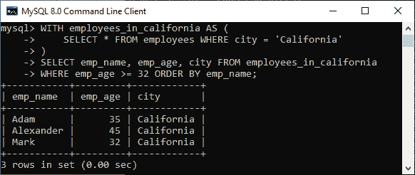
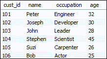
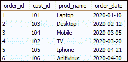
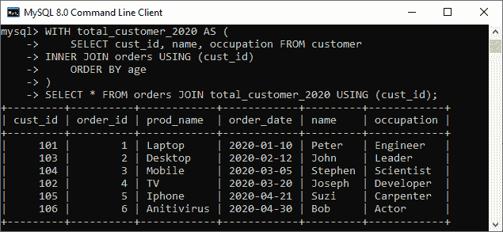
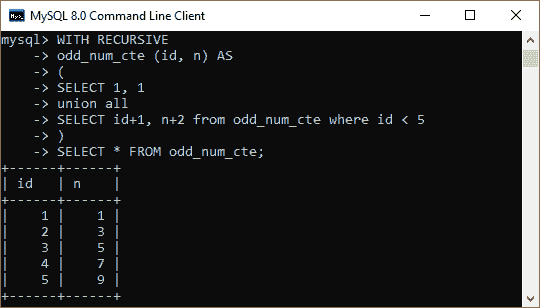

# MySQL 通用表表达式(CTE)

> 原文：<https://www.javatpoint.com/mysql-common-table-expression>

在 MySQL 中，每个语句或查询都会产生一个临时结果或关系。一个通用的表表达式或 CTE 被用来**命名那些存在于特定语句的执行范围内的临时结果集**，如 CREATE、 [INSERT](https://www.javatpoint.com/mysql-insert) 、 [SELECT](https://www.javatpoint.com/mysql-select) 、 [UPDATE](https://www.javatpoint.com/mysql-update) 、 [DELETE](https://www.javatpoint.com/mysql-delete) 等。

与 CTE 有关的一些要点是:

*   它是通过使用 **WITH** 子句定义的。
*   WITH 子句允许我们在一个查询中指定多个 cte。
*   CTE 可以引用同一个 wit 子句中的其他 cte，但是这些 cte 应该更早定义。
*   CTE 的执行范围存在于使用它的特定语句中。

### CTE 语法

MySQL CTE 的语法包括名称、可选的列列表和定义通用表表达式的语句/查询(CTE)。定义 CTE 之后，我们可以将其用作选择、插入、更新和删除查询中的视图。

以下是 [MySQL](https://www.javatpoint.com/mysql-tutorial) 中 CTE 的基本语法:

```

WITH cte_name (column_names) AS (query) 
SELECT * FROM cte_name;

```

这是为了确保 CTE 参数中的列数必须与查询中的列数相同。如果我们没有定义 CTE 参数中的列，它将使用定义 CTE 的查询列。

与派生表类似，它不能存储为对象，并且一旦查询执行完成就会丢失。与派生表相比，CTE 提供了更好的可读性，也提高了性能。

与派生表不同，CTE 是一个**子查询**，它可以使用自己的名称**自引用**。也称为**递归 CTE** ，也可以在同一个查询中多次引用。

与递归 CTE 相关的一些要点是:

*   它是通过使用 WITH RECURSIVE 子句定义的。
*   递归 CTE 必须包含终止条件。
*   我们将使用递归 CTE 来生成和遍历分层或树形数据。

### MySQL 递归 CTE 语法

以下是 MySQL 中递归 CTE 的基本语法:

```

WITH RECURSIVE cte_name (column_names) AS ( subquery ) 
SELECT * FROM cte_name;

```

这里，子查询是一个 MySQL 查询，通过使用 cte_name 作为自己的名称来引用自己。

### MySQL CTE 示例

让我们通过各种例子来理解 CTE 是如何在 MySQL 中工作的。在这里，我们将使用一个表格**“员工”**进行演示。假设该表包含以下数据:


执行以下语句来理解 CTE 的概念。在这个例子中，CTE 的名字是 **employee_in_california** ，定义 CTE 的子查询返回三列 emp_name、emp_age 和 city。因此，加州的 CTE 员工将返回位于加州城市**的所有员工。**

 **在定义了加州的 CTE 员工之后，我们在 **SELECT** 语句中引用了它，以便只选择那些位于加州的员工。

```

WITH employees_in_california AS (
    SELECT * FROM employees WHERE city = 'California' 
	) 
	SELECT emp_name, emp_age, city FROM employees_in_california
	WHERE emp_age >= 32 ORDER BY emp_name;

```

执行上述语句后，它将给出以下输出。在这里，我们可以看到结果只返回位于加州的员工数据。



**更高级的 MySQL CTE 示例**

假设我们有一个名为**客户**和**订单**的表，其中包含以下数据:

**表:客户**



**表:订单**



参见下面使用 **[INNER JOIN](https://www.javatpoint.com/mysql-inner-join)** 子句解释高级 CTE 示例的语句。

```

WITH total_customer_2020 AS (
    SELECT cust_id, name, occupation FROM customer 
	INNER JOIN orders USING (cust_id)
    ORDER BY age
)
SELECT * FROM orders JOIN total_customer_2020 USING (cust_id);

```

执行后，我们将获得如下输出:



### MySQL 递归 CTE 示例

下面的例子解释递归 CTE 的工作原理。考虑以下语句，该语句生成一系列**前五个奇数**:

```

WITH RECURSIVE 
odd_num_cte (id, n) AS
(
SELECT 1, 1 
union all
SELECT id+1, n+2 from odd_num_cte where id < 5 
)
SELECT * FROM odd_num_cte;

```

执行上述语句后，它将给出如下输出:



上面的语句由两部分组成，一部分是非递归的，另一部分是递归的。

**非递归:选择 1，1**

该部分将生成初始行，其中两列为“id”和“n”，一行为单行。

**递归:从 odd_num_cte 中选择 id+1，n+2，其中 id < 5**

该部分负责将行添加到先前的输出中，直到不满足终止条件(id < 5)。当 id 达到 5 时，条件变为假，递归过程终止。

### WITH 子句使用

MySQL 提供了许多上下文来使用 WITH 子句创建 CTE。让我们一个一个详细讨论。

首先，我们可以在 SELECT、UPDATE 和 DELETE 查询的开头使用 WITH 子句，如下所示。

```

WITH ... SELECT ...
WITH ... UPDATE ...
WITH ... DELETE ...

```

其次，我们可以在子查询或派生表子查询的开头使用 WITH 子句，如下所示:

```

SELECT ... WHERE id IN (WITH ... SELECT ...);

SELECT * FROM (WITH ... SELECT ...) AS derived_table;

```

第三，我们可以在包含 SELECT 子句的 SELECT 语句之前使用 WITH 子句，如下所示:

```

CREATE TABLE ... WITH ... SELECT ...
CREATE VIEW ... WITH ... SELECT ...
INSERT ... WITH ... SELECT ...
REPLACE ... WITH ... SELECT ...
DECLARE CURSOR ... WITH ... SELECT ...
EXPLAIN ... WITH ... SELECT ...

```

### 使用 CTE 的好处

*   它提供了更好的查询可读性。
*   它提高了查询的性能。
*   CTE 让我们可以用它来替代视图概念
*   它还可以用作 CTE 链，以简化查询。
*   它还可以用来轻松实现递归查询。

* * ***