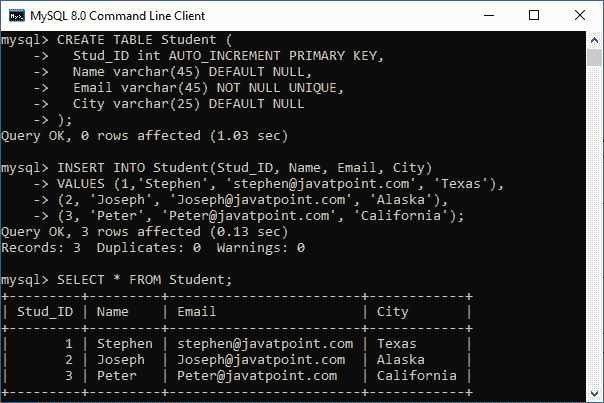
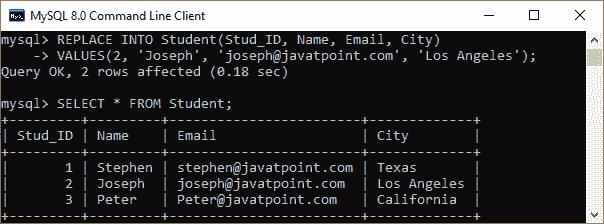
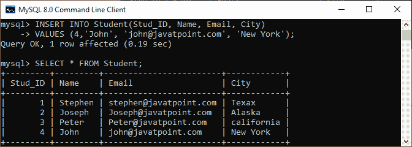
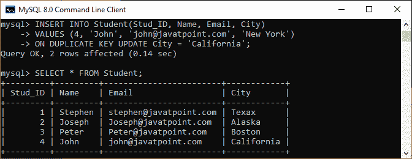

# MySQL UPSERT

> 原文：<https://www.javatpoint.com/mysql-upsert>

UPSERT 是用于**管理数据库**的 DBMS 软件的基本特性之一。此操作允许 DML 用户向表中插入新记录或更新现有数据。升级版由两个词组成，分别是**更新**和**插入**。前两个字母，即 UP 代表更新，而 SERT 代表插入。UPSERT 是一个原子操作，这意味着它是一个单步完成的操作。例如，如果一条记录是新的，它将触发一个 INSERT 命令。但是，如果它已经存在于表中，那么该操作将执行[更新语句](https://www.javatpoint.com/mysql-update)。

默认情况下， [MySQL](https://www.javatpoint.com/mysql-tutorial) 为 INSERT 提供了 ON DUPLICATE KEY UPDATE 选项，该选项可以完成此任务。但是，它也包含一些其他语句来实现这个目标，例如 INSERT IGNORE 或 REPLACE。我们将详细学习和查看所有这些解决方案。

### MySQL UPSERT 示例

我们可以主要通过三种方式执行 MySQL UPSERT 操作，如下所示:

1.  使用插入忽略进行追加
2.  使用 REPLACE 的 UPSERT
3.  使用重复密钥更新时插入进行追加

### 使用插入忽略进行追加

[INSERT IGNORE 语句](https://www.javatpoint.com/mysql-insert-ignore)用于在我们执行无效行的插入操作时忽略我们的执行错误。例如，主键列不能允许我们存储重复的值。如果我们试图插入一个新记录，该记录与表中已经存在的主键相同，我们将得到一个错误。但是，如果我们使用 INSERT IGNORE 命令执行此操作，它将生成警告而不是错误。

**语法**

以下是在 MySQL 中使用 **INSERT IGNORE** 语句的语法:

```sql

INSERT IGNORE INTO table_name (column_names)
VALUES ( value_list), ( value_list) .....;

```

**MySQL INSERT IGNORE 示例**

让我们了解一下 MySQL 中 INSERT IGNORE 语句的工作原理。首先，我们需要使用以下语句创建一个名为**“Student”**的表:

```sql

CREATE TABLE Student (
  Stud_ID int AUTO_INCREMENT PRIMARY KEY,
  Name varchar(45) DEFAULT NULL,
  Email varchar(45) NOT NULL UNIQUE,
  City varchar(25) DEFAULT NULL
);

```

**唯一的** [约束](https://www.javatpoint.com/mysql-constraints)确保我们不能将重复的值保存到**电子邮件列**中。接下来，需要将记录插入到表中。以下语句用于向表中添加数据:

```sql

INSERT INTO Student(Stud_ID, Name, Email, City) 
VALUES (1,'Stephen', 'stephen@javatpoint.com', 'Texas'), 
(2, 'Joseph', 'Joseph@javatpoint.com', 'Alaska'), 
(3, 'Peter', 'Peter@javatpoint.com', 'California');

```

现在，我们可以使用**选择**语句来验证[插入](https://www.javatpoint.com/mysql-insert)操作:

```sql

mysql> SELECT * FROM Student;

```

我们将得到下面的输出，其中我们在表中有**三个**行:



现在，我们将执行下面的语句向表中添加两条记录:

```sql

INSERT INTO Student(Stud_ID, Name, Email, City) 
VALUES (4,'Donald', 'donald@javatpoint.com', 'New York'), 
(5, 'Joseph', 'Joseph@javatpoint.com', 'Chicago');

```

执行上述语句后，我们将看到错误: ***错误 1062 (23000):重复条目“[【电子邮件保护】](/cdn-cgi/l/email-protection)”为“关键”学生。*电子邮件“**因为电子邮件紫罗兰的独特约束。

但是，当我们使用 INSERT IGNORE 命令执行相同的语句时，我们没有收到任何错误。相反，我们只收到警告。

```sql

INSERT IGNORE INTO Student(Stud_ID, Name, Email, City) 
VALUES (4,'Donald', 'donald@javatpoint.com', 'New York'), 
(5, 'Joseph', 'Joseph@javatpoint.com', 'Chicago');

```

MySQL 将产生一条消息:一行被添加，另一行被忽略。

```sql

1 row affected, 1 warning(s): 1062 Duplicate entry for key email.
Records: 2  Duplicates: 1  Warning: 1

```

我们可以使用**显示警告**命令来查看详细的警告:


因此，如果存在一些重复，并且我们使用了 INSERT IGNORE 语句，MySQL 会给出警告而不是发出错误，并将剩余的记录添加到表中。

### 使用 REPLACE 的 UPSERT

在某些情况下，我们希望将现有记录更新到表中，以保持它们的更新。如果我们为此使用标准的插入查询，它将给出主键错误的重复条目。在这种情况下，我们将使用 REPLACE 语句来执行我们的任务。当我们使用 REPLACE 命令时，有两种可能的**事件发生:**

*   如果没有找到与现有数据行匹配的值，则执行标准的 INSERT 语句。
*   如果旧记录与新记录匹配，replace 命令将删除现有行，然后执行普通的 INSERT 语句，在表中添加新记录。

在 REPLACE 语句中，更新分两步执行。首先，它将删除现有记录，然后添加新更新的记录，类似于标准的 INSERT 命令。因此，我们可以说 REPLACE 语句执行两个标准功能， **DELETE** 和 **INSERT** 。

MySQL 中 **REPLACE** 语句的语法如下:

```sql

REPLACE [INTO] table_name(column_list)
VALUES(value_list);

```

**例**

让我们借助一个真实的例子来理解它。这里，我们将采用我们之前创建的包含以下数据的**学生**表:


现在，我们将使用 REPLACE 语句用新城市**洛杉矶**更新 id = 2 的学生的**城市。为此，请执行以下语句:**

```sql

REPLACE INTO Student(Stud_ID, Name, Email, City)
VALUES(2, 'Joseph', 'joseph@javatpoint.com', 'Los Angeles');

```

成功执行后，我们将获得如下输出:



在上图中，我们可以看到消息说**“2 行受影响”**，而我们只更新了一行的值。这是因为 REPLACE 命令首先删除了记录，然后将新记录添加到表中。因此，消息显示“2 行受影响。”

### 使用重复密钥更新时插入进行追加

到目前为止，我们已经看到了两个 UPSERT 命令，但是它们有一些限制。INSERT IGNORE 语句只忽略重复的错误，而不对表进行任何修改。REPLACE 方法检测到了 INSERT 错误，但是它会在添加新记录之前删除该行。因此，到目前为止，我们仍在寻找更好的解决方案。

因此，我们使用更精确的解决方案作为[在复制密钥更新时插入](mysql-insert-on-duplicate-key-update)语句。这是一种非破坏性方法，意味着它不会删除重复的行。相反，当我们在一条 SQL 语句中指定 ON DUPLICATE KEY UPDATE 子句，并且一行将导致在 ***UNIQUE 或 PRIMARY KEY*** 索引列中出现重复的错误值时，就会发生现有行的更新。

MySQL 中**重复键更新时插入**语句的语法如下:

```sql

INSERT INTO table (column_names)
VALUES (data)
ON DUPLICATE KEY UPDATE 
column1 = expression, column2 = expression...;

```

**例**

让我们借助一个真实的例子来理解它。在这里，我们将采用之前创建的**学生**表。现在，使用下面的查询向表中再添加一行:

```sql

INSERT INTO Student(Stud_ID, Name, Email, City) 
VALUES (4,'John', 'john@javatpoint.com', 'New York');

```

此查询将向表中成功添加一条记录，因为它没有任何重复值。



接下来，执行下面的 MySQL UPSERT 命令，该命令更新了 **Stud_ID** 列中的重复记录:

```sql

INSERT INTO Student(Stud_ID, Name, Email, City) 
VALUES (4, 'John', 'john@javatpoint.com', 'New York')
ON DUPLICATE KEY UPDATE City = 'California';

```

成功执行后，MySQL 给出如下消息:

```sql

Query OK, 2 rows affected.

```

在输出中，我们可以看到**行 id=4** 已经存在。因此该查询只更新了纽约州 T2 市的 T3 和加利福尼亚州 T4 的 T5。



* * *