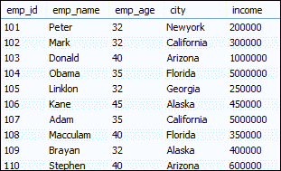
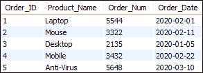
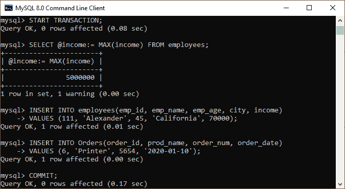
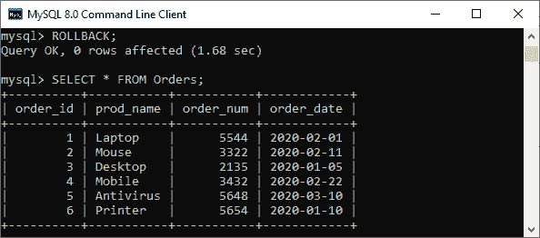
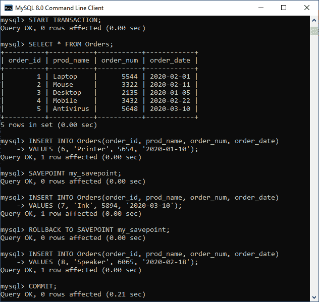
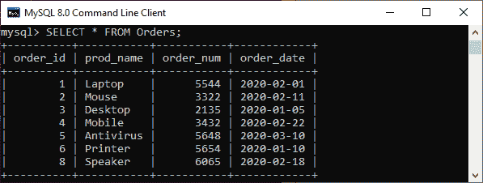
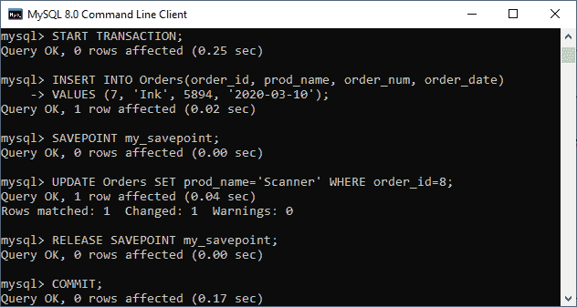

# MySQL 事务

> 原文：<https://www.javatpoint.com/mysql-transaction>

MySQL 中的事务是一组**连续的语句**、查询或操作，如选择、插入、更新或删除，作为一个可以提交或回滚的单一工作单元来执行。如果事务对数据库进行多次修改，会发生两件事:

*   提交事务时，要么所有修改都成功。
*   或者，当事务回滚时，所有修改都被撤消。

换句话说，如果不完成集合中可用的每个操作，事务就不能成功。这意味着如果任何语句失败，事务操作就不能产生结果。

MySQL 中的事务从第一条可执行的 SQL 语句开始，当它发现提交或显式或隐式回滚时结束。当使用 DDL 语句时，它显式使用 COMMIT 或 ROLL 语句，隐式使用。

**让我们通过下面的解释来理解交易的概念。**

我们可以通过考虑一个**银行数据库**来理解 [MySQL](https://www.javatpoint.com/mysql-tutorial) 中交易的概念。假设一个银行客户想把钱从一个账户转到另一个账户。我们可以通过使用将分为以下步骤的 SQL 语句来实现这一点:

*   首先，需要检查第一个帐户中请求金额的可用性。
*   接下来，如果金额可用，从第一个账户中扣除。然后，更新第一个帐户。
*   最后，将金额存入第二个账户。然后更新第二个账户完成交易。
*   如果上述任何一个过程失败，事务将回滚到其以前的状态。

### 交易的属性

该交易主要包含四个属性，称为 **ACID** 属性。现在，我们将详细讨论 ACID 属性。ACID 属性代表:

1.  原子数
2.  一致性
3.  隔离
4.  持久性

**原子性:**该属性确保事务单元内的所有语句或操作都必须成功执行。否则，如果任何操作失败，整个事务将被中止，并回滚到以前的状态。它包括以下特征:

*   COMMIT 语句。
*   ROLLBACK 语句。
*   自动提交设置。
*   信息模式表中的操作数据。

**一致性:**此属性确保只有在事务成功提交时，数据库才会更改状态。它还负责保护数据免受崩溃。它包括以下特征:

*   InnoDB 双写缓冲区。
*   InnoDB 崩溃恢复。

**隔离:**该属性保证事务单元中的每个操作独立运行。它还确保语句对彼此透明。它包括以下特征:

*   设置隔离级别语句。
*   自动提交设置。
*   InnoDB 锁定的低级细节。

**持久性:**该属性保证即使系统崩溃或失败，提交事务的结果也能永久保持。它包括以下特征:

*   存储设备中的写缓冲区。
*   存储设备中的电池后备高速缓存。
*   配置选项 innodb_file_per_table。
*   配置选项 innodb_flush_log_at_trx_commit。
*   配置选项 sync_binlog。

### MySQL 事务语句

MySQL 借助以下语句控制事务:

*   MySQL 提供了一个 START TRANSACTION 语句来开始事务。它还提供了一个“开始”和“开始工作”作为开始交易的别名。
*   我们将使用 COMMIT 语句来提交当前事务。它允许数据库进行永久更改。
*   我们将使用 ROLLBACK 语句来回滚当前事务。它允许数据库取消所有更改，并进入以前的状态。
*   我们将使用 SET 自动提交语句来禁用/启用当前事务的自动提交模式。默认情况下，COMMIT 语句会自动执行。因此，如果我们不想自动提交更改，请使用下面的语句:

```sql

SET autocommit = 0;
OR,
SET autocommit = OFF:

```

同样，使用下面的语句来启用自动提交模式:

```sql

SET autocommit = 1;
OR,
SET autocommit = ON:

```

### MySQL 事务示例

假设我们有两个名为**“员工”**和**“订单”**的表，其中包含以下数据:

**表:员工**



**表:订单**



### 提交示例

如果我们想使用事务，需要将 [SQL](https://www.javatpoint.com/sql-tutorial) 语句分解成逻辑部分。之后，我们可以定义数据应该提交还是回滚。

以下步骤说明了如何创建事务:

1.  使用开始交易语句开始交易。
2.  然后，在员工中选择最大收入。
3.  向员工表中添加新记录。
4.  向订单表中添加新记录。
5.  使用 COMMIT 语句完成事务。

以下是执行上述操作的命令:

```sql

-- 1\. Start a new transaction

START TRANSACTION;

-- 2\. Get the highest income

SELECT @income:= MAX(income) FROM employees;

-- 3\. Insert a new record into the employee table

INSERT INTO employees(emp_id, emp_name, emp_age, city, income) 
VALUES (111, 'Alexander', 45, 'California', 70000);

-- 4\. Insert a new record into the order table

INSERT INTO Orders(order_id, prod_name, order_num, order_date) 
VALUES (6, 'Printer', 5654, '2020-01-10');

-- 5\. Commit changes    
COMMIT;

```

下图更清楚地解释了这一点:



### 回滚示例

借助下图，我们可以理解回滚事务。首先，打开 MySQL 命令提示符，使用密码登录数据库服务器。接下来，我们必须选择一个数据库。

假设我们的数据库包含“**订单**”表。下面是执行回滚操作的脚本:

```sql

-- 1\. Start a new transaction
START TRANSACTION;

-- 2\. Delete data from the order table
DELETE FROM Orders;

```

执行上述语句后，我们将获得如下输出，显示 Orders 表中的所有记录都已成功删除。


现在，我们需要打开一个单独的 MySQL 数据库服务器会话，并执行下面的语句来验证 Orders 表中的数据:

```sql

SELECT * FROM Orders;

```

它将给出如下输出。


虽然我们在第一个会话中进行了更改，但我们仍然可以在表中看到可用的记录。这是因为直到我们在第一个会话中没有执行 **COMMIT 或 ROLLBACK** 语句，更改才是永久的。

因此，如果我们想使更改永久化，请使用 COMMIT 语句。否则，执行 ROLLBACK 语句来回滚第一个会话中的更改。

```sql

-- 3\. Rollback changes    
ROLLBACK;

-- 4\. Verify the records in the first session
SELECT * FROM Orders;

```

成功执行后，它将产生以下结果，我们可以看到更改已经回滚。



**使用 MySQL Transaction 时不能回退的语句。**

MySQL 事务无法回滚所有语句。例如，这些语句包括 DDL(数据定义语言)命令，如 CREATE、ALTER 或 DROP 数据库，以及 CREATE、UPDATE 或 DROP 表或存储例程。我们必须确保在设计交易时，这些陈述不包括。

### 保存点，回滚到保存点，释放保存点

**保存点**语句在事务内部用**标识符**的名称创建一个特殊标记。它允许回滚保存点之后执行的所有语句。以便事务恢复到保存点之前的状态。如果我们在当前事务中设置了多个同名的保存点，新保存点负责回滚。

**回滚到保存点**语句允许我们将所有事务回滚到给定的保存点，而不会中止事务。

**RELEASE savet**语句从当前事务中销毁指定的保存点，而不撤销保存点建立后执行的查询的影响。在这些语句之后，不会出现回滚命令。如果事务中不存在保存点，它会给出一个错误。

以下是 MySQL Transaction 中上述语句的**语法**:

```sql

SAVEPOINT savepoint_name
ROLLBACK TO [SAVEPOINT] savepoint_name
RELEASE SAVEPOINT savepoint_name

```

### 例子

让我们通过例子了解如何使用这些语句。在下面的示例中，我们将使用保存点和回滚到保存点语句，解释保存点如何确定当前事务的哪些记录可以回滚。

```sql

START TRANSACTION;

SELECT * FROM Orders;

INSERT INTO Orders(order_id, prod_name, order_num, order_date) 
VALUES (6, 'Printer', 5654, '2020-01-10');

SAVEPOINT my_savepoint;

INSERT INTO Orders(order_id, prod_name, order_num, order_date) 
VALUES (7, 'Ink', 5894, '2020-03-10');

ROLLBACK TO SAVEPOINT my_savepoint;

INSERT INTO Orders(order_id, prod_name, order_num, order_date) 
VALUES (8, 'Speaker', 6065, '2020-02-18');

COMMIT;

```

在上图中，

*   我们必须首先开始交易，然后在订单表中显示可用的记录。
*   接下来，我们将一条记录插入到表中，然后创建一个保存点标记。
*   同样，我们在表中插入了一条记录，然后使用回滚到保存点语句来删除保存点建立位置的更改。
*   同样，我们在表中插入了一条记录。
*   最后，执行 COMMIT 语句进行永久更改。

下面的输出按顺序解释了上述步骤，这有助于非常容易地理解。



现在，我们将使用 SELECT 语句来验证上述操作。在输出中，我们可以看到 **order_id=6** 、 **order_id=8** 添加成功，但是 **order_id=7** 没有插入表中。它会回滚保存点建立后输入的值:



现在我们将举另一个例子来释放保存点，它建立 my_savepoint，然后删除一个保存点。

```sql

START TRANSACTION;

INSERT INTO Orders(order_id, prod_name, order_num, order_date) 
VALUES (7, 'Ink', 5894, '2020-03-10');

SAVEPOINT my_savepoint;

UPDATE Orders SET prod_name='Scanner' WHERE order_id=8;

RELEASE SAVEPOINT my_savepoint;

COMMIT;

```

在输出中，我们可以看到事务中的所有语句都成功执行了。在这里， [INSERT](https://www.javatpoint.com/mysql-insert) 和 [UPDATE](https://www.javatpoint.com/mysql-update) 语句都会在 COMMIT 时修改表。



* * *