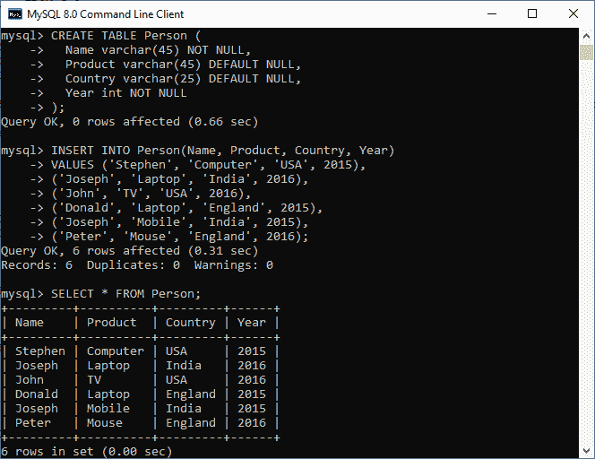
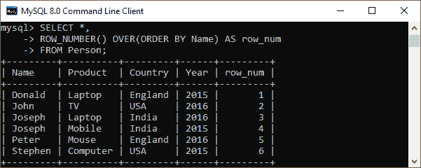
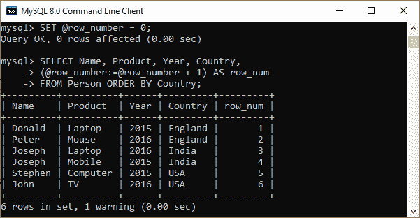
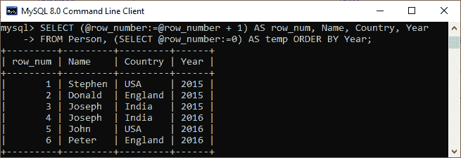

# MySQL ROW_NUMBER()函数

> 原文：<https://www.javatpoint.com/mysql-row_number-function>

MySQL 中的 ROW_NUMBER()函数用于返回分区内每一行的**序号**。它是一种窗口功能。行号从 1 开始到分区中的行数。

需要注意的是，在 8.0 版本之前，MySQL 并不支持 ROW_NUMBER()函数，但是他们提供了一个**会话变量**，让我们可以模拟这个函数。

**语法**

以下是在 [MySQL](https://www.javatpoint.com/mysql-tutorial) 中使用 ROW_NUMBER()的基本语法:

```sql

ROW_NUMBER() OVER (<partition_definition> <order_definition>)

```

**让我们用一个例子**来演示一下。

首先，我们将使用下面的语句创建一个名为“ **Person** ”的表:

```sql

CREATE TABLE Person (
  Name varchar(45) NOT NULL,
  Product varchar(45) DEFAULT NULL,
  Country varchar(25) DEFAULT NULL,
  Year int NOT NULL
);

```

接下来，需要向该表添加值。执行以下语句:

```sql

INSERT INTO Person(Name, Product, Country, Year) 
VALUES ('Stephen', 'Computer', 'USA', 2015), 
('Joseph', 'Laptop', 'India', 2016), 
('John', 'TV', 'USA', 2016),
('Donald', 'Laptop', 'England', 2015),
('Joseph', 'Mobile', 'India', 2015),
('Peter', 'Mouse', 'England', 2016);

```

接下来，执行 SELECT 语句以显示记录:

```sql

mysql> SELECT * FROM Person;

```

我们将获得如下所示的输出:



现在，我们可以使用 ROW_NUMBER()函数，使用下面的语句为每条记录分配一个序列号:

```sql

SELECT *, 
	ROW_NUMBER() OVER(PARTITION BY Year) AS row_num
FROM Person;

```

它将给出以下输出:



同样，我们可以使用 ROW_NUMBER()函数，使用下面的语句为分区内的每个记录分配一个序列号:

```sql

SELECT *, 
	ROW_NUMBER() OVER(PARTITION BY Year) AS row_num
FROM Person;

```

它将给出如下输出，其中根据年份(2015 年和 2016 年)找到了两个分区。


### 使用会话变量

我们可以模拟 ROW_NUMBER()函数，使用会话变量以递增的顺序添加行号。

执行下面的语句，添加每行的行号，从 1 开始:

```sql

SET @row_number = 0; 

SELECT Name, Product, Year, Country,
	(@row_number:=@row_number + 1) AS row_num
FROM Person ORDER BY Country;

```

在这个语句中，我们首先指定了由@prfix 指示的会话变量 **@row_number** ，并将其值设置为 0。然后，我们从表 Person 中选择数据，并将变量@row_number 的值每增加一行。

成功执行查询后，我们将获得如下输出:



同样，我们将使用会话变量作为表，并使用以下语句将其与源表交叉连接:

```sql

SELECT (@row_number:=@row_number + 1) AS row_num, Name, Country, Year
FROM Person, (SELECT @row_number:=0) AS temp ORDER BY Year;

```

我们将获得如下输出:



* * *