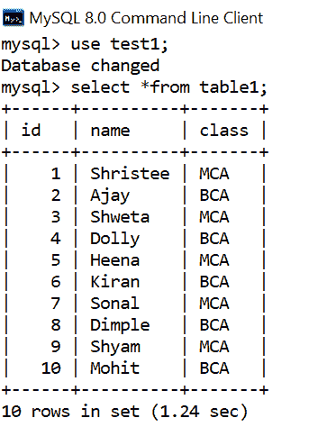
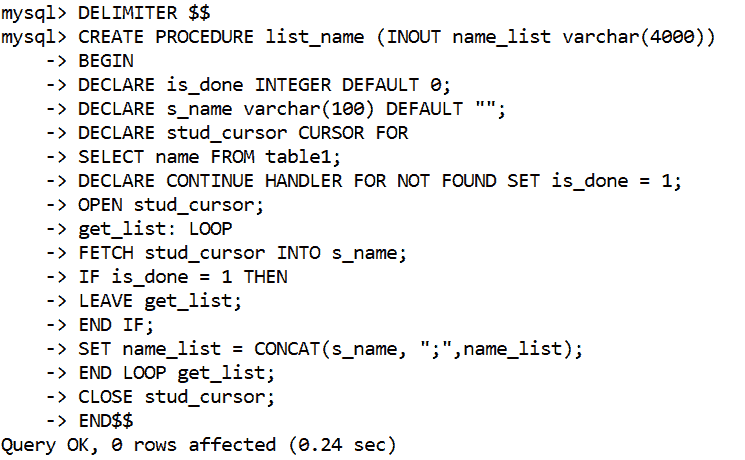
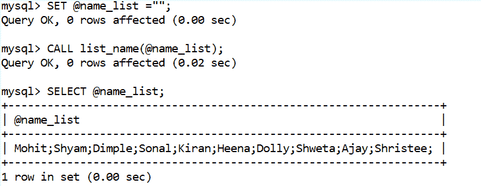

# 我的 SQL 游标

> 原文：<https://www.javatpoint.com/mysql-cursor>

在 MySQL 中，也可以创建 Cursor。以下是创建光标的步骤。

## 1.声明光标

游标是一个 select 语句，在 [MySQL](https://www.javatpoint.com/mysql-tutorial) 的声明部分定义。

## 句法

```sql

DECLARE cursor_name CURSOR FOR
Select statement;

```

## 参数:

**光标名称:**光标的名称

**select_statement:** 选择与光标关联的查询

## 2.打开光标

声明游标后，下一步是使用 open 语句打开游标。

## 句法

```sql

Open cursor_name;

```

## 参数:

**光标名称:**已经声明的光标名称。

## 3.获取光标

声明并打开游标后，下一步是获取游标。它用于获取行或列。

## 句法

```sql

FETCH [ NEXT [ FROM ] ] cursor_name INTO variable_list;

```

## 参数:

**光标名称:**光标的名称

**变量 _ 列表:**变量，逗号分隔等。存储在结果集的游标中

## 4.关闭光标

最后一步是关闭光标。

## 句法

```sql

Close cursor_name;

```

## 参数:

**光标名称:**光标名称

## 光标示例:

**第一步:**打开数据库和表格。



**步骤 2:** 现在创建光标。

**查询:**



**第三步:**现在调用光标。

**查询:**

```sql

SET @name_list ="";
CALL list_name(@name_list);
SELECT @name_list;

```



* * *