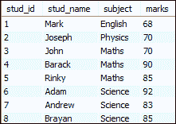
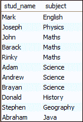
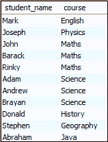
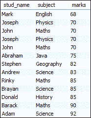

# MySQL 联盟

> 原文：<https://www.javatpoint.com/mysql-union>

MySQL Union 是一个运算符，它允许我们将多个 SELECT 查询的两个或多个结果组合成一个结果集。它带有一个默认功能，可以从结果集中删除**重复的**行。MySQL 总是使用第一条 SELECT 语句中的列名将结果集的列名(输出)。

[MySQL](https://www.javatpoint.com/mysql-tutorial) 联盟必须遵循以下基本规则:

*   在您将要使用的所有表中，列的数量和顺序应该相同。
*   数据类型必须与每个选择查询的相应位置兼容。
*   在不同的 SELECT 查询中选择的列名必须是相同的顺序。

### MySQL 联合语法

以下是 MySQL 中联合运算符的语法:

```

SELECT column_list FROM table1
UNION
SELECT column_list FROM table2;

```

我们可以通过以下可视化表示来理解联合运算符:


在上图中，我们可以看到 Union 运算符删除了重复的行，只返回唯一的行。

### 联合与加入

union 和 join 子句是不同的，因为 Union 总是垂直地组合结果集**，而 Join 水平地附加输出**。我们可以通过以下视觉表现来理解它:****

****

### MySQL 联合示例

让我们创建两个表，看看联合运算符在 MySQL 中是如何工作的。

**表:学生 1**



**表:学生 2**


以下语句通过组合两个表返回一个结果集，该结果集包含**学生姓名**和**科目**。当您执行此语句时，您会注意到，如果学生姓名和科目在两个表中都有相同的字段，那么每个表都会列出一次。这是因为联合运算符只返回**不同的值。**

```

SELECT stud_name, subject FROM student1
UNION
SELECT stud_name, subject FROM student2;

```

执行上述语句后，我们将获得以下输出。



在上面的输出中，可以看到 MySQL Union 使用的结果集列名的**标题**与第一个 [SELECT 语句](https://www.javatpoint.com/mysql-select)的列名相同。有时您希望用不同的标题来更改输出的列名的标题。我们可以通过在第一个 SELECT 语句中显式使用列**别名**来实现这一点。

下面的例子解释得更清楚:

```

SELECT stud_name AS student_name, subject AS course FROM student1
UNION
SELECT stud_name, subject FROM student2;

```

它将给出以下输出，其中列名的标题分别从“ **stud_name** 更改为“ **student_name** ”和“ **subject** ”更改为“ **course** ”。



### MySQL 与 ORDER BY 的结合

如果要使用联合运算符对查询返回的结果进行排序，则需要在最后一条 SELECT 语句中使用 ORDER BY 子句。我们可以将每个 [SQL SELECT 查询](https://www.javatpoint.com/sql-select)放在括号中，然后在最后一个 SELECT 语句中使用 [ORDER BY 子句](https://www.javatpoint.com/mysql-order-by)，如下例所示:

```

(SELECT stud_name, subject, marks FROM students)
UNION
(SELECT stud_name, subject, marks FROM student2)
ORDER BY marks;

```

成功执行上述语句后，我们将获得以下输出，根据获得的分数按升序对学生姓名和科目进行排序:


### MySQL 联合所有

该运算符通过将多个 SELECT 查询的两个或多个结果组合成一个结果集来返回所有行。它不会从结果集中删除重复的行。

我们可以用下面的图片来理解它:


Union 和 Union All 运算符的区别在于，“Union”将两个或多个表中所有不同的行(消除重复行)返回到一个输出中。相反，“联合所有”返回所有行，包括重复的行。

**语法**

以下是 MySQL 中联合运算符的语法:

```

SELECT column_list FROM table1
UNION ALL
SELECT column_list FROM table2;

```

**例**

让我们取一个之前创建的表(student1 和 student2)，了解 Union All 操作符在 MySQL 中是如何工作的。

以下语句返回所有学生姓名、科目和分数，包括单个结果中的所有重复行。它还根据使用 ORDER BY 子句获得的分数，按升序对学生姓名进行排序。

```

(SELECT stud_name, subject, marks FROM students)
UNION ALL
(SELECT stud_name, subject, marks FROM student2)
ORDER BY marks;

```

当您执行上述语句时，您将获得以下输出，其中包含结果集中存在的所有重复行:



* * *****