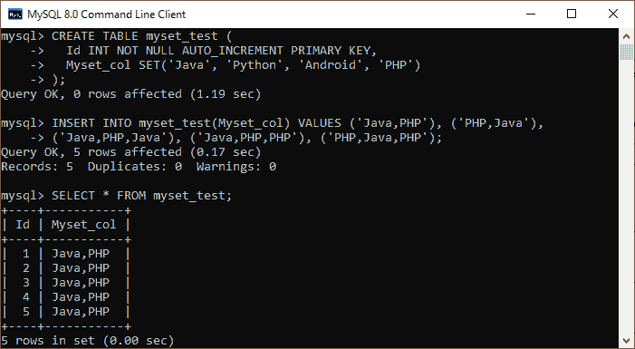
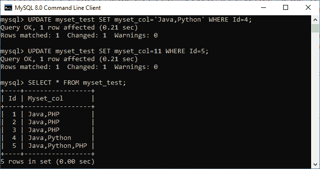
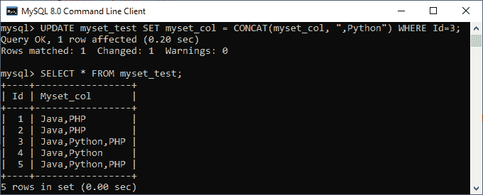
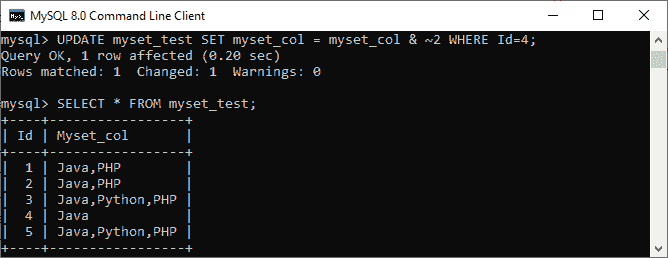
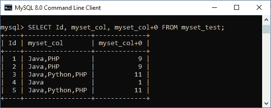

# MySQL SET

> 原文：<https://www.javatpoint.com/mysql-set>

SET 是 String 对象的**数据类型，可以保存零个或多个，或者任意数量的字符串值。它们必须从表创建期间指定的预定义值列表中选择。它是 MySQL 数据库中很少使用的数据类型之一。它被称为复杂类型，因为它的实现增加了复杂性。**

SET 和 ENUM 数据类型的工作方式类似，因为 [MySQL](https://www.javatpoint.com/mysql-tutorial) 将其与预定义的值列表一起使用。但是有一点不同，ENUM 数据类型只能保存预定义值列表中的一个成员，而 SET 数据类型允许我们一起存储零个或任意数量的值。

如果我们用多个 set 成员定义 SET 列值，那么需要使用逗号(，)运算符来分隔它。例如，我们将列定义为:

```sql

SET (''one'', ''two'') NOT NULL

```

然后，我们的列可以具有以下任何值:

```sql

''
'one'
'two'
'one,two'

```

### SET 数据类型的存储

一个 SET 数据类型在其列中最多可以存储 **64 个不同的**成员。如果 SET 列包含重复值，则在启用严格的 SQL 模式时，它会引发错误。

当我们创建一个表时，如果表定义中的 SET 成员值有空格，那么在执行 create 语句后，它们会自动从表定义中删除。

SET 数据类型在 MySQL 表中存储为**数值**。它占用一到八(即 1、2、3、4、8)个字节，这取决于 SET 列中包含的元素数量。下表说明了 MySQL 中 SET 数据类型的存储要求:

| 元素数量 | 字节数 |
| 1-8 | one |
| 9-16 | Two |
| 17-24 | three |
| 25-32 | four |
| 33-64 | eight |

在 MySQL 中，存储在**位图**中的 SET 元素，其中每个成员由一个位值表示。让我们看看下表，它更清楚地说明了这一点:

```sql

CREATE TABLE myset_test(
    Id INT NOT NULL AUTO_INCREMENT PRIMARY KEY,
    Myset SET('Java','Python','Android','PHP')
  );

```

在上面的定义中，每个集合成员分配了一个位，该位具有以下十进制和二进制值:

| 集合元素 | 十进制值 | 二进制值 |
| 爪哇 | one | 0001 |
| 计算机编程语言 | Two | 0010 |
| 机器人 | four | 0100 |
| 服务器端编程语言（Professional Hypertext Preprocessor 的缩写） | eight | One thousand |

现在，如果我们给这个列赋值 9，用二进制表示，它将是 1001。所以，它选择第一个和第四个 SET 元素，得到的值是**“Java，PHP”**，这将是 SET 列的第五个成员。

有时我们的 SET 数据类型列有多个元素；在这种情况下，不需要以特定的顺序插入值。这意味着元素可以是任何顺序。MySQL 还允许我们在 SET 数据类型列中多次插入相同的元素。当我们检索该值时，它将根据每个元素在表创建期间的排列顺序返回一次。

让我们借助下面的例子来理解它，我们将创建一个名为**“my SET _ test”**的表，该表包含一个列 SET(‘Java’、‘Python’、‘Android’、‘PHP’):

```sql

mysql> CREATE TABLE myset_test (
  Id INT NOT NULL AUTO_INCREMENT PRIMARY KEY, 
  Myset_col SET('Java', 'Python', 'Android', 'PHP')
);

```

接下来，我们需要将这些值插入到表中:

```sql

INSERT INTO myset_test(Myset_col) VALUES ('Java,PHP'), ('PHP,Java'), 
('Java,PHP,Java'), ('Java,PHP,PHP'), ('PHP,Java,PHP');

```

现在，当我们从表中检索值时，我们将得到所有这些值显示为“ [Java](https://www.javatpoint.com/java-tutorial) ，PHP”，因此执行下面的语句来查看:

```sql

Mysql> SELECT * FROM myset_test;

```

在输出中，我们可以看到我们的 SET 列只有(Java，PHP)个值:



### 如何更新 SET 数据

MySQL SET 数据类型可以通过三种方式更新数据，具体如下:

### 1.通过完全替换 SET 数据

如果我们想把完整的数据替换成一个集合，就需要指定新的值。执行以下语句，其中第一个查询使用值= 'Java，Python '更新行= 4，第二个查询使用值= 11 更新行= 5。这里，11 表示 8+2+1=Java、 [Python](https://www.javatpoint.com/python-tutorial) 、 [PHP](https://www.javatpoint.com/php-tutorial) 。

```sql

mysql> UPDATE myset_test SET myset_col = 'Java, Python' WHERE Id = 4;
mysql> UPDATE myset_test SET myset_col = 11 WHERE Id = 5;

```

成功执行后，执行以下命令来验证输出:

```sql

mysql> SELECT * FROM myset_test;

```

**输出**



### 2.通过添加 SET 成员

有时，需要将元素添加到现有的 SET 列中，然后一个 ***CONCAT()或 CONCAT_WS()函数*** 允许我们在逗号分隔的列表中插入一个新元素。执行以下语句以更清楚地理解它:

```sql

mysql> UPDATE myset_test SET myset_col = CONCAT(myset_col, ", Python") WHERE Id = 3;

```

成功执行后，执行以下命令来验证输出:

```sql

mysql> SELECT * FROM myset_test;

```

**输出**



### 3.通过删除 SET 成员

如果要从现有集合中删除任何元素，则可以使用 ***【替换】()功能*** 删除元素集合列。执行以下语句以更清楚地理解它:

```sql

mysql> UPDATE myset_test SET myset_col = REPLACE(myset_col, "Python", "") WHERE Id = 4;

```

同样，如果使用十进制值从现有集合中移除元素，请使用按位 **AND( & )** 运算符和按位 **NOT(~)** 运算符。执行以下语句:

```sql

mysql> UPDATE myset_test SET myset_col = myset_col & ~2 WHERE Id = 4;

```

成功执行后，执行以下命令来验证输出:

```sql

mysql> SELECT * FROM myset_test;

```

**输出**



如果我们想看到 SET 成员对应的整数值，那么我们需要添加带有列名的**“+0”**。让我们看看下面的例子:

```sql

Mysql> SELECT Id, myset_col, myset_col+0 FROM myset_test;

```

当我们执行上述语句时，会出现以下结果，其中包含与 SET 成员对应的整数值:



### 使用 SET 数据类型的缺点

SET 数据类型不建议我们在数据库中使用它，因为它有以下缺点:

*   SET 数据类型将我们限制在列中的 64 个成员。
*   我们不能在 SET 元素中包含逗号。
*   设置数据未标准化。
*   set 数据类型只有一个代表整个 SET 数据的索引。因此，我们不能搜索集合中的特定元素或成员。

### 为什么我们使用 SET 数据类型

以下是在 MySQL 中使用 SET [数据类型的原因:](https://www.javatpoint.com/mysql-data-types)

*   它可以处理多个值，没有太大的麻烦。
*   它允许我们在不使用复杂的 JOIN 操作的情况下比较多个值。
*   它的模式很简单，只使用一列而不是三个不同的表(例如，人员、兴趣、将人员链接到特定兴趣)来存储元素。
*   它允许我们通过比较单个列上的位值来使用二进制函数进行复杂的比较。

* * *