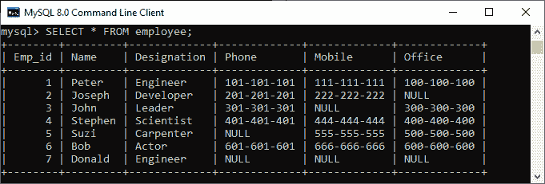

# MySQL 聚结()函数

> 原文：<https://www.javatpoint.com/mysql-coalesce-function>

MySQL 中的 COMPETE()函数用于返回指定的一系列表达式中的第一个**非空**值。如果该函数计算出列表中的所有值都为空，或者没有找到任何非空值，则返回**空值**。

### 句法

以下是在 MySQL 中使用 COMPETE()[函数的语法:](https://www.javatpoint.com/mysql-functions)

```sql

COALESCE(value1, value2, value3....., valueN);

```

在上面的语法中，我们可以看到该函数接受了许多参数，当它找到非空值的第一个值时，它会返回非空值。有时列表的所有值都为空；在这种情况下，它返回空值。

聚结()函数类似于 IF_ELSE 语句，如下所示:

```sql

  IF (value1!= NULL) THEN
     result = value1;
  ELSIF (value2 != NULL) THEN
     result = value2;
  ELSE
     result = NULL;
  END IF;

```

### 参数说明

该函数只接受一个参数，即具有不同值的列表。

**值 1，值 2，…..，valueN:** 它指定列表的值以在输出中返回非空值或空值。

我们可以通过下图更清楚地理解它:

**案例 1:** 聚结(空，空)；

**案例 2:** 聚结(0，空)；

在这两种情况下，函数总是返回空值，因为它找不到任何非空值。

### MySQL 版本支持

聚结()功能可以支持以下 [MySQL 版本](https://www.javatpoint.com/mysql-versions):

*   MySQL 8.0
*   MySQL 5.7
*   MySQL 5.6
*   MySQL 5.5
*   MySQL 5.1
*   MySQL 5.0
*   MySQL 4.1
*   MySQL 4.0

让我们用下面的例子来理解一下[MySQL](https://www.javatpoint.com/mysql-tutorial)JECTION()函数。我们可以直接使用带有[选择语句](https://www.javatpoint.com/mysql-select)的聚结()函数。

### 例 1

```sql

SELECT COALESCE(NULL, 'A', 'B', NULL); 

```

**输出**

当我们在列表上实现联合函数时，它将给出输出“A”，因为它是列表的第一个非空值。

### 例 2

```sql

SELECT COALESCE('Mango', 'Apple', 'Orange', NULL);

```

**输出**

当我们在列表上实现联合函数时，它将给出输出“Mango”，因为它是列表的第一个非空值。

### 例 3

```sql

SELECT COALESCE(NULL, 1, 2, 'MySQL', NULL, 'JAVA', NULL); 

```

**输出**

当我们在列表上实现联合函数时，它将返回数值“1”，因为它是列表的第一个非空值。

### 例 4

```sql

SELECT COALESCE(NULL, NULL, 'javatpoint', NULL); 

```

**输出**

当我们在列表上实现联合函数时，它将返回“javatpoint”，因为它是列表的第一个非空值。

让我们在 MySQL 命令行工具中看到所有上述示例:


### 例 5

在本例中，我们将了解如何对表数据使用 function()函数。首先，使用以下语句创建一个表“**员工**”:

```sql

CREATE TABLE employee (
  Emp_id INT NOT NULL,
  Name VARCHAR(45) NULL,
  Designation VARCHAR(45) NULL,
  Phone VARCHAR(45) NULL,
  Mobile VARCHAR(45) NULL,
  Office VARCHAR(45) NULL,
  PRIMARY KEY (Emp_id)
);

```

接下来，使用 [INSERT 语句](https://www.javatpoint.com/mysql-insert)将数据添加到表中，如下所示:

```sql

INSERT INTO employee(Emp_id, Name, Designation, Phone, Mobile, Office) 
VALUES (1, 'Peter', 'Engineer', '101-101-101', '111-111-111', '100-100-100'),
(2, 'Joseph', 'Developer', '201-201-201', '222-222-222', NULL),
(3, 'John', 'Leader', '301-301-301', NULL, '300-300-300'),
(4, 'Stephen', 'Scientist', '401-401-401', '444-444-444', '400-400-400'),
(5, 'Suzi', 'Carpenter', NULL, '555-555-555', '500-500-500'),
(6, 'Bob', 'Actor', '601-601-601', '666-666-666', '600-600-600'),
(7, 'Donald', 'Engineer', NULL, NULL, NULL);

```

执行以下查询以显示表格数据:

```sql

SELECT * FROM employee;

```

我们将获得以下输出:



现在，执行以下语句，如果员工拥有所有联系人号码，则使用 COMPETE()函数仅返回手机号码:

```sql

SELECT Emp_id, Name, Designation, COALESCE(Mobile, Office, Phone) FROM employee;

```

它将给出以下输出:


如果员工只有一个办公室或移动联系人，则执行返回办公室号码的语句。当它没有找到办公室号码时，返回电话联系。

```sql

SELECT Emp_id, Name, Designation, Mobile, Office, Phone, COALESCE(Office, Mobile) FROM employee;

```

我们将获得如下输出:


### IFNULL()与 COMPLETE()函数

这些功能之间的主要区别是:

| IFNULL() | 聚结() |
| IFNULL()函数只接受两个表达式。在进行计算后，如果第一个表达式不为空，则返回该表达式；否则，它返回第二个表达式。 | COMPETE()函数返回指定表达式序列中的第一个非空值。如果此函数计算出列表中的所有值都为空，或者它没有找到任何非空值，则它返回空值。 |

* * *