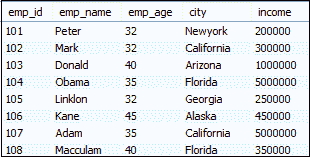
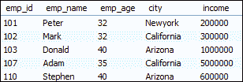
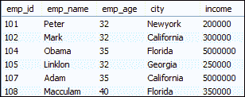
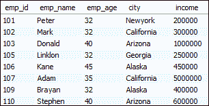
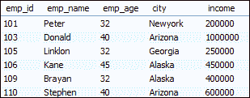

# MySQL 通配符

> 原文：<https://www.javatpoint.com/mysql-wildcards>

MySQL 中的通配符是允许我们非常容易和快速地从表中**搜索复杂数据**的字符。它通过替换一个或多个字符来处理字符串，并在将字符串匹配到表中后产生结果。

在正常的比较中，我们使用两个字符串，其中两个字符串的每个字符在给出输出之前应该完全匹配。而在通配符中，它们提供了在一个字符串中使用单个字符或一组字符的灵活性，这对于另一个字符串来说是可以接受的。

[MySQL](https://www.javatpoint.com/mysql-tutorial) 将通配符与 **LIKE** 或 **NOT LIKE** 比较运算符结合使用。LIKE 运算符与 [WHERE 子句](https://www.javatpoint.com/mysql-where)一起工作，在一列中查找指定模式的结果。

### 通配符的优势

MySQL 具有以下通配符优势:

*   它提高了应用程序的性能。
*   它节省了从表中过滤记录的时间。
*   它使复杂查询的使用变得非常容易和快速。
*   它允许我们将强大的搜索引擎开发到大型数据驱动的应用程序中。

### 通配符的类型

以下是 MySQL 中常用的通配符类型，可以单独使用，也可以组合使用:

| 塞内加尔 | 通配符符号 |  | 描述 |
| 1. | % | 该符号表示零个或多个字符。 |
| 2. | _ | 该符号用于精确匹配一个字符。 |

现在，我们将通过以下示例来了解这些通配符符号在 MySQL 中的使用:

让我们首先创建一个名为“**员工**”的表，其中包含以下数据:



### 1.百分比符号(%)

它用于从指定 0、1 或更多字符的表中搜索或筛选记录。我们可以在带有 LIKE 子句的字符串的开头、结尾或两端使用它。

**语法**

使用此通配符的基本语法是:

```

SELECT * FROM tab_name WHERE column_name LIKE 'X%';
OR,
SELECT * FROM tab_name WHERE column_name LIKE '%X';
OR,
SELECT * FROM tab_name WHERE column_name LIKE 'X%X';

```

在上面的语法中，‘**X**’指定任意单个字符， **%** 匹配任意数量的字符。

**例**

该语句返回所有**城市**名称以‘F’字符开头的员工。

```

mysql> SELECT * FROM employees WHERE city LIKE 'F%';

```

它将给出以下输出:


同样，该语句从城市名称以“a”开头、以“a”结尾的表中返回所有员工:

```

mysql> SELECT * FROM employees WHERE city LIKE 'a%a';

```

成功执行后，我们会得到如下结果:


此语句返回 X 值可以在任何位置的所有员工:

```

mysql> SELECT * FROM employees WHERE city LIKE '%n%';

```

它将给出如下输出:



如果我们想从城市不以“a”开头、以“a”结尾的表中返回所有员工，请执行以下语句:

```

mysql> SELECT * FROM employees WHERE city NOT LIKE 'a%a';

```

我们将得到下面的结果，我们可以看到没有以“a”开头，以“a”结尾的城市名称。



### 2.下划线符号(_)

当需要从任何位置返回与单个字符完全匹配的表的结果时，我们可以使用它。

**语法**

使用此通配符的基本语法是:

```

SELECT * FROM tab_name WHERE column_name LIKE 'X_';
OR,
SELECT * FROM tab_name WHERE column_name LIKE '_X';

```

在上面的语法中，**‘X’**指定任何字符串模式， **_** 符号正好匹配一个字符。

**例**

此语句返回年龄在 40 至 49 岁之间的所有员工:

```

SELECT * FROM employees WHERE emp_age LIKE '4_';

```

我们将看到如下结果:


该语句从表中返回所有员工，其城市名称以任何字符开头，后跟**‘lorida’**字符:

```

mysql> SELECT * FROM employees WHERE city LIKE '_lorida';

```

成功执行后，我们会得到如下结果:


如果我们想从城市不以任何字符开头，后面跟着“lorida”字符的表中返回所有员工，请执行以下语句:

```

mysql> SELECT * FROM employees WHERE city NOT LIKE '_lorida';

```

出现以下输出:



### 组合通配符

我们已经了解到通配符也可以用作两者的组合，让我们通过下面的例子来理解它。

该语句返回名称以 X 开头且长度至少为两个字符的所有员工:

```

mysql> SELECT * FROM employees WHERE city LIKE 'a_%_';

```

我们将获得以下输出:


另一个例子是，所有在**收入**列中第二位的**【5】**员工产生的输出:

```

mysql> SELECT * FROM employees WHERE income LIKE '_5%';

```

我们可以获得以下输出:


### 3.连字符符号(-)

当我们需要在一定范围内过滤表中的记录时，这个符号用来返回结果。它是使用 **REGEXP_LIKE()** 函数的通配符的扩展版本。

该语句从 employees 表中获取所有城市包含字母“b”、“c”或“d”的记录，如下所示:

```

mysql> SELECT * FROM employees WHERE REGEXP_LIKE(city, '[b-d]');

```

**输出**

成功执行后，我们会得到如下结果:


如果我们想从城市不包含字母“b”、“c”或“d”的表中返回所有员工，如下所示:

```

mysql> SELECT * FROM employees WHERE NOT REGEXP_LIKE(city, '[b-d]');

```

**输出**



* * *