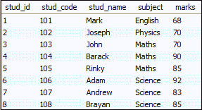
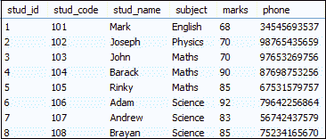
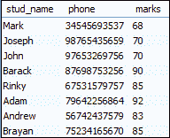
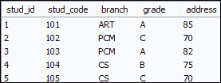
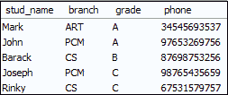

# MySQL 别名

> 原文：<https://www.javatpoint.com/mysql-alias>

MySQL 中的别名用于为表或表中的列赋予一个**临时名称**，以便进行特定的查询。它用作表示表或列名的昵称。它使查询变得简洁明了。

当表名或列名不是实时用户友好时，它非常有用。它使列名更易读。MySQL 别名只能在查询的**持续时间**内存在。

### MySQL 别名的优势

以下是 MySQL 中别名的优势:

*   当一个查询中要使用多个表时，这是首选。
*   它提供了一个非常有用和灵活的特性，允许我们快速完成复杂的任务。
*   它使列名或表名更易读。
*   当您在查询中使用函数时，它非常有用。
*   它还允许我们组合两个或更多列。
*   当列名很大或不可读时，它也很有用。

### 句法

以下是 MySQL 中使用的别名的基本语法:

**用于列**

```

SELECT col_name AS alias_name FROM table_name;

```

表的

 **```

SELECT col_name1, col_name2,... FROM table_name AS alias_name;

```

### 参数说明

下表详细解释了这些参数:

| 参数 | 描述 |
| **列名** | 这是我们要创建别名的列名。 |
| **表名** | 我们要创建的别名是表名。 |
| **别名 _ 名称** | 这是我们要为列或表指定的临时名称。 |
| **AS** | 它是可选的。如果没有指定，对查询执行没有影响。这是程序员的选择，他们在列名的别名中使用它，但在表名中不使用别名。 |

如果要给别名加上**空格**，那么必须用引号括起来。通常，在别名列名中提供空格是一种好的做法，而不是表名。下面的语法解释得更清楚:

```

SELECT col_name AS 'alias_name' FROM table_name;

```

现在，我们将了解别名在 MySQL 中是如何工作的。让我们首先使用以下查询创建一个名为“ **Student_info** ”的表:

```

CREATE TABLE Student_info(
  stud_id int PRIMARY KEY NOT NULL,
  stud_code varchar(15),
  stud_name varchar(35),
  subject varchar(25),
  marks int
);

```

创建表后，我们需要插入一条记录。假设该表包含以下数据:



**显示列别名**

如果我们想使用**“辊号”**作为别名从上表中获取**螺柱 _ 代码**，请执行以下语句:

```

mysql> SELECT stud_code AS Roll_No FROM Student_info;

```

它将返回如下输出:


同样，如果我们想使用包含空格和分数标记的“滚动号”获取 stud_code，请执行以下语句:

```

mysql> SELECT stud_code AS 'Roll No', marks AS scores FROM Student_info;

```

它将返回如下输出:


再举一个例子，会返回分数大于 70 的**学名**和**科目**。

```

mysql> SELECT stud_name AS 'Student Name', subject AS 'Subject', marks
FROM Student_info  
HAVING marks > 70
ORDER BY stud_name;

```

成功执行后，我们可以看到结果集中只包含那些标记大于 70 的记录。


### 说明表格别名

它允许我们用不同的名称指定表名。大多数情况下，表别名用于多个单个表，并使用 **JOIN** 操作连接它们。

假设我们的数据库有一个名为“**学生**”的表，其中包含以下数据:



此语句将使用表别名返回记录:

```

mysql> SELECT Student_details.stud_name, Student_details.phone, Student_details.marks 
FROM Students AS Student_details;

```

它将给出以下输出:



让我们看另一个使用 JOIN 操作来理解表别名的例子。假设我们的数据库还有一个名为“ **Student_detail** ”的表，该表包含下面给出的数据:



在这两个表中，我们可以看到它们包含同一个列“stud_code”。如果我们在没有表别名的情况下使用它，它会给出一个**错误**，它说:一个子句中的列“stud_code”是不明确的。

因此，如果我们想避免这种类型的错误，请使用表别名概念。这种说法解释得更清楚:

```

mysql> SELECT stud_name, branch, grade, phone
FROM Students AS S
INNER JOIN Student_detail AS D
ON S.stud_code=D.stud_code
ORDER BY grade;

```

成功执行上述语句后，我们将获得如下输出:



如果您不想在查询中使用别名概念，那么 MySQL 使用表名来标识列名。这一过程使语句变得冗长，可读性降低，如下所示:

```

mysql> SELECT stud_name, branch, grade, phone
FROM Students INNER JOIN Student_detail 
ON Students.stud_code=Student_detail.stud_code
ORDER BY grade;

```

* * ***