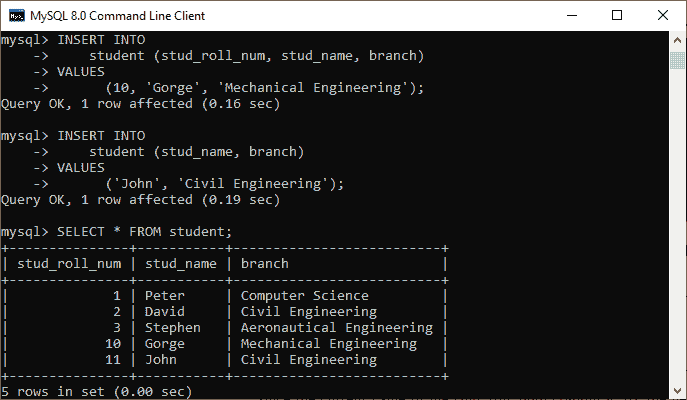
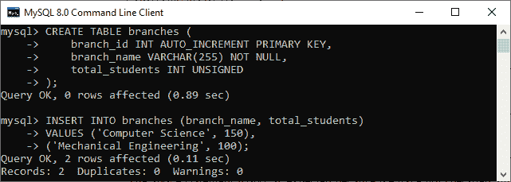

# MySQL INT

> 原文：<https://www.javatpoint.com/mysql-int>

MySQL 中的 INT 是**整数数据类型，**是一个整数。**它允许数字的书写没有小数部分(没有小数部分)**。例如，1，5，-10 是整数类型，而 1.5，5/7 不能是整数。需要注意的是，整数值可以是**正值、负值或零**。我们可以在各种算术运算中使用这种数据类型，如加法(+)、减法(-)、除法(/)、乘法(*)和模(%)。

一般情况下，MySQL 支持所有名为 integer 或 INT 和 SMALLINT 的 [SQL](https://www.javatpoint.com/sql-tutorial) 标准整数类型。在标准整数类型的扩展中，它还提供了 TINYINT MEDIUMINT 和 BIGINT。

[MySQL](https://www.javatpoint.com/mysql-tutorial) 中的 INT 数据类型可以是**签署的**和**未签署的**。我们可以通过下表来理解它，该表说明了每个整数类型的特征，包括每个整数类型所需的存储和范围(最小值和最大值)。

| 类型 | 存储(字节) | 有符号的最小值 | 最小值无符号 | 最大有符号值 | 最大值无符号 |
| 数据类型 | one | -128 | Zero | One hundred and twenty-seven | Two hundred and twenty-five |
| 斯莫列特 | Two | -32768 | Zero | Thirty-two thousand seven hundred and sixty-seven | Sixty-five thousand five hundred and thirty-five |
| 中位 | three | -8388608 | Zero | Eight million three hundred and eighty-eight thousand six hundred and seven | Sixteen million seven hundred and seventy-seven thousand two hundred and fifteen |
| （同 Internationalorganizations）国际组织 | four | -2147483648 | Zero | Two billion one hundred and forty-seven million four hundred and eighty-three thousand six hundred and forty-seven | Four billion two hundred and ninety-four million nine hundred and sixty-seven thousand two hundred and ninety-five |
| 比吉斯本 | eight | -9223372036854775808 | Zero | 9223372036854775807 | 18446744073709551615 |

我们要使用的数据类型的选择取决于我们要存储的数据类型。例如，TINYINT 数据类型对于最多 35 人的班级中的学生数量来说是足够的。但是，如果我们需要在一个国家存储每个人的联系电话，我们必须选择 INT 或 BIGINT 数据类型。**只要有可能，最好选择最小的数据类型，因为这样可以最小化数据库的大小**。

## MySQL INT 数据类型示例

让我们了解如何使用 MySQL 中的各种示例来处理整数数据类型。

### 1.列的 MySQL INT

我们通常将它用作表的主键，因为整数数据类型表示精确的数字。此外，我们可以用这个列指定一个 AUTO_INCREMENT 属性。

如果我们在 INT AUTO_INCREMENT 列中插入一个 **NULL** 或 0，该列的值将被设置为下一个以 1 开头的序列值。并且，如果我们将一个非空值插入到 INT AUTO _ INDEX 列中，该列将接受该值，并且它的序列将被重置为插入值的下一个值。

让我们用一个实际的例子来看看。首先，创建一个名为**学生**的新表，以整数列作为主键和自动递增属性:

```

mysql> CREATE TABLE student (
    stud_roll_num INT AUTO_INCREMENT PRIMARY KEY,
    stud_name VARCHAR(100),
    branch VARCHAR(100)
);

```

在用 [**CREATE TABLE** 语句](https://www.javatpoint.com/mysql-create-table)创建表格时，我们可以使用 INT 或 INTEGER 数据类型，因为它们是可以互换的。由于我们在上面的查询中使用了 AUTO_INCREMENT 属性，每当我们在学生表中插入一个新行时， **stud_roll_num** 列的值就会增加 1。

接下来，执行下面的 INSERT 语句，该语句将在学生表中插入三行:

```

mysql> INSERT INTO 
    student (stud_name, branch)
VALUES
    ('Peter', 'Computer Science'),
    ('David', 'Civil Engineering'),
    ('Stephen', 'Aeronautical Engineering');

```

现在，我们需要执行 SELECT 语句来查询学生表中的数据:

```

mysql> SELECT * FROM student;

```

mysql> SELECT * FROM 学生；


再次，插入一个新行，我们将在其中**明确指定 stud_roll_num 列的值:**

```

mysql> INSERT INTO 
    student (stud_roll_num, stud_name, branch)
VALUES
      (10, 'Gorge', 'Mechanical Engineering');

```

由于 stud_roll_num 列的当前值是 10，下一个序列被重置为 11。执行下面的语句，我们将不指定螺柱 _ 滚动 _ 编号:

```

mysql> INSERT INTO 
    student (stud_name, branch)
VALUES
      ('John', 'Civil Engineering');

```

最后，使用 [SELECT 语句](https://www.javatpoint.com/mysql-select)再次查询学生表的数据，查看结果。



### 2.MySQL INT UNSIGNED 示例

MySQL 中的无符号整数只存储正数。如果我们试图将负数存储在无符号整数中，就会产生错误。我们可以通过创建一个名为**“分支”**的新表来理解它，该表带有列**total _ studies**，该列存储无符号整数数据类型。

```

CREATE TABLE branches (
    branch_id INT AUTO_INCREMENT PRIMARY KEY,
    branch_name VARCHAR(255) NOT NULL,
    total_students INT UNSIGNED
);

```

接下来，我们需要使用下面的语句向该表中插入数据:

```

INSERT INTO branches (branch_name, total_students)
VALUES ('Computer Science', 150),
('Mechanical Engineering', 100);

```

上面的语句工作正常，因为我们没有在 total_students 列中指定任何负数。请参见以下输出:



同样，我们将尝试在 total_students 列中存储一个负数:

```

INSERT INTO branches (branch_name, total_students)
VALUES ('Civil Engineering', -100);

```

在这种情况下，MySQL 会产生以下错误:


### 带有显示宽度属性的 MySQL INT

MySQL 支持一个扩展，可以选择允许我们指定显示宽度和整数数据类型。显示宽度被包装在该类型的 base 关键字后面的括号中。**例如**，INT (4)指定一个显示宽度为四位数的整数。

需要注意的是，该属性不控制可以存储在列中的值的范围。我们主要在应用程序中使用这个属性来格式化整数值。MySQL 将其作为返回结果集的元数据。

例如，如果我们用 SMALINT(3)指定该列，它的值范围为-32768 到 32767。并且超出该范围的值通过使用三位以上的数字来完整显示。

### 带有零填充属性的 MySQL INT

MySQL 提供了一个非标准的 ZEROFILL 属性，可以与显示宽度属性结合使用。在这种情况下，MySQL 用零代替了空格的填充。让我们借助一个例子来理解:

首先，我们将使用下面的语句创建一个名为 numeric_tests 的新表:

```

mysql> CREATE TABLE numeric_tests (
    test_id INT AUTO_INCREMENT PRIMARY KEY,
    val1 INT(2) ZEROFILL,
    val2 INT(3) ZEROFILL,
    val3 INT(5) ZEROFILL
); 

```

接下来，我们将使用下面的语句将数据插入到一个表中:

```

mysql> INSERT INTO numeric_tests (val1,val2,val3)
VALUES(1,5,8);

```

现在，我们将使用 SELECT 语句查询该表的数据:

```

mysql> SELECT * FROM numeric_tests;

```

我们将得到如下截图的结果:


在上面的输出中，我们可以看到列 val1 的显示宽度为 2，包括 ZEROFILL。这里，我们插入了它的值 1；因此，我们将在输出中看到 01，MySQL 将第一个空格替换为一个零(0)。

列 **val2** 有 3 个显示，包括零填充。这里，我们插入了它的值 5；因此，我们将在列中看到 005，MySQL 用两个零替换了前导空格。

列 **val3** 的显示宽度为 5，包括 ZEROFILL，而我们已经将其值插入为 8；因此，我们将在列中看到 00008，MySQL 在输出中的数字开头用四个零(0000)替换了前导空格。

#### 注意:如果我们对整数列使用 ZEROFILL 属性，MySQL 将自动为该列添加一个 UNSIGNED 属性。

* * *