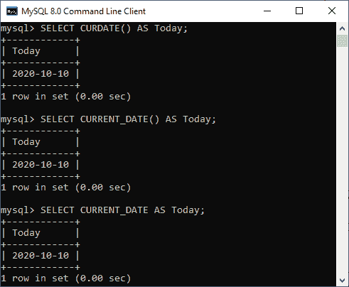
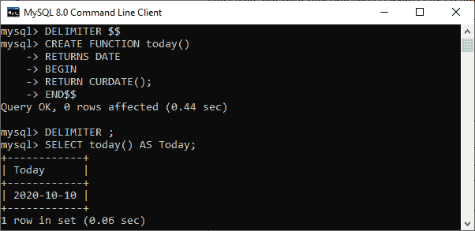

# 今日 MySQL

> 原文：<https://www.javatpoint.com/mysql-today>

## 如何才能获得 MySQL 的今日日期？

我们可以使用**内置的日期函数 cordate()**在 MySQL 中获取今天的日期。该函数根据函数中使用的是字符串还是数字，以**‘yyymmdd’**或**‘YYYY-MM-DD’**格式返回日期。CURRENT_DATE 和 CURRENT_DATE()都是 CURDATE()函数的同义词。

我们可以如下使用 CODETATE()函数:

```sql

mysql> SELECT CURDATE() AS Today;
                              OR,
mysql> SELECT CURRENT_DATE() AS Today;
                              OR,
mysql> SELECT CURRENT_DATE AS Today;

```

执行上述查询后，我们将看到相同的日期。请看下面的截图:



我们也可以通过使用 **NOW()** 函数获得今天的日期，如下所示:

```sql

mysql> SELECT DATE(NOW()) AS Today;

```

上面的查询给出了如下截图所示的输出:


### 创建 MySQL 今日存储函数

有时我们需要在查询中多次使用 CURDATE()函数，并希望通过 **today()** 函数对其进行重命名，以使语句更具可读性。在这种情况下，我们可以通过创建如下存储函数来创建我们自己的名为 today()的函数:

```sql

DELIMITER $$
CREATE FUNCTION today()
RETURNS DATE
BEGIN
RETURN CURDATE();
END$$
DELIMITER ;

```

现在，我们可以如下使用这个新创建的 today()函数:

```sql

mysql> SELECT today() AS Today;

```

请参见下面的截图，以便更容易地解释:



假设我们想得到**明天的日期，**存储的函数让它变得非常容易。请参见以下查询:

```sql

mysql> SELECT today() + interval 1 day AS Tomorrow;

```

执行后，它将返回明天日期:


假设我们想得到**昨天的日期**，可以像下面的查询一样使用存储函数:

```sql

mysql> SELECT today() - interval 1 day AS Yesterday;

```

执行后，我们将获得以下输出:


* * *