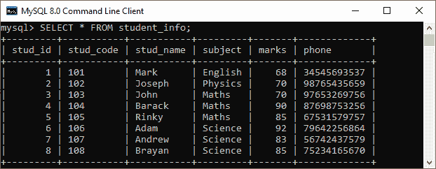
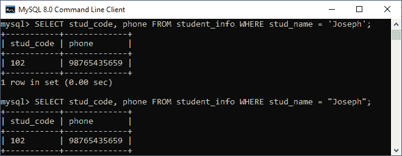
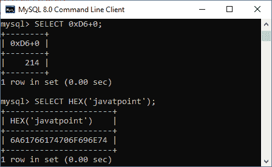
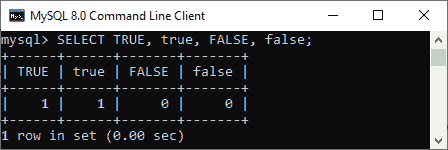
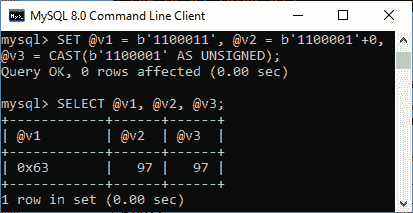

# 文字(常数)

> 原文：<https://www.javatpoint.com/mysql-literals>

文字是表示/表达不变值的**符号**或概念。在 MySQL 中，文字类似于常量。我们可以在声明变量或执行查询时使用文字。

在本节中，我们将描述不同类型的文字以及它们如何在 MySQL 语句中使用。

以下是文字的类型:

1.  字符串文字
2.  数字文字
3.  日期和时间文字
4.  十六进制文字
5.  位值文字
6.  布尔文字
7.  空值

### 字符串文字

MySQL 中的字符串是用单引号**(')或双引号**(")括起来的字符或字节序列。例如，“第一个字符串”和“第二个字符串”都是相同的。字节串称为二进制串。每个二进制字符串包含一个字符集和一个排序规则。****

 ****让我们借助一个例子来理解它。首先，我们将创建一个名为“ **student_info** ”的表，其中包含以下数据:



**例**

如果我们想要获取姓名为 Joseph 的学生代码和电话号码，请执行以下语句:

```

mysql> SELECT stud_code, phone FROM student_info WHERE stud_name = 'Joseph';
OR,
mysql> SELECT stud_code, phone FROM student_info WHERE stud_name = "Joseph";

```

**输出**

它将给出以下输出，我们可以看到两个查询给出相同的结果，要么使用单引号，要么使用双引号。



字符串文字也可以与特殊字符转义序列一起使用。这些特殊字符以表格形式总结如下:

| 换码顺序 | 由序列表示的字符 |
| \0 | 它代表 ASCII 空字符。 |
| \b | 它代表退格字符。 |
| \n | 它代表一个换行符。 |
| \r | 它代表回车符。 |
| \t | 它代表制表符。 |
| \\ | 它表示反斜杠(\)字符。 |
| \% | 它代表一个%字符。 |
| \_ | 它表示反斜杠字符。 |

### 数字文字

[MySQL](https://www.javatpoint.com/mysql-tutorial) 中的数值用于指定两种类型的文字值:**精确值**(整数和小数)和**近似值**(浮点)文字。它可以是正值或负值。精确值可以是整数、分数或两者都有。近似值主要用于包含尾数和指数的科学符号。

| 数字文字 | 描述 |
| 整数 | 它表示为没有任何小数部分的数字序列。如果数字前面有-号，则它是负整数。如果数字前面有+号，则它是正整数。如果数字没有任何符号，它就假定为正整数。**例如**，55，+55，-55 都是整数。 |
| 小数 | 它被表示为一个带有小数部分的数字序列。换句话说，它包含一个整数加小数部分，用点(^)分隔。)运算符或小数点。它可以是整数也可以是非整数。它以精确的数字形式进行计算。**例如**，325.90，355.6 都是十进制数。 |
| 浮点 | 它是一个包含浮点小数点的数字。意思是小数点前后没有固定的数字。它包含两种名为 float 和 double 的数据类型，产生一个近似值。**例如**、2.36E0、0.005 和-2，328.679 都是浮点数。 |

**例**

如果我们想要获得分数> 80 的学生姓名、科目和分数，请执行以下语句:

```

mysql> SELECT stud_name, subject, marks FROM student_info WHERE marks > +80;

```

**输出**

它将给出以下输出，我们可以在其中看到所有分数>+80 的学生姓名。


### 日期和时间文字

[MySQL 中的日期和时间](https://www.javatpoint.com/mysql-date-and-time)值可以用 ***引用的字符串或数字格式*** 来表示，这取决于确切的值和一些因素。例如，MySQL 将此“2020-09-22”、“20200922”和 20200922 中的任何一个解释为有效日期。

下表说明了 MySQL 中**日期值** s 的格式:

| 日期格式 | 描述 |
| '年-月-日'或' YY-月-日' | 它表示字符串格式的日期，带有标点符号，可以用作日期部分之间的分隔符。**例如**、【2020-03-31】、【2020/03/31】和'2020^03^31'都是相同的日期值。 |
| ' YYYMMDD '或' YYMMDD ' | 它以字符串格式表示日期，日期部分之间没有任何标点或分隔符。**例如**，‘20200422’和‘200522’解释为‘2007-05-23’，但是‘071342’是非法的，变成了‘0000-00-00’日期值。 |
| YYYMMDD 或 yyymmdd | 它表示数字格式的日期。**例如**，20200305 和 200305 解释为‘2020-03-05’日期值。 |

下表说明了 MySQL 中**时间值**的格式:

| 时间格式 | 描述 |
| D hh:mm:ss '，' hh:mm:ss '，' hh:mm '，' D hh:mm '，' D hh '或' ss ' | 它表示字符串格式的时间，带有标点符号，可以用作时间部分之间的分隔符。这里，D 代表数值从 0 到 34 的天数。**例如**、' 22 10:11:12 '、' 10:11:12 '时间值。 |
| " hhmmss " | 它以字符串格式表示时间，时间部分之间没有任何标点或分隔符。**例如**，‘101211’解释为‘10:12:11’，但是‘109813’是不合法的，变成了‘00:00:00’时间值。 |
| hhmmss、ss 或 mmss， | 它以数字格式表示时间。**例如**，101211 解释为‘10:12:11’时间值。 |

下表说明了 MySQL 中**日期时间和时间戳**值的格式:

| 日期时间格式 | 描述 |
| '年-月-日 hh:mm:ss '或' YY-月-日 hh:mm:ss ' | 它以字符串格式表示日期和时间，带有标点符号，可用作日期和时间部分之间的分隔符。**例如**、【2020-05-31 12:30:45】、【2020/05/31 12*30*45】、[【email protected】](/cdn-cgi/l/email-protection)@ 31 12^30^45'均为相同值。 |
| “YYYYMMDDhhmmss”或“yyymmdhhmmss” | 它以字符串格式表示日期，在日期和时间部分之间没有任何标点或分隔符。**例如**，‘20070523091528’和‘070523091528’解释为‘2007-05-23 09:15:28’，但‘071122129015’是不合法的，变成了‘0000-00-00 00:00:00’日期时间值。 |
| YYYYMMDDhhmmss 或 yyymmdhhmmss | 它以数字格式表示日期和时间。**例如**，20200105142500 和 200105142500 解释为‘2020-01-05 14:25:00’日期时间值。 |

**例 1**

假设我们有一个名为**“orders”**的表，它包含以下数据:


如果我们想要以不同的日期格式获取订单标识、产品名称，请执行以下语句:

```

mysql> SELECT Order_ID, Product_Name, DATE_FORMAT(Order_Date,'%d--%m--%y') as new_date_formate FROM orders;

```

**输出**

它将给出以下输出，我们可以看到日期的格式将会改变。


**例 2**

```

mysql> SELECT Order_ID, Product_Name, DATE_FORMAT(Order_Date,'%d%m%y 11:30:45') as new_date_formate FROM orders;

```

**输出**


### 十六进制文字

在编号系统中，十六进制可以表示为基数为 16 的整数。十六进制文字值可以写成以下术语:

*   x'val'
*   X'val'
*   是吗

这里，**值**包含范围为(0..9 和 A..f)。在 0xval 中，前导 0x 区分大小写；因此，我们不能将其写成 0X'val '。然而，在数字的字母大小写的情况下，前导 X 或 0x 对于特定的区分大小写并不重要。

以下示例解释了合法和非法的十六进制文字:

| 合法的 | 违法的 |
| X ' 01BF '
X ' 01BF '
X ' 01BF '
X ' 01BF '
0x 01BF
0x 01BF | X'0H '(因为 H 不是十六进制数字)
0X0BAF(因为 0X 应该写成 0X) |

它确保符号 X'val '或 x'val '应该包含偶数个数字。否则，我们将得到一个语法错误。这种类型的错误可以通过在字符串的开头填充零来避免。

**例**

下面的例子解释得更清楚:

```

mysql> SELECT 0xD6+0;
mysql> SELECT HEX('javatpoint');

```

**输出**



### 布尔文字

MySQL 中的布尔文字总是以 1 或 0 的值计算。这里，1 代表**真**，0 代表**假**常数。

让我们用下面的例子来理解它:

```

mysql> SELECT TRUE, true, FALSE, false;

```

**输出**



### 位值文字

MySQL 中的位值文字可以写成 b'val '或 0bval 表示法。这里，val 是一个包含 0 和 1 的二进制值，b 的任何前导值的字母大小写都无关紧要。前导 0b 值区分大小写，因此我们不能将其写成 0B。

以下示例解释了合法和非法的位值文字:

| 合法的 | 违法的 |
| b'0011'
B'0011'
0b0011 | b‘3’(3 不是二进制数字)
0B11 (0B 应该写成 0B) |

**例**

下面的例子有助于清楚地理解它:

```

mysql> SET @v1 = b'1100011', @v2 = b'1100001'+0, @v3 = CAST(b'1100001' AS UNSIGNED);

```

**输出**



### 空值

表示**无数据**。它不区分大小写，这意味着我们可以用任何语言编写空文本。

* * *****