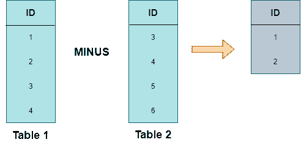

# MySQL 减

> 原文：<https://www.javatpoint.com/mysql-minus>

减运算符是 SQL 中的一种集合运算，也包括交集、并集和联集全。**减运算符返回第一个表/集合中的唯一元素，该元素在第二个表/集合**中找不到。换句话说，它将比较两个查询的结果，并从第一个查询获得的结果集中生成结果行，而在第二个查询获得的结果集中找不到结果行。

### 句法

以下是说明减运算符使用的语法:

```sql

SELECT column_lists FROM table_name WHERE (condition)
MINUS
SELECT column_lists FROM table_name WHERE (condition); 

```

#### 注意:MySQL 不支持减运算符。本文向您展示了如何在 MySQL 中使用 JOIN 子句模拟减查询。

**以下是使用减运算符的语句的规则:**

*   所有 SELECT 语句中的列数和顺序必须相同。
*   两个 SELECT 语句中相应列的数据类型必须相同或可转换。

我们可以用下面的可视化表示来理解减运算符。在这里，该运算符从第一个**选择语句** 获得的结果中返回不同/唯一的值，而在第二个**选择语句**获得的结果中找不到:



### MySQL 减运算符的模拟

由于 [MySQL](https://www.javatpoint.com/mysql-tutorial) 不支持减运算符。但是，我们可以使用 [**左连接**子句](https://www.javatpoint.com/mysql-left-join)来模拟这个运算符。

我们可以使用以下语法来模拟减运算符:

```sql

SELECT column_list FROM table1
LEFT JOIN table2 ON condition
WHERE table2.column_name IS NULL;

```

### 例子

让我们首先为演示创建两个具有以下结构的表:

**表 1 结构和数据:**

```sql

mysql> CREATE TABLE tab1 (
    Id INT PRIMARY KEY
);

mysql> INSERT INTO tab1 VALUES (1), (2), (3), (4);

```

**表 2 结构及数据:**

```sql

mysql> CREATE TABLE tab2 (
    id INT PRIMARY KEY
);

mysql> INSERT INTO tab2 VALUES (3), (4), (5), (6);

```

现在，我们将在 LEFT JOIN 子句的帮助下执行以下查询。它给出了与减运算符相同的结果:

```sql

mysql> SELECT Id FROM tab1
LEFT JOIN tab2 USING (Id)
WHERE tab2.Id IS NULL;

```

**输出:**

执行上述查询后，我们应该得到如下图所示的输出:


* * *